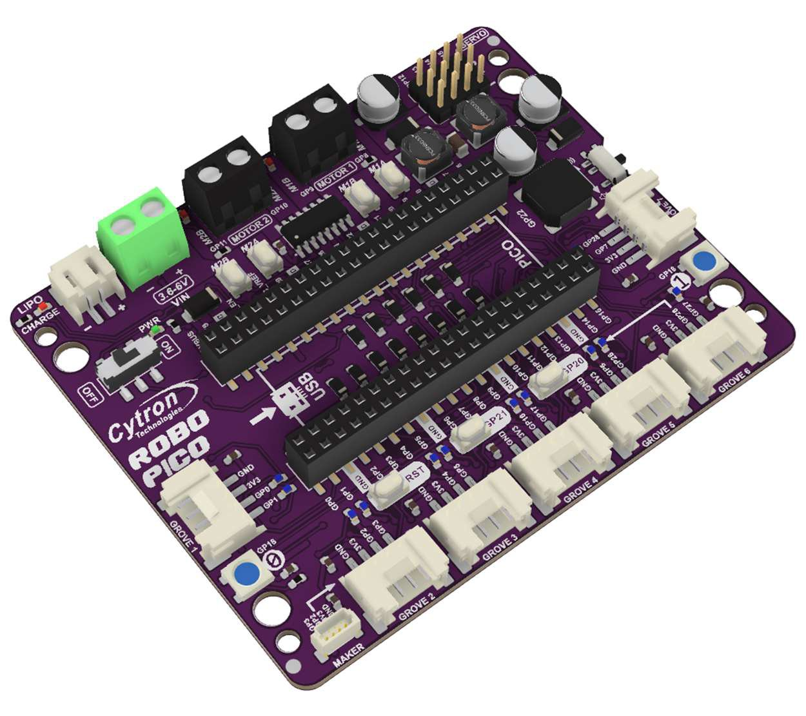
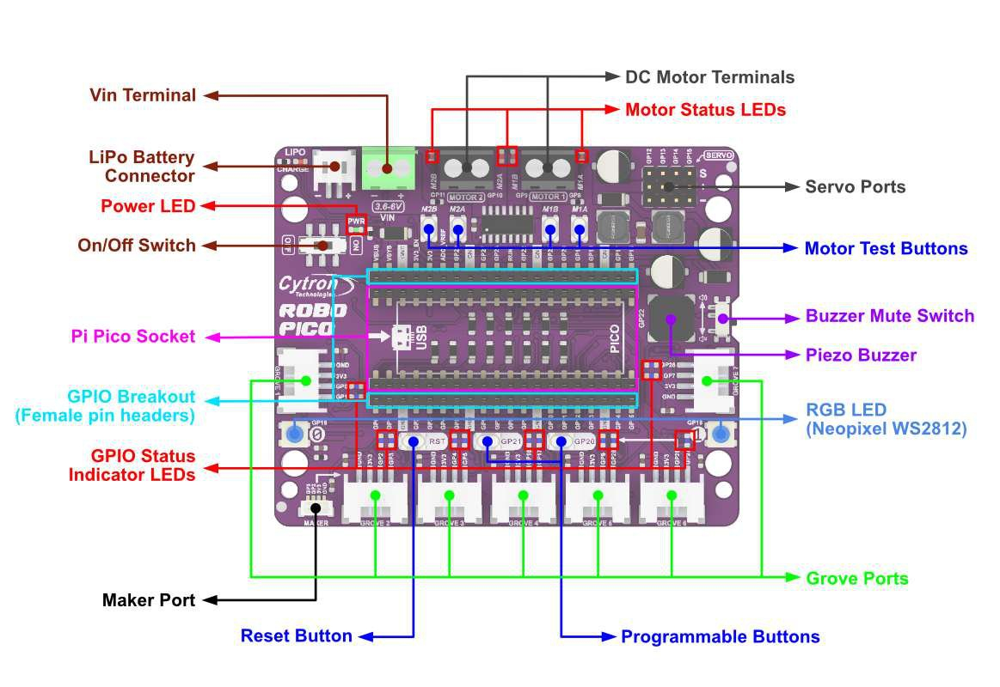
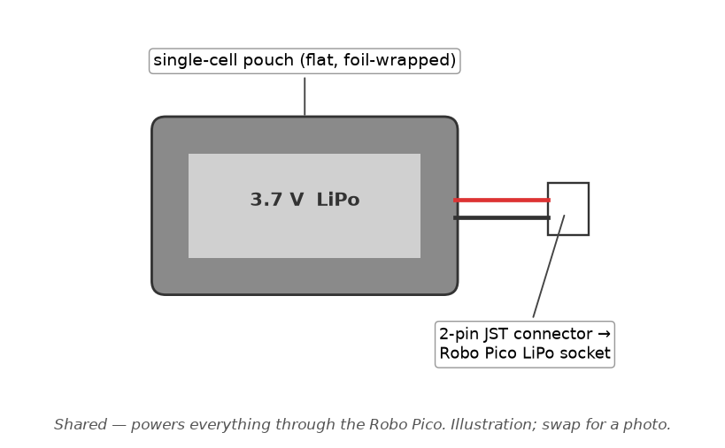

# Team Guide — the shared picture

Three guides, three jobs:

| Guide | Read it when you want to know… |
|---|---|
| **This file** | how the code is organised, the code *everyone* runs on (`core/`, `app/`, `sub_nav.c`), the shared hardware, and who owns which part |
| [`BUILD.md`](BUILD.md) | how to install the tools, build, flash, watch the console, and test each part — every step, in VS Code |
| [`docs/guide/buddyN-….md`](docs/guide/) | *your* part: your hardware wired pin by pin, your code explained line by line, your TODOs |

Everything is written for someone who has **never used a Raspberry Pi
Pico, never written C and never done any IoT**. Words are defined the first
time they appear. If something here is still unclear, that's a bug in the
guide — say so.

Read §1 once (ten minutes). Skim §2 and §3. Then open your own guide.

---

## 1. The big picture

The car is built from small, focused pieces of code that never call each
other directly. Instead, every piece **shouts into a shared announcement
system** (called the "event bus") when something happens — "I just read the
IR sensor," "I just decoded a barcode," "the wheel just finished this many
millimetres." Any other piece that cares can **subscribe** to that kind of
announcement and react. This is exactly like a group chat where people only
post updates relevant to their role, and everyone else mutes the channels
they don't need — nobody has to personally phone every other person on the
team every time something happens.

Why build it this way? Because it lets five people write and test their own
module against fake/stub data, without waiting for everyone else's code to
exist, and then plug all five together at the end and have it mostly just
work.

### 1.1 Folders — where does my code live?

```
core/         the plumbing everyone shares (event bus, timing, interrupts, PWM) — §2.3
drivers/      one file per physical part (motor, encoder, servo, ultrasonic, IR, IMU)
subsystems/   one file per team member's "job", plus the shared mission logic (sub_nav) — §2.2
app/          the start-up code that boots the car (§2.1), plus app_bench.c, the per-buddy tests (§2.4)
build/        the scripts VS Code's tasks run: setup, build, flash — BUILD.md
external/     the micro T-Kernel operating system we run on, fetched by the setup task
docs/         HARDWARE.md (pin table, calibration), guide/ (your buddy guide), img/hw/ (pictures,
              the pin-map generator), datasheets, and the Week 6 design review
BUILD.md      install, build, flash, test — every step
TEAM_GUIDE.md this file
```

A **driver** talks directly to one physical part (e.g. "read the raw motor
encoder"). A **subsystem** is the smart layer on top that makes decisions
(e.g. "drive forward exactly 300mm and tell me when you're done"). You will
mostly work in `subsystems/`, and read (but rarely edit) the matching
`drivers/` file underneath it.

### 1.2 The event bus, in plain terms

File: `core/rc_event.h`. Two ideas to remember:

- **Publish / subscribe.** A "producer" (an interrupt, a driver, a
  subsystem) calls `rc_event_publish(...)` with a small packet of data (an
  `rc_event_t`) tagged with an ID like `RC_EVT_ODOMETRY` or
  `RC_EVT_BARCODE_DECODED`. Any code that previously called
  `rc_event_subscribe(id, lane, my_function, ctx)` for that same ID gets
  `my_function` called automatically with the data. You never call another
  subsystem's function by name — you just publish or subscribe.
- **Two lanes, like two mail queues with different priority.**
  `RC_LANE_FAST` is for things that must react quickly — steering,
  obstacle response. `RC_LANE_SLOW` is for things that can wait a beat —
  telemetry, logging, planning. This exists so that, for example, a slow
  network send can never delay the wheels reacting to an obstacle. When you
  subscribe to something, ask yourself: "does the car steer differently
  because of this, right now?" If yes, fast lane. If no, slow lane.

**Golden rule for any code you write that runs inside an interrupt** (an
"ISR" — a tiny piece of code the chip automatically jumps to the instant a
sensor pin changes state, pausing everything else): it may only record a
timestamp, flip a couple of registers, and hand off to a task via
`rc_defer_signal_i()`. It may **not** loop, publish an event directly, call
a callback, or do division. If you're ever tempted to add a
`while(...)`-style wait anywhere in a driver, stop — see §1.3.

### 1.3 "Non-blocking" — the one rule that shapes everything

Nothing in this codebase is allowed to freeze the whole car while it waits
for something slow to finish (like a 30-millisecond ultrasonic echo, or a
motor move that takes two seconds). Instead:

1. You call a function like `sub_motion_forward_mm(300, my_callback, ctx)`.
2. It returns **immediately** — the car starts moving in the background.
3. Later, when the move actually finishes, `my_callback` gets called
   automatically (via the event bus) to tell you it's done.

This is the same pattern as clicking "download" in a browser: you don't
freeze the whole browser while the file downloads, you get a notification
when it's done. Every module in this project follows this pattern — get
used to writing "start it and register a callback" instead of "wait for
it."

---

## 2. The shared code

Three pieces of code belong to everybody. They are small, and once you can
read them you can read anything in this repo.

### 2.1 Start-up, line by line — `app/app_main.c`

This is the first of our code to run after the operating system boots. It
switches everything on in the right order, then either starts the mission
or one buddy's bench test. Open the file alongside this.

**The includes (top of the file).** `#include "rc_prelude.h"` must be
first in every `.c` file in this project — it settles a clash between two
definitions of `size_t` (a standard C type) that would otherwise stop the
file compiling (§2.3). `<tm/tmonitor.h>` gives us `tm_printf`, the function
that prints to the console. Then every driver and subsystem header, because
`usermain` calls each one's `init`.

**`#define IMU_CAL_SAMPLES (100U)`** — how many accelerometer readings to
average when calibrating at boot. A `#define` is a named constant: the
compiler swaps in `100` wherever it sees the name. `U` marks it unsigned
(never negative).

**`static ID sense_tskid; static ID blink_tskid;`** — two variables that
will hold the kernel's ID numbers for the two tasks we create below. `ID`
is the kernel's type for "a handle to a kernel object". `static` at file
level means "private to this file".

**`sense_task()`** — a *task* is a small independent program the operating
system runs alongside the others (think of it as one worker with one job).
This one's job: every 5 ms read the two line sensors, and every 10 ms read
the IMU. The loop is:

```c
for (;;) {                              // forever
    tk_dly_tsk(RC_PERIOD_LINE_MS);      // sleep 5 ms (RC_PERIOD_LINE_MS is 5)
    ms += RC_PERIOD_LINE_MS;            // keep our own millisecond count
    drv_ir_sample_line();               // Buddy 3's driver reads GP16/GP6, publishes LINE_SAMPLE
    if ((ms % RC_PERIOD_IMU_MS) == 0U) {// every 10 ms (% is "remainder": 10, 20, 30…)
        drv_imu_sample();               // Buddy 4's driver reads the IMU over I²C, publishes IMU_SAMPLE
    }
}
```

`tk_dly_tsk` ("delay task") is the kernel call that says "wake me in N
ms" — while asleep this task uses no CPU, which is what "non-blocking"
(§1.3) means in practice. The two arguments `stacd` and `exinf` are values
the kernel hands every task at start; we don't use them, and `(void)x;` is
the C idiom for "yes, I know I'm ignoring this, don't warn me".

**`blink_task()`** — the liveness LED. `gpio_set_pin(RC_PIN_STATUS_LED,
GPIO_MODE_OUT)` makes GP19 an output; then forever: flip `on` between 0
and 1, `gpio_set_val` writes it to the pin, sleep 500 ms. One blink per
second means "the kernel is scheduling tasks" — bring-up step 1. The pin
number comes from `rc_config.h`, the one file every pin lives in.

**`step()`** — a tiny helper so each initialisation prints a line. It
takes a name and the result code an `init` returned; prints `[init] motor
ok` or `[init] motor FAILED (3)`, and returns true/false. That is the boot
log you watch in the Serial Monitor (`BUILD.md` §4.3). `rc_result_t` is
our own list of result codes (`RC_OK`, `RC_ERR_PARAM`, …) from
`rc_types.h`.

**`usermain()`** — the entry point. The kernel calls this once, in its own
task, after it has booted. Reading down:

1. `rc_defer_init()`, `rc_event_init()`, `rc_gpioirq_init()` — the three
   `core/` services, in dependency order: the "do it in a moment" task
   must exist before any driver registers work for it; the event bus
   before anyone subscribes; the interrupt switchboard before any driver
   attaches a pin. Each is wrapped in `if (!step(...)) { return 1; }` — a
   failure here stops the boot, because nothing downstream would work.
2. The six drivers: motor, encoder, servo, ultrasonic, IR, then IMU. The
   IMU's result is deliberately ignored (`(void)step(...)`) — a car that
   can't measure humps can still finish the course, so an unplugged IMU
   only costs you hump detection, not the whole run.
3. The six subsystems, ending with `sub_nav_init()` — last because it
   subscribes to all the others' events, so they must exist first.
4. Creating the two housekeeping tasks. `T_CTSK ctsk;` is a form you fill
   in for the kernel: `itskpri` = priority (lower number wins, from
   `rc_config.h`), `stksz` = stack size, `task` = which function to run,
   `tskatr = TA_HLNG | TA_RNG3` = "written in C, user level". `tk_cre_tsk`
   creates it and returns an ID; `tk_sta_tsk` starts it. The Sense task
   gets priority 7 (`RC_PRI_SENSE`), Blink priority 10 — nothing depends on
   the blink, so it may be starved.
5. `drv_imu_calibrate(IMU_CAL_SAMPLES)` — **the car must be level and
   still here**; it averages 100 readings to learn what "flat" looks like.
6. `sub_motion_set_speed(250U)` — cruising speed in mm/s.
   `sub_line_set_base(350)` — the line follower's base motor duty, in
   permille (parts per thousand: 350 = 35 %).
7. Then the fork:
   - a **bench build** (`#if RC_BENCH != RC_BENCH_NONE`) prints
     `BENCH MODE: <name>` and calls `rc_bench_run()`, which never returns
     (§2.4, `BUILD.md` §5);
   - the **mission build** prints `ready, starting run`, calls
     `sub_nav_start()` (§2.2), and then `tk_slp_tsk(TMO_FEVR)` — "sleep
     forever". `usermain` *must not return*: if it did, the kernel would
     shut down. Sleeping forever parks this task and lets all the others
     run.

`#if … #else … #endif` is decided at compile time: the bench build
contains only the bench branch, the mission build only the mission
branch. That's why the mission image has no bench code in it at all.

**Adding a new driver or subsystem?** Slot its `init` into the same
pattern: after the `core/` services it needs, before anything that
subscribes to it.

### 2.2 The mission state machine — `sub_nav.c`

This file belongs to everyone jointly — it is the "traffic controller" that
decides which mode the car is in (following the line, reading a barcode,
executing a turn command, avoiding an obstacle, recovering after avoidance,
or stopped) and turns the right subsystems on/off for each mode. You
probably won't need to edit it, but understanding it helps you see how your
own module fits into the whole mission:

- `RC_NAV_FOLLOWING` — driving normally, line follower active, obstacle
  watch active.
- `RC_NAV_READING_BARCODE` — the line follower lost the line or saw a
  junction; the barcode decoder is now armed and listening.
- `RC_NAV_EXECUTING_CMD` — a barcode was decoded; the car is turning
  (left/right/U-turn) or continuing straight.
- `RC_NAV_AVOIDING` — an obstacle was seen close up; a full ultrasonic
  scan is running and a bypass path is being planned.
- `RC_NAV_RECOVERING` — the car has driven around an obstacle and is
  hunting for the line again.
- `RC_NAV_STOPPED` / `RC_NAV_IDLE` — everything off.

Every buddy's module publishes events (line lost, barcode decoded,
ultrasonic result, scan plan ready) that `sub_nav.c` listens for to decide
when to change mode. If your module isn't reacting the way you expect,
check here first — it's often a case of the nav state machine not being in
the mode you assumed.


**Function by function.** `sub_nav.c` is ~300 lines and reads top to
bottom:

- Two constants: `WATCH_TRIGGER_MM (300U)` — if the forward "watch" ping
  sees something closer than 300 mm while following, start a full scan;
  `TURN_DEG (90)` / `UTURN_DEG (180)` — the turn angles for barcode
  commands (Buddy 2's calibration decides how well a "90" really is 90).
- `static rc_nav_state_t state;` — which mode we're in.
  `static rc_pl_plan_t pending_plan;` — the avoidance plan we're executing.
- **`enter(next)`** — the one function that changes mode. It records the
  new state and then, in one `switch`, turns subsystems on or off for that
  mode: `FOLLOWING` enables the line follower, disarms the barcode decoder
  and switches on the forward watch ping; `READING_BARCODE` keeps following
  but arms the decoder; `EXECUTING_CMD` disables the follower (a turn is
  not a line-following move); `AVOIDING` disables the follower and the
  watch; `RECOVERING` just disarms the decoder; `STOPPED`/`IDLE` switch
  everything off and brake. Because every transition goes through here,
  there is exactly one place to look when "the car did X in mode Y".
- **The three bypass legs** — `bypass_leg1/2/3`. Going around an obstacle
  is three queued moves: turn away, run past, turn back. Each is a
  *completion callback*: `sub_motion_turn_deg(…, bypass_leg1, NULL)` asks
  Buddy 2's motion code to turn and to call `bypass_leg1` when it's done;
  `bypass_leg1` then requests the forward run with `bypass_leg2` as its
  callback; `bypass_leg2` requests the turn back with `bypass_leg3`;
  `bypass_leg3` hands control to the line follower's *search* mode and
  enters `RECOVERING`. Nothing waits — each step is started by the
  previous one finishing. The `if (!ok) { enter(RC_NAV_STOPPED); }` at the
  top of each leg aborts the whole manoeuvre if a move was cancelled.
- **`cmd_done`** — the callback for a barcode turn: back to `FOLLOWING`
  on success, `STOPPED` on abort.
- **The event handlers** — each is subscribed in `sub_nav_init()`, and
  each first checks `state`, so an event in the "wrong" mode is ignored:
  - `on_barcode` (only in `READING_BARCODE`): maps the decoded command to
    a turn (`TURN_LEFT` → `-TURN_DEG`, `TURN_RIGHT` → `+TURN_DEG`,
    `U_TURN` → `UTURN_DEG`) via `sub_motion_turn_deg(…, cmd_done)`;
    `GO_STRAIGHT` just resumes following.
  - `on_ultra` (only in `FOLLOWING`): a valid range under
    `WATCH_TRIGGER_MM` → enter `AVOIDING`, slow to 150 permille, and
    `sub_scan_start()`. Slowing rather than stopping saves completion
    time.
  - `on_plan` (only in `AVOIDING`): the scan's verdict arrives.
    `RC_CMD_STOP` → boxed in, stop. `GO_STRAIGHT` → nothing in the way,
    resume following. Otherwise start the bypass with the first turn.
  - `on_line_reacquired` (only in `RECOVERING`): the follower found the
    line again → `FOLLOWING`.
  - `on_line_lost` (only in `FOLLOWING`): losing the line while following
    usually means a junction with a barcode just ahead → arm the decoder
    (`READING_BARCODE`) and let the follower hunt.
  - `on_junction` (slow lane, every line sample): both sensors on black
    while following → same, `READING_BARCODE`.
- **`sub_nav_init()`** subscribes each handler. Note the lanes: everything
  that changes what the wheels do is on `RC_LANE_FAST`; `on_junction`,
  which merely looks at every line sample, is on `RC_LANE_SLOW` (§1.2).
- **`sub_nav_start()`** resets the terrain module's hump record and enters
  `FOLLOWING`. **`sub_nav_stop()`** enters `STOPPED`. **`sub_nav_state()`**
  reports the mode (telemetry reads it).

The two `tm_printf` calls (`boxed in, stopping`, `line reacquired`) are
the `[nav]` lines you see on the console during a run.

### 2.3 The `core/` toolbox — the nine shared files and who plugs into them

**First, a common confusion cleared up.** Two separate piles of code end up
on the Pico:

- **The RTOS port** (`mtk3smp-rp2040`, written by our lecturer). This is
  the *operating system*: it knows how to start the chip, run several
  tasks "at once", and provides every function whose name starts with
  `tk_` (`tk_cre_tsk`, `tk_wai_flg`, `tk_dly_tsk`…) or `tm_`
  (`tm_printf`). We never edit it — we only apply the two small patches
  from `BUILD.md` §3.
- **This project** (`core/`, `drivers/`, `subsystems/`, `app/`). Every
  file here was written by us for this car. Nothing in it is copied from
  the RTOS.

`core/` is the part of *our* code that everyone else's code leans on. Think
of it as the toolbox in the middle of the workshop: it doesn't build the
car, but every buddy reaches into it. It wraps the raw Pico chip and the
RTOS into a handful of simple services (a stopwatch, a doorbell
switchboard, a notice board, a dimmer switch…) so that the drivers and
subsystems can be written in plain terms like "publish this event" or "set
this pin to 40% power" instead of poking at hardware registers.

**Who uses what — the connection map**

| `core/` file | What it is (one line) | Used directly by | Which buddy that serves |
|---|---|---|---|
| `rc_prelude.h` | The mandatory first `#include` in every `.c` file | every `.c` file in the tree | everyone |
| `rc_types.h` | The shared dictionary: result codes, command names, event IDs, the event "parcel" | every file (pulled in by the other headers) | everyone |
| `rc_config.h` | The one settings sheet: every pin number and tuning constant | every driver, subsystem and `app_main.c` | everyone |
| `rc_time.*` | Microsecond stopwatch read straight from the chip | `drv_encoder`, `drv_ir`, `drv_ultrasonic`, `sub_terrain`, `sub_telemetry` | 2, 3, 4, 5, 1 |
| `rc_gpioirq.*` | The doorbell switchboard: routes the chip's single GPIO interrupt to the right driver | `drv_encoder` (GP0/GP7), `drv_ir` (GP27), `drv_ultrasonic` (GP3) | 2, 3, 5 |
| `rc_defer.*` | The "do it in a moment" list: lets an interrupt hand real work to a task | `drv_encoder`, `drv_ir`, `drv_ultrasonic` | 2, 3, 5 |
| `rc_event.*` | The notice board (publish / subscribe) that connects all subsystems | every driver and subsystem | everyone |
| `rc_pwm.*` | The dimmer switch: turns "40 % power" or "1500 µs pulse" into a PWM signal | `drv_motor` (20 kHz), `drv_servo` (50 Hz) | 2, 5 |
| `rc_fmt.*` | A tiny, safe text formatter for building telemetry messages | `sub_telemetry` | 1 |

Read the table by row: *"`rc_pwm` is the dimmer switch; the motor driver
and the servo driver use it; so it serves Buddy 2 and Buddy 5."* Each
buddy's section further down repeats just the rows that matter to them.

Below, each file in plain language. You do not need to understand the
insides to use them — the point is to know what each one *offers* and
which of your files calls it.

---

#### `rc_prelude.h` — "include me first"

**What it is.** A 50-line header whose only job is to be the first line of
every `.c` file. It fixes a naming clash: the RTOS defines a type called
`size_t` one way and the standard C library (which we need for
`memset`/`strlen`-style helpers) defines it another way. If both
definitions meet in one file, the compiler stops with
`conflicting types for 'size_t'`. It's like two colleagues named "Sam" in
one email thread — someone has to say which Sam we mean. `rc_prelude.h`
tells the RTOS "don't define `size_t`, let the C library do it" *before*
any RTOS header is read. That's why the rule is "first line, always".

**Who uses it.** Every `.c` file. If you create a new file and forget it,
the very first `#include <string.h>` will fail to compile.

#### `rc_types.h` — the shared dictionary

**What it is.** The definitions everyone has to agree on so the files can
talk to each other:

- `rc_result_t` — the answer every function gives back: `RC_OK`, or a
  named reason for failure (`RC_ERR_BUSY`, `RC_ERR_TIMEOUT`,
  `RC_ERR_HARDWARE`…). Every driver and subsystem function returns one of
  these instead of a bare number, so a failure is readable at a glance.
- `rc_nav_cmd_t` — the four barcode commands plus stop:
  `RC_CMD_TURN_LEFT`, `RC_CMD_TURN_RIGHT`, `RC_CMD_GO_STRAIGHT`,
  `RC_CMD_U_TURN`, `RC_CMD_STOP`. Buddy 3 produces these; `sub_nav`
  consumes them.
- `rc_evt_id_t` — the list of every event that can appear on the notice
  board (`RC_EVT_ODOMETRY`, `RC_EVT_LINE_SAMPLE`, `RC_EVT_HUMP_END`…).
  Adding a new kind of message to the car means adding one line here.
- `rc_event_t` — the **parcel** itself. It has a label (`id`), a
  timestamp (`t_us`, stamped automatically when published), and a
  compartment `u` that holds *one* of many possible contents: `u.odometry`
  for speed/distance, `u.line` for the two IR sensor bits, `u.ultra` for a
  range reading, and so on. In C this "one box, many possible contents" is
  called a *union*: the box is only as big as the largest item, and the
  `id` label tells the reader which item is inside. A subscriber reads
  `evt->id` first and then the matching `evt->u.xxx`.

**Who uses it.** Everyone, automatically — every other `core/` header
includes it.

#### `rc_config.h` — the settings sheet

**What it is.** A single header containing every GPIO pin number, every
timing period, every task priority and every mechanical measurement
(wheel diameter, encoder slots, wheel base). Nothing else in the tree is
allowed to contain a bare pin number. Changing a pin, a sample rate or a
priority means editing exactly one line here.

The file is split into blocks: *fixed by the Robo Pico board* (motors,
servo ports, buzzer, buttons — do not touch), *chosen by us* (encoders,
IR sensors, ultrasonic, IMU — move if your wiring differs), *timing*,
*task priorities*, *mechanical constants*, and per-subsystem tuning
(ultrasonic limits, scan geometry, event ring sizes).

**Who uses it.** Every driver, every subsystem, `app_main.c`, and three of
the `core/` files themselves. If you're looking for "which pin is the
right encoder on?" or "how often does the PID run?" the answer is here.

#### `rc_time.c` / `rc_time.h` — the stopwatch

**What it is.** A way to read *microseconds* (millionths of a second)
since the chip powered on. The RTOS's own clock only ticks every 1 ms,
which is far too coarse for two things this car does: measuring how long
an ultrasonic echo takes to come back (1 ms of error is 17 cm of range)
and measuring how wide a barcode bar is as it slides past the sensor. The
RP2040 has a free-running 1 MHz counter in hardware, and `rc_time_us()`
simply reads it — no interrupt, no RTOS call, so it is safe to read from
inside an interrupt.

Three functions:

- `rc_time_us()` — the raw microsecond count.
- `rc_time_since(then)` — microseconds elapsed since an earlier reading.
  Use this rather than `now - then` by hand: the counter is 32-bit and
  wraps back to zero every ~71 minutes, and this function is written so
  the wrap doesn't produce a wrong answer.
- `rc_time_ms()` — the same clock in milliseconds, for less precise uses
  like "how long did the hump last" or telemetry timestamps.

**Who uses it.** `drv_encoder` (time between clicks → speed), `drv_ir`
(time between barcode edges → bar width), `drv_ultrasonic` (echo flight
time → distance), `sub_terrain` (hump duration), `sub_telemetry`
(message timestamps). `rc_event` also stamps every parcel with it.

#### `rc_gpioirq.c` / `rc_gpioirq.h` — the doorbell switchboard

**What it is.** The RP2040 has 30 GPIO pins but only *one* interrupt line
for all of them together. Four of our pins need to trigger code the
instant they change (left encoder A on GP0, right encoder A on GP7,
ultrasonic echo GP3, barcode sensor GP27). Picture an apartment block with one shared
doorbell: when it rings, someone has to look at the panel to see which
flat was pressed and go tell *that* tenant. `rc_gpioirq` is that
concierge. It claims the one interrupt from the RTOS, and when it fires it
reads the chip's status register, works out which pin(s) changed, and
calls the small handler the owning driver registered for that pin —
passing the pin number, whether it went high or low, and a microsecond
timestamp taken at the door.

Three functions a driver uses:

- `rc_gpioirq_attach(pin, edges, pull, handler, ctx)` — "ring my handler
  when this pin goes up / down / either way". Also sets the pin up as an
  input with the requested pull resistor.
- `rc_gpioirq_enable(pin, on/off)` — temporarily mute one pin without
  forgetting the registration. The ultrasonic driver uses this so echo
  edges are only listened to while a ping is actually in flight.
- `rc_gpioirq_detach(pin)` — undo attach.

The handler you register runs *inside the interrupt*, so the rule in §1.2
applies: timestamp, update a counter, ring the defer bell, return. Nothing
else. On the dual-core build the interrupt is owned by core 0 only, as the
port requires.

**Who uses it.** `drv_encoder` (rising edges on GP0/GP7, reading GP1/GP28
for direction inside the handler), `drv_ir` (both edges on GP27),
`drv_ultrasonic` (both edges on GP3).

#### `rc_defer.c` / `rc_defer.h` — the "do it in a moment" list

**What it is.** The partner to `rc_gpioirq`. An interrupt handler is only
allowed a few microseconds and may not do anything that could wait, loop
or call into another subsystem. But the *result* of an interrupt — "a
barcode edge arrived, decode it", "the echo came back, publish the
range" — is real work. `rc_defer` is how the interrupt hands that work to
a normal task without doing it itself.

Each driver registers a **drain** function once at start-up
(`rc_defer_register(my_drain, ctx)` → returns a small handle number). Then,
inside its interrupt handler, the driver calls
`rc_defer_signal_i(handle)` — a single RTOS call that sets one bit in an
event flag, the RTOS equivalent of pressing a "please come" button. A
dedicated **Defer task** (priority 4, the highest in the car) is sleeping
on that flag; it wakes, sees which bits are set, and calls the matching
drain functions in task context, where publishing events and calling
callbacks is allowed. Because the Defer task sits above both event
dispatchers, the drain normally runs within microseconds of the interrupt
that asked for it.

Up to 16 drains can be registered; the car uses three. `rc_defer_count()`
tells you how many times drains have been requested, handy for spotting a
sensor that's "ringing the bell" far more often than it should.

**Who uses it.** `drv_encoder` (`encoder_drain`), `drv_ir`
(`barcode_drain`), `drv_ultrasonic` (`ultra_drain`). `app_main.c` calls
`rc_defer_init()` before anything else so the task exists before any
driver registers with it.

#### `rc_event.c` / `rc_event.h` — the notice board

**What it is.** §1.2 already explains the idea (publish / subscribe, two
lanes). This is what's inside:

- Each lane owns a **ring buffer** of 64 parcel slots — a fixed circle of
  pigeon-holes. Publishing copies your `rc_event_t` into the next free
  slot and moves the "write" pointer on; the dispatcher reads from the
  "read" pointer and moves it on. When write catches up with read the ring
  is full and the parcel is *dropped and counted* (`rc_event_dropped()`),
  never blocked on. Bounded and predictable is the whole point.
- Each lane has a **dispatcher task** (FAST at priority 5, SLOW at
  priority 9). It sleeps on an event flag; every publish sets the flag; the
  task wakes, pops parcels one by one and calls every subscriber for that
  parcel's `id`, in the order they subscribed. Up to 32 subscriptions per
  lane.
- Two ways to publish: `rc_event_publish()` from a task, and
  `rc_event_publish_i()` from inside an interrupt (it uses the
  interrupt-safe lock). Both fill in the timestamp for you.
- `rc_event_subscribe(id, lane, callback, ctx)` returns a handle;
  `rc_event_unsubscribe(handle)` removes it.

The protection around the ring is a few-microsecond critical section:
interrupts masked on single core, plus a spinlock on the dual-core build.
There are no mutexes anywhere on the control path — subsystems never share
variables, they only pass parcels.

**Who uses it.** Everything. Drivers publish raw readings
(`ENCODER_EDGE`, `LINE_SAMPLE`, `IMU_SAMPLE`, `ULTRA_RESULT`,
`BARCODE_EDGE`); subsystems subscribe to those and publish their
conclusions (`ODOMETRY`, `LINE_LOST`, `BARCODE_DECODED`, `HUMP_END`,
`OBSTACLE_PROFILE`, `AVOIDANCE_PLAN`); `sub_nav` and `sub_telemetry`
subscribe to the conclusions. `app_main.c` calls `rc_event_init()` second,
straight after `rc_defer_init()`, because every other `init` subscribes or
publishes.

#### `rc_pwm.c` / `rc_pwm.h` — the dimmer switch

**What it is.** A motor can't be told "run at 40 %". What you *can* do is
switch its power on and off very fast — say 20,000 times a second — and
leave it on for 40 % of each cycle. The motor's inertia smooths that into
40 % of full speed. That trick is **PWM** (pulse-width modulation). A
hobby servo uses the same idea at a different speed: 50 pulses a second,
and the *width* of each pulse (1000–2000 µs) tells the servo which angle
to hold.

The RTOS port gives us the raw PWM registers but no way to set the slow
frequency a servo needs; `rc_pwm` adds that one missing register write
and wraps everything in four calls:

- `rc_pwm_init_pin(pin, freq_hz)` — set the pin's PWM channel to this
  frequency and start it at 0 %.
- `rc_pwm_set_duty(pin, permille)` — 0..1000, i.e. tenths of a percent.
  (We use "permille" everywhere instead of "percent" so we never need a
  decimal point — there's no floating point on this chip.)
- `rc_pwm_set_pulse_us(pin, us)` — set the pulse width directly in
  microseconds; what servos want.
- `rc_pwm_enable(pin, on/off)`.

One catch worth knowing: the RP2040's PWM hardware is organised in
**slices** of two pins each, and both pins in a slice must share the same
frequency. The pin map in `rc_config.h` was chosen so that the two pins of
each motor (GP8/GP9, GP10/GP11) and the scan servo (GP15, slice 7) each
land on their own slice. Don't move a motor pin onto the servo's slice.

**Who uses it.** `drv_motor` (both motors at 20 kHz — above hearing, so
no whine), `drv_servo` (50 Hz, pulse in µs).

#### `rc_fmt.c` / `rc_fmt.h` — the tiny text printer

**What it is.** Telemetry needs to build text like
`{"state":2,"speed":250,"dist":1830}`. The standard C way is `snprintf`,
but on this chip that drags in 10–20 kB of library code and, in some
configurations, calls `malloc` from inside a periodic task — both things
the resource-efficiency marking scheme penalises. `rc_snprintf` is our own
150-line replacement that supports only what telemetry needs
(`%d %u %ld %lu %c %s %%`), never allocates memory, and always leaves the
output properly terminated even when the buffer is too small.
`rc_strlen` is the matching string-length helper.

**Who uses it.** `sub_telemetry` only. If you ever need to format text
elsewhere, use this rather than `snprintf` so the rest of the tree stays
consistent.

---

### 2.4 The bench harness — `app/app_bench.c`

One plain file, one function per buddy (`bench_motion()`,
`bench_line()`, …), selected at build time by `RC_BENCH`. Each function
runs forever in `usermain`'s task, sleeps with `tk_dly_tsk` between
prints, and reads live values either straight from the driver or by
subscribing to the same events the mission uses. Nothing in a bench
touches another buddy's module, so a bench that misbehaves points at
exactly one place. It's *your* test harness — edit yours. How to build and
flash each bench, and what good output looks like, is `BUILD.md` §5.

---

## 3. Shared hardware, and who owns what

### 3.1 What's in the kit, and who is responsible for it

Every part in the kit has exactly one buddy responsible for wiring it,
calibrating it and writing its driver — except the handful of *shared*
parts that everyone's code runs through. The shared parts are described
and pictured here; each buddy's own parts are pictured and wired, pin by
pin, in that buddy's guide (§4). The table in §3.5 says who owns what.

Where the pictures come from: the Robo Pico, Pico W, HC-SR04, GY-511 and
TCRT5000 images are lifted from the datasheets in `docs/`. The
motor, encoder, servo, IR module and battery have no datasheet in the
folder, so those are labelled drawings of the standard part — **when the
kit is in front of you, photograph the real thing and drop it into
`docs/img/hw/` under the same filename**; this guide will pick it up
without any other edit.

### 3.2 The shared parts

**Raspberry Pi Pico W** — the computer. A green board with a silver RP2040
chip in the middle and a metal-canned WiFi module (the CYW43439) near the
USB end. It sits in the Robo Pico's socket, USB connector facing outwards.
Everything in this repo runs on it. The pinout below is the one you'll
keep coming back to: our pin numbers (GP2, GP16, …) are the green
`GPn` labels, *not* the physical pin numbers 1–40.


**Cytron Robo Pico** — the purple carrier board the Pico W plugs into. It
provides the motor driver (so the Pico's 3.3 V pins can drive 6 V
motors), four servo ports, seven Grove connectors, a LiPo charger and
power switch, a buzzer, two buttons and a Neopixel LED. Nobody "owns" it
because every buddy's part plugs into it somewhere — but Buddy 2 uses it
most heavily (the motor terminals *are* the Robo Pico's motor driver).

  

Where the fixed pins live on it (from `core/rc_config.h`): motors on
GP8–GP11, servo ports on GP12–GP15, buzzer GP22, buttons GP20/GP21,
Neopixel GP18. Those cannot be moved — they're wired on the board.

**Battery** — a single-cell 3.7 V LiPo pouch with a 2-pin JST plug that
goes into the Robo Pico's LiPo socket. The Robo Pico charges it over USB
and its power switch turns the whole car on and off. Note the HC-SR04
wants 5 V and will lose range on a sagging battery — see
`docs/HARDWARE.md` §3.



**Also shared, no picture needed:** the chassis and castor wheel; seven
Grove cables (one per socket); the external liveness LED on GP19 with its
330 Ω resistor. There is no USB-serial adapter — the console rides the
Pico's own USB cable (`BUILD.md` §4.3).

### 3.3 The pin map — every socket, every wire


This is the Robo Pico as wired for this car. Find a socket on the picture,
follow its chips: the GPIO number, the function it's using, and what plugs
in. Faded chips are parts of the board this car doesn't use. The same
information as a table is `docs/HARDWARE.md` §2, and every number on it
comes from one file, `core/rc_config.h` — if you ever find a bare pin
number anywhere else in the code, that's a bug.

**How to read a Grove socket.** Every Grove socket has four pins, printed
on the board in this order: `GND`, `3V3`, then the two GPIO numbers. A
standard Grove cable's wires are colour-coded — black = GND, red = 3V3,
white = the first GPIO printed, yellow = the second — but always check by
holding the cable against the socket and reading the labels. Grove 1 is on
the board's left edge, Grove 7 on the right edge, Grove 2–6 along the
bottom.

**One socket per device.** Left encoder → Grove 1, ultrasonic → Grove 2,
IMU → Grove 3, line sensor 1 → Grove 4, line sensor 2 → Grove 5, barcode →
Grove 6, right encoder → Grove 7; left motor → MOTOR 2 terminal, right
motor → MOTOR 1; servo → servo port 4. The pin-by-pin wiring for each is in
its owner's guide (§4). Two board quirks worth knowing even if they're not
yours: **GP26 is on both Grove 5 and Grove 6** (so line sensor 2's `AO`
must stay unwired), and the **MAKER port duplicates Grove 2's pins** (leave
it empty).

### 3.4 The one shared wire — the status LED

The Pico W's own LED can't be used (it's wired to the WiFi chip, not to a
pin), so the liveness blink (`BUILD.md` §4.3) uses an external LED on
**GP19**, which is only available on the 20-way header, not on a Grove
socket. It's two jumper wires and a resistor, and whoever assembles the
chassis does it once:

| From | To | Note |
|---|---|---|
| Header pin labelled `GP19` (top row of the upper 20-way header — see the pin map, it's highlighted) | LED **long** leg (+) via a **330 Ω** resistor | resistor on either leg, it doesn't matter which |
| LED **short** leg (−) | any header pin labelled `GND` | |

If it doesn't blink after flashing: LED backwards (swap the legs), wrong
header pin (count from the labels, not from the end), or the kernel-port
patch that moves the LED to GP19 hasn't been applied (run the setup task,
`BUILD.md` §3).

### 3.5 Ownership at a glance

| Part | Qty | Owner | Plugs into | Details |
|---|---|---|---|---|
| Raspberry Pi Pico W | 1 | **shared** | Robo Pico's Pico socket | §3.2 |
| Cytron Robo Pico carrier board | 1 | **shared** | — (everything plugs into it) | §3.2 |
| Single-cell LiPo battery | 1 | **shared** | Robo Pico LiPo socket | §3.2 |
| Chassis, wheels, castor, Grove cables, status LED | — | **shared** | see `docs/HARDWARE.md` §8; status LED wiring in §3.4 | — |
| DC gear motor + wheel | 2 | **Buddy 2** | Left → MOTOR 2 terminal (GP10/GP11), right → MOTOR 1 terminal (GP8/GP9) | [Buddy 2](docs/guide/buddy2-motion.md) |
| Wheel encoder, two-channel A/B | 2 | **Buddy 2** | Grove 1 → GP0/GP1 (left), Grove 7 → GP7/GP28 (right) | [Buddy 2](docs/guide/buddy2-motion.md) |
| MH-Sensor-Series IR module (TCRT5000 + LM393) | 3 | **Buddy 3** | Grove 4 → GP16, Grove 5 → GP6 (line); Grove 6 → GP27 + GP26/ADC0 (barcode) | [Buddy 3](docs/guide/buddy3-line-barcode.md) |
| GY-511 breakout (LSM303DLHC accel + magnetometer) | 1 | **Buddy 4** | Grove 3 → I2C0 on GP4 (SDA) / GP5 (SCL) | [Buddy 4](docs/guide/buddy4-imu-terrain.md) |
| HC-SR04 ultrasonic ranger | 1 | **Buddy 5** | Grove 2 → GP2 (TRIG), GP3 (ECHO via divider) | [Buddy 5](docs/guide/buddy5-scan-avoidance.md) |
| SG90-class servo + pan bracket | 1 | **Buddy 5** | Robo Pico servo port 4 (GP15) | [Buddy 5](docs/guide/buddy5-scan-avoidance.md) |
| 1 kΩ + 2 kΩ resistors (ECHO divider) | 1 each | **Buddy 5** | inline on the ECHO wire | — |
| WiFi radio (CYW43439, on the Pico W itself) | — | **Buddy 1** | nothing to wire | §3.2 |

### 3.6 Two rules that follow from the table

1. **If it's shared, don't change it without telling everyone.** Moving a
   jumper on the Robo Pico, re-flashing with a different pin patch, or
   swapping the battery affects every buddy's testing.
2. **If it's yours, it's yours end to end** — mounting, wiring, the
   `drivers/` file, calibration, and the "is it plugged in?" question at
   integration time.

---

## 4. Your own guide

| Buddy | Guide | Files you own | You're building |
|---|---|---|---|
| 1 | [`docs/guide/buddy1-telemetry.md`](docs/guide/buddy1-telemetry.md) | `subsystems/sub_telemetry.*` | reporting the car's status over WiFi (and receiving commands) |
| 2 | [`docs/guide/buddy2-motion.md`](docs/guide/buddy2-motion.md) | `subsystems/sub_motion.*`, `drivers/drv_motor.*`, `drivers/drv_encoder.*` | making the wheels move the right speed, distance and angle |
| 3 | [`docs/guide/buddy3-line-barcode.md`](docs/guide/buddy3-line-barcode.md) | `subsystems/sub_line.*`, `subsystems/sub_barcode.*`, `drivers/drv_ir.*` | staying on the black line, reading barcodes |
| 4 | [`docs/guide/buddy4-imu-terrain.md`](docs/guide/buddy4-imu-terrain.md) | `subsystems/sub_terrain.*`, `drivers/drv_imu.*` | detecting speed humps, classifying how the car is moving |
| 5 | [`docs/guide/buddy5-scan-avoidance.md`](docs/guide/buddy5-scan-avoidance.md) | `subsystems/sub_scan.*`, `drivers/drv_ultrasonic.*`, `drivers/drv_servo.*` | scanning for obstacles and planning a way round them |

Each guide has the same shape: **your hardware, wired pin by pin** → **run
your module** (pointing at the matching bench in `BUILD.md`) → **how to get
started** → **your code, function by function** → **your TODOs**, which
are the graded work.

---

## 5. Rules for everyone

- **No ISR in this codebase calls `tm_printf`/`rc_snprintf`/any print
  function, and none should.** This was checked across every interrupt
  handler in the tree (`encoder_isr`, `timeout_handler`, `barcode_isr`,
  `trig_done_handler`, `echo_isr`, `gpio_bank0_handler`) — all of the
  `tm_printf` calls in the codebase live in ordinary tasks (`app_main.c`'s
  startup sequence, `sub_nav.c`'s state-change logging, and
  `sub_telemetry.c`'s console sink), never inside an ISR. Why this
  matters: printing text is *slow* — even this project's small
  `rc_snprintf` (see §2.3 and Buddy 1's walkthrough) has to walk the whole
  format string and write out each character, and `tm_printf` on top of
  that waits on the UART/USB hardware to actually send the bytes. An ISR
  is only allowed a handful of microseconds (see the interrupt rule in
  `SKILL.md`) before it starts blocking the other interrupts sharing its
  vector — the two encoder pins, the ultrasonic echo pin and the barcode
  pin all currently share one. A `tm_printf` call inside any of those
  handlers would very likely corrupt a barcode reading or drop an encoder
  tick on the very next interrupt. **If you're ever debugging and tempted
  to add a print statement inside an ISR to see what's happening, don't**
  — instead, either print from the "bottom half" task the ISR hands off
  to (e.g. `encoder_drain`, `ultra_drain`, `barcode_drain` — these already
  run in task context and are safe to print from), or record the value
  into a variable the ISR already has and read it back later from a task.
- **Every pin lives in `core/rc_config.h`, nowhere else.** If you find a
  bare GPIO number in a `.c` file, that's a bug — fix it by adding a named
  constant there instead.
- **No floating point anywhere.** The RP2040 (Cortex-M0+) has no hardware
  floating-point unit, so every calculation in this tree uses whole
  numbers or fixed-point tricks (like the small-angle approximations in
  Buddy 4 and Buddy 5's code). Don't introduce `float`/`double`.
- **The `TODO` markers listed in each section above are placeholder
  values you're expected to fill in as the graded work of this course**
  — that's intentional, not a bug in the framework. When you finish one,
  say so clearly (e.g. in your commit message or report) so the team and
  graders know it's now real.
- **Before adding any interrupt-handling code**, read §1.2 above and copy
  the pattern in `drv_ultrasonic.c` — record-and-flag in the ISR, do the
  real work in a deferred task.
- **Build and check for warnings after every change**: `./build/build.sh`
  (single core) and `./build/build.sh smp` (dual core). Both must stay at
  zero warnings.
