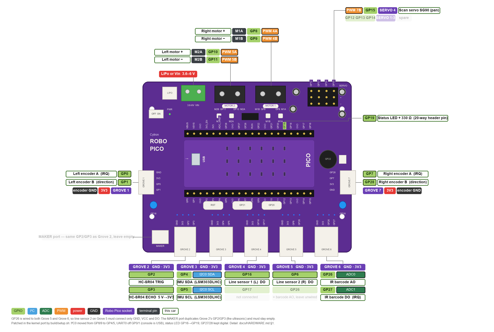

# Hardware and Driver Setup Guide

Autonomous robotic car, Raspberry Pi Pico W on a Cytron Robo Pico carrier,
running µT-Kernel 3.0 from the `mtk3smp-rp2040` port.

Everything below is checked against the datasheets in `OKY3231-2.zip` and
against the port's own source, not against a generic Pico tutorial. Where the
port disagrees with what you would expect from the Pico SDK, that is called
out.

---

## 1. Read this first: five things that will cost you a day each

These are not edge cases. Each one is a conflict you will hit in the first
week if nobody tells you.

### 1.1 The IMU has no gyroscope

The `OKY3231-2` part is a **GY-511 / LSM303DLHC**: a 3-axis accelerometer and
a 3-axis magnetometer, on two separate dice with two separate I²C addresses.
There is no gyro on this board.

Three of Buddy 4's listed tasks assume one:

| Task in the brief | What you actually have to do |
|---|---|
| Tilt detection | Derive from the gravity vector in the accelerometer |
| Turn-rate monitoring | Use the encoder difference from Buddy 2. The magnetometer will read heading, but the motors sit centimetres away and will swamp it |
| Peak hump measurement | Do **not** double-integrate acceleration. Over a two-second climb the bias drift exceeds the hump height. Estimate peak pitch and convert with the wheelbase |

`sub_terrain.c` implements the pitch-and-wheelbase approach and documents the
trade-off. Validate it against a ruler on three known humps and quote the
error in your terrain analysis report.

### 1.2 The stock port claims the wrong pins at boot

> **All of §1.2, §1.3 and §1.5 are applied for you by `build/setup.sh`**
> (it runs `build/patch_port.py` against the kernel submodule). You do not
> edit the port by hand. This section explains *what* the script changes and
> why, so you can recognise the symptoms if it ever hasn't run.

The port sets up pins in two places, and both default to pins this car uses
for something else:

- `kernel/sysdepend/pico_rp2040/hw_setting.c` has a boot-time pin table that
  muxes **GP0/GP1 to UART0**, **GP8/GP9 to I²C0** (on Robo Pico those are
  **M1A and M1B**, the right motor) and parks **GP26/GP27/GP28** as analogue
  inputs with their digital input buffers switched off.
- `device/i2c/sysdepend/rp2040/i2c_rp2040.c` repeats the **I²C0 → GP8/GP9**
  mux when the driver is registered (`DEVCNF_I2C_SETPINFUNC`). Unit 1 would
  use GP6/GP7, but the port only ever registers unit 0, so it never runs.

The IMU lives on **Grove 3 (GP4 / GP5)**. In RP2040 silicon GP4 can only be
`I2C0 SDA` and GP5 only `I2C0 SCL` — the function is fixed per pin, not
configurable — so the IMU is on **unit 0**, opened as `"iica"`. The script
re-pins **both** places from GP8/GP9 to GP4/GP5, drops the GP0/GP1 UART mux
(the left encoder lives there, §1.5), and drops the GP27/GP28 analogue
parking (barcode DO and right-encoder B are digital inputs; only GP26 stays
analogue).

Wire **SDA → GP4** and **SCL → GP5**. Getting these the other way round is
the most common reason an I²C device never answers.

### 1.3 The liveness LED default sits on a pin you need

The port defaults `BOARD_LED_PIN` to **GP16**, which is half of Grove 4 and
which this framework uses for line sensor 1. You cannot fall back to the
Pico W's on-board LED, because it hangs off the CYW43439 radio rather than an
RP2040 pin.

Fix (applied by `build/setup.sh`): `BOARD_LED_PIN` in
`include/sys/sysdepend/pico_rp2040/sysdef.h` becomes **GP19** (matching
`RC_PIN_STATUS_LED`). Wire an external LED with a series resistor there.

### 1.4 The kernel's physical timer is built on the PWM block

`INTNO_PTIM` is `INTNO_PWM`, and `StartPhysicalTimer` claims a PWM *slice*.
Any slice used for motors or servos is therefore unavailable as a physical
timer.

- Slice 4 (GP8/GP9): right motor (MOTOR 1)
- Slice 5 (GP10/GP11): left motor (MOTOR 2)
- Slice 7 (GP14/GP15): scan servo on GP15

Slices 0–3 and 6 remain free. This framework does not use `StartPhysicalTimer`
at all; it uses the RP2040 **TIMER** block's alarms instead, which are
untouched by the kernel.

### 1.5 The console must be USB, not UART

GP0/GP1 are the port's default UART0 console **and** the left encoder's A/B
channels. A UART build drives GP0 as TX and the encoder never counts. Three
things together keep UART0 off those pins, and `build/setup.sh` /
`build/build.sh` do all three:

1. The image is built with `CONSOLE=usb_cdc`, so `tm_printf` and the console
   telemetry sink come out of the Pico's own USB port.
2. `config/config_tm.h` gets `TM_CONSOLE_UART 0`. The port otherwise keeps
   UART0 alive **even in a USB build** as an early-boot/panic mirror, which
   would still transmit on GP0.
3. `config/config_device.h` gets `DEVCNF_USE_SER 0`, so the `"sera"` UART
   device driver is not registered at all, and the boot pin table no longer
   muxes GP0/GP1 to UART (§1.2).

Confirm after the first boot that GP0 is not being driven: with the motor
off, `drv_encoder_count(RC_SIDE_LEFT)` must stay at zero.

---

## 2. Pin map



The Robo Pico drawn as it is on the bench — motor terminals and servo header
along the top, Grove 1 on the left edge, Grove 7 on the right edge, Grove 2–6
along the bottom, the Pico socket and its two 20-way headers in the middle —
with poster-style chips fanning out from every connector this car uses: the
GPIO number, the function in use (I²C / ADC / PWM) and the device on that
socket. Faded chips are parts of the board this car does not use.


Board-level view of the same wiring, for when you are holding the board and
want to know which socket a device goes into: Grove 1 on the left edge,
Grove 7 on the right edge, Grove 2–6 along the bottom, motor terminals and
the four-way servo header along the top.

Both are generated — edit the scripts, never the PNGs, then re-run:

| Script | Output | Copy for the design review |
|---|---|---|
| `docs/img/hw/gen_pin_map.py` | `robopico_pin_map.png` | `documents/week6_diagrams/d2_pin_layout.png` |
| `docs/img/hw/gen_board_view.py` | `robopico_board_view.png` | `documents/week6_diagrams/d2b_board_view.png` |

Slice number is `(GPIO >> 1) & 7`. Grove port numbers are from the Robo Pico
datasheet.

| GPIO | Use | Owner | Fixed? | Notes |
|---|---|---|---|---|
| GP0 | Left encoder A | Buddy 2 | chosen | Grove 1. Edge interrupt. Also UART0 TX — see §1.5 |
| GP1 | Left encoder B | Buddy 2 | chosen | Grove 1. Sampled for direction |
| GP2 | Ultrasonic TRIG | Buddy 5 | chosen | Grove 2 |
| GP3 | Ultrasonic ECHO | Buddy 5 | chosen | Grove 2. **Needs a divider**, see §4.5 |
| GP4 | I²C0 SDA → IMU | Buddy 4 | chosen | Grove 3, after the §1.2 patch |
| GP5 | I²C0 SCL → IMU | Buddy 4 | chosen | Grove 3 |
| GP6 | IR line sensor 2, right (DOUT) | Buddy 3 | chosen | Grove 5 pin 1. **Connect DO only**, see the note below |
| GP7 | Right encoder A | Buddy 2 | chosen | Grove 7. Edge interrupt |
| GP8 | Motor M1A — right wheel | Buddy 2 | **board** | Slice 4A |
| GP9 | Motor M1B — right wheel | Buddy 2 | **board** | Slice 4B |
| GP10 | Motor M2A — left wheel | Buddy 2 | **board** | Slice 5A |
| GP11 | Motor M2B — left wheel | Buddy 2 | **board** | Slice 5B |
| GP12, GP13, GP14 | Servo ports 1, 2, 3 | — | **board** | Unused |
| GP15 | Scan servo | Buddy 5 | **board** | Servo port 4, slice 7B |
| GP16 | IR line sensor 1, left (DOUT) | Buddy 3 | chosen | Grove 4 pin 1. See §1.3 |
| GP17 | — | — | — | Grove 4 pin 2, unused |
| GP18 | NeoPixel | — | **board** | Unused |
| GP19 | Status LED | shared | chosen | Breakout header. External LED + resistor |
| GP20, GP21 | Buttons | — | **board** | Unused |
| GP22 | Piezo buzzer | — | **board** | Unused |
| GP23, GP24, GP25, GP29 | **Radio reserved** | — | **board** | CYW43439. Do not touch |
| GP26 | IR barcode, AOUT | Buddy 3 | chosen | ADC0. Grove 6 pin 1 — and Grove 5 pin 2 |
| GP27 | IR barcode, DOUT | Buddy 3 | chosen | Grove 6 pin 2. Edge interrupt |
| GP28 | Right encoder B | Buddy 2 | chosen | Grove 7. Sampled for direction |

> **GP26 is on two sockets.** The Robo Pico routes GP26 to Grove 6 pin 1 *and*
> Grove 5 pin 2. Line sensor 2 sits on Grove 5 and the barcode sensor on
> Grove 6, so on Grove 5 connect only the line sensor's **DO** wire (to GP6)
> and leave its **AO** pin unconnected — otherwise the two sensors' analogue
> outputs are shorted together on GP26. Verify against the silkscreen on your
> own board before cabling.

Everything above is defined in one place, `core/rc_config.h`. No other file
hard-codes a GPIO number.

---

## 3. Power

| Item | Value |
|---|---|
| Input range (Vin, LiPo or USB) | 3.6 – 6 V |
| Total +3V3 available to Grove ports | 300 mA |
| Motor voltage at full speed | equals the supply voltage |

Two consequences worth planning around:

1. **The HC-SR04 wants 5 V.** On a single-cell LiPo the rail is 3.7–4.2 V.
   Most HC-SR04 modules work down to about 3.3 V with reduced range; if yours
   does not, feed it from USB 5 V during bench testing and accept a shorter
   range on battery, or fit a boost module.
2. **The servo and the motors share the supply.** A servo step during a
   motor-current spike can brown out the Pico. `drv_servo_release()` exists so
   you can stop driving the servo when it is not scanning. If you still see
   resets, add a bulk capacitor (470 µF or more) across the servo supply.

---

## 4. Per-buddy hardware, wiring and drivers

### 4.1 Buddy 1 — WiFi, command and telemetry

**Hardware:** none beyond the Pico W's built-in CYW43439.

**The problem you need to know about up front.** The port's own
`docs/PORT_RP2040.md` is explicit:

- WiFi and lwIP (DHCP, DNS, UDP, TCP) exist as `WIFI_*` build knobs, are
  described as a **development profile**, and are **not part of the qualified
  release**. Association, DHCP and a repeating 64-packet UDP echo have run on
  hardware; static addressing and TCP have had less exposure.
- **No MQTT client ships.** MQTT is listed under "Not ported", with the note
  that transports are present and anything layered on top is left as an
  exercise.

So if you write the telemetry subsystem directly against an MQTT client, you
have nothing to demo until that client exists. `sub_telemetry.h` puts the
transport behind a `sub_telemetry_sink_t` interface instead, so the framing,
topic design, message structures and publish scheduling all work today over
the console sink.

**Recommended order:**

1. **Console sink** (shipped). Gives you a working telemetry framework on day
   one and lets the other four buddies see their data.
2. **UDP sink.** Uses the port's lwIP UDP profile, which is the best-tested
   network path it has. Enable the `WIFI_*` build knobs, put credentials in
   `config/wifi_credentials.h` (copy the `.example.h`), and point it at a
   `netcat` listener on your laptop.
3. **MQTT sink.** Bring in a client. lwIP's own `apps/` sources are in the
   Pico SDK checkout, and `LWIP_ALTCP` in `lib/libnet/lwip/include/lwipopts.h`
   is the switch some of them need.

**Drivers required:** `lib/libwifi` (CYW43439 bring-up, in the port),
`lib/libnet/lwip` (in the port), an MQTT client (you supply).

**Ownership rule that will bite you:** the CYW43439 PIO-SPI, DMA, pins and
state are owned by **processor 1** (physical core 0). Its service task must be
pinned `TP_PRC1`. Other tasks may only read its published status. Same for
TinyUSB: any task may call `tm_printf`, but nothing may call TinyUSB directly.

**The console is USB, not UART.** GP0/GP1 belong to the left encoder (§1.5),
so the console sink and every `tm_printf` come out of the Pico's own USB port
via TinyUSB. No USB-serial adapter and no Grove port is used for the console.

---

### 4.2 Buddy 2 — Motion control

**Hardware:** 2 × DC gear motors into the Robo Pico terminals, 2 × two-channel
(A/B) encoders.

**Wiring:**

| Signal | Pin | Note |
|---|---|---|
| Left motor | M2 terminal | M2A = GP10, M2B = GP11 |
| Right motor | M1 terminal | M1A = GP8, M1B = GP9 |
| Left encoder A / B | GP0 / GP1 | Grove 1: GND, 3V3, A, B — one cable |
| Right encoder A / B | GP7 / GP28 | Grove 7: GND, 3V3, A, B — one cable |

Each encoder's four wires map straight onto a Grove socket: GND to GND, VCC to
3V3, A to the first signal pin, B to the second. Because GP0/GP1 are also the
port's UART0, the build **must** be `CONSOLE=usb_cdc` (§1.5).

Robo Pico uses **two PWM pins per motor**, not PWM-plus-direction. Forward is
PWM on MxA with MxB low; reverse swaps them; brake is both high; coast is both
low. `drv_motor.c` handles this. Actual direction depends on how you wired the
motor terminals — if a wheel spins backwards, swap that motor's two wires
rather than adding a sign in software.

**Direction comes from channel B.** A raises the edge interrupt and is
counted; B is sampled inside that interrupt. At the instant A rises, B is low
in one direction and high in the other, so `drv_encoder.c` reads the true
direction from the wheel — including while it is still coasting after a
reversal. Which sense is "forward" depends on how the encoder is mounted: if
`drv_encoder_speed_mm_s()` reads negative while the car drives forward, swap
that encoder's A and B wires rather than adding a sign in software.

**Drivers required:** `rc_pwm` (in this tree, adds the missing clock divider),
`rc_gpioirq` (in this tree). No kernel device driver.

**Setup and calibration, in order:**

1. Measure your wheel diameter and slot count. Set `RC_WHEEL_DIAM_MM`,
   `RC_ENC_SLOTS_PER_REV` and `RC_WHEEL_BASE_MM` in `rc_config.h`.
2. Wheels off the ground. Command a fixed duty, log `drv_encoder_speed_mm_s`,
   and confirm it is stable, roughly linear in duty, and **positive** for a
   forward command on both sides. Negative on one side means that encoder's
   A and B are swapped.
3. Tune the PID gains in `sub_motion_init()`. The shipped values are
   placeholders. Record the step responses — that is your PID tuning report.
4. On the ground: command `sub_motion_forward_mm(1000)` ten times, measure
   with a tape, and fold the average error into `RC_ENC_UM_PER_TICK`.
5. Calibrate turns the same way. Expect the measured turn to fall **short** of
   the geometric one because of slip. Apply a correction factor rather than
   trusting the geometry.

---

### 4.3 Buddy 3 — IR line following and barcode

**Hardware:** 3 × MH-Sensor-Series reflective IR modules (TCRT5000 + LM393;
the Waveshare ST188 board is pin-compatible). Two watch the line, one reads
barcodes. Each module has four pins: VCC, GND, DO (digital) and AO (analogue).

**Wiring:**

| Sensor | Socket | DO | AO | Note |
|---|---|---|---|---|
| Line 1, left | Grove 4 | GP16 | leave unconnected | Digital, polled at 200 Hz |
| Line 2, right | Grove 5 | GP6 | **must be unconnected** | Digital, polled at 200 Hz |
| Barcode | Grove 6 | GP27 | GP26 (ADC0) | DO is edge-interrupt driven, AO is for calibration |

> **Line 2's AO must stay unconnected.** Grove 5's second signal pin is GP26,
> which is the barcode sensor's AO on Grove 6. If you plug all four wires of
> line sensor 2 into Grove 5, its analogue output is shorted onto the barcode
> sensor's analogue output and neither reads correctly. Wire GND, VCC and DO
> only.

Each module has a **trim pot** setting the LM393 comparator threshold, and
exposes the raw divider on AO. Only the barcode sensor's AO is wired to an ADC
pin, so `drv_ir_read_raw()` works for that channel alone; calibrate the line
sensors by watching DO flip.

**Polarity warning.** On the Waveshare board, DOUT goes **LOW** over a
reflective (white) surface and **HIGH** over a non-reflective (black) one, so
HIGH means on-line. `IR_ACTIVE_HIGH` at the top of `drv_ir.c` controls this.
Getting it backwards is the single most common cause of a car that
confidently drives off the table.

**Calibration:**

1. Hold the barcode sensor over white track. Read AO with `drv_ir_read_raw()`.
2. Hold it over the black line. Read again.
3. Set the trim pot so DO flips at roughly the midpoint of the two. For the
   two line sensors, which have no ADC, turn the pot until DO flips cleanly
   as you slide the sensor across the line edge.
4. Repeat under the lighting you will actually demo in. IR ambient from
   fluorescent tubes and sunlight are very different.

**Why the barcode sensor is interrupt-driven and the line sensors are not.**
At 200 Hz a poll is cheaper than an interrupt, and line timing does not need
to be tight. Barcode is the opposite: bar widths at speed are tens of
milliseconds, and what carries the data is the **ratio** between wide and
narrow bars, not the absolute width. So each transition needs a microsecond
stamp. `drv_ir.c` publishes a width with every edge, and `sub_barcode.c`
decodes purely in ratios — which is what makes it speed-independent, and what
the brief means by "robust operation at varying speeds".

**Drivers required:** `rc_gpioirq` (in this tree), `device/adc` (the port's
ADC driver, opened as `"adca"`, channel number passed as the read start
position).

**Known gap:** the Code 39 pattern table in `sub_barcode.c` has real values
for `*` and `A` only. `B`, `C` and `D` are marked `TODO` placeholders. Fill
them from a Code 39 reference before you test decoding.

---

### 4.4 Buddy 4 — IMU and terrain

**Hardware:** GY-511 (LSM303DLHC) breakout.

**Wiring:** Grove 3, on I²C0 after the §1.2 patch. **SDA → GP4, SCL → GP5**,
VIN → 3V3, GND → GND. The module accepts 3–5 V. Leave INT1, INT2 and DRDY
unconnected — the driver polls at 100 Hz and never uses them.

| Die | I²C address |
|---|---|
| Accelerometer | `0x19` |
| Magnetometer | `0x1E` |

Two register-level traps that catch nearly everyone:

- The **accelerometer** is little-endian and **left-justified**: the 12-bit
  result sits in the top bits, so shift down by 4. Multi-byte reads need the
  MSB of the sub-address set (`0x80`) for auto-increment.
- The **magnetometer** is **big-endian**, and the axis order in the register
  block is **X, Z, Y** — not X, Y, Z.

`drv_imu.c` handles both.

**Drivers required:** `device/i2c` (the port's driver, opened as `"iica"` for
unit 0), patched per §1.2.

**Setup:**

1. Configure `A_CTRL_REG1 = 0x57` (100 Hz, all axes) and
   `A_CTRL_REG4 = 0x08` (±2 g, high resolution). At ±2 g one LSB is about
   1 mg, which is the resolution hump detection needs.
2. Mount the board **rigidly**. A breakout on a wobbly standoff will register
   its own vibration as terrain.
3. Run `drv_imu_calibrate(100)` with the car level and still. This zeroes X
   and Y and stores the deviation of Z from 1 g.
4. Set your hump thresholds empirically: drive hard on flat ground, log the
   pitch, and set `PITCH_ENTER_DDEG` in `sub_terrain.c` above the peak you see
   there. Cornering and braking both tilt the car.

---

### 4.5 Buddy 5 — Ultrasonic scanning and obstacle avoidance

**Hardware:** HC-SR04 + one RC servo (SG90 class) on a pan bracket.

**Wiring:**

| Signal | Pin | Note |
|---|---|---|
| Servo | GP15 | Robo Pico servo port 4 |
| TRIG | GP2 | Grove 2 |
| ECHO | GP3 | Grove 2, **through a divider** |
| VCC / GND | 3V3 / GND | Grove 2 |

> **ECHO is a 5 V output and the RP2040 is not 5 V tolerant.** Do not connect
> it directly. Use a divider: 1 kΩ from ECHO to GP3, 2 kΩ from GP3 to GND.
> That gives 3.33 V at the pin. A level shifter works too. Skipping this is
> the fastest way to destroy a Pico on this project.

From the datasheet: TRIG needs a pulse of **at least 10 µs**; the module then
sends eight 40 kHz bursts and holds ECHO high for the round-trip time. Range
is 2 cm to 4 m, beam width about 15°, and accuracy about 3 mm.

That 15° beam width is the real limit on obstacle profiling. Below about 15°
of angular separation the sensor cannot tell two bearings apart, so
`RC_SCAN_FINE_STEP` of 6° is oversampling the beam — useful for smoothing,
not for genuinely finer resolution. Say so in your report rather than claiming
6° accuracy.

**Drivers required:** `rc_pwm` and `rc_gpioirq` (this tree). Two RP2040 TIMER
alarm interrupts (IRQ 1 and IRQ 2), claimed directly in
`drv_ultrasonic.c` — these are unused by the kernel, which was verified
against the port source.

**Why the driver looks the way it does.** The usual Arduino approach:

```c
digitalWrite(TRIG, HIGH); delayMicroseconds(10);
digitalWrite(TRIG, LOW);  pulseIn(ECHO, HIGH);
```

Both of those are busy-waits, and `pulseIn` holds the CPU for up to 30 ms when
nothing echoes back. On a car running a 50 Hz PID loop that is a missed
control update and a visible swerve. `drv_ultrasonic.c` instead spreads one
measurement across five interrupts and costs a few microseconds of CPU:

| Step | What happens |
|---|---|
| `ping()` | Raise TRIG, arm TIMER alarm 1 for +12 µs, return |
| Alarm 1 ISR | Drop TRIG, unmask the ECHO edge, arm alarm 2 as the timeout |
| ECHO rise ISR | Stamp the start |
| ECHO fall ISR | Compute width, publish the result |
| Alarm 2 ISR | Publish an invalid result if no echo came back |

The 30 ms of flight time costs nothing.

**Setup:**

1. Centre the servo mechanically at 90° before you bolt the bracket on.
2. Measure `drv_servo_settle_ms`'s constants for your servo. They dominate
   total scan time — a full coarse scan is roughly 5 × (travel + 30 ms).
3. Set `CAR_WIDTH_MM` in `sub_scan.c` from your car's widest point plus
   40 mm of margin.

---

## 5. Build and flash

The kernel port is a git submodule at `external/mtk3smp-rp2040`, pinned to a
known commit so everyone builds the same kernel. Three scripts in `build/`
wrap the port's own `make` tree:

```sh
git clone --recurse-submodules <this repo>     # or: git submodule update --init
./build/setup.sh          # patch the port (§1) and install the app makefile hook
./build/build.sh          # single core  -> build/out/mtk3pico_smp0_usb_cdc.uf2
./build/build.sh smp      # dual core    -> build/out/mtk3pico_smp1_usb_cdc.uf2
./build/flash.sh          # picotool load, with the Pico in BOOTSEL mode
```

Hold **BOOTSEL** while plugging in the Pico, then either run `flash.sh` or copy
the `.uf2` from `build/out/` to the `RPI-RP2` drive.

**How the pieces fit.** The port compiles `$(wildcard ../app_program/*.c)` —
one flat directory — so it cannot see `core/`, `drivers/`, `subsystems/` and
`app/` on its own. `build/robocar.mk` is a replacement for the port's
`build_make/mtkernel_3/app_program/subdir.mk` that points the same compile
rule at those four directories (three levels up, in this repo) and adds
`device/include` to their include path, which the port's own `INCPATH` omits.
`setup.sh` copies it into place; the port's demo `app_program/` is then simply
not compiled, and `app/app_main.c`'s `usermain()` overrides the kernel's weak
default. `build.sh` always passes `CONSOLE=usb_cdc` (§1.5), finds the
toolchain and Pico SDK under `~/.pico-sdk` when the VS Code Pico extension put
them there, and converts the `.elf` with `picotool` instead of the port's
`elf2uf2`, which would need a host `g++`.

**Tools:** `arm-none-eabi-gcc` (13.2.1 or newer; 15.2 verified), GNU `make`
(Windows: `winget install ezwinports.make`, then reopen Git Bash), the Pico
SDK (for TinyUSB only — not its CMake build), and `picotool`. The VS Code
Raspberry Pi Pico extension installs all but `make`.

**After `git submodule update`** (the pinned commit changed), run `setup.sh`
again — it re-applies the patches and re-installs the hook, and is safe to run
any number of times. `.gitmodules` marks the submodule `ignore = dirty` so the
patched files don't show as changes in `git status`.

Verified clean: both profiles build with 0 warnings (SMP=0: 62,784 B text,
20,892 B bss).

**Start on `SMP=0`.** Get the car working on one core first. The single-core
build is the port's default and its conservative profile, and every bug you
hit will be your bug rather than a cross-core one.

---

## 6. SMP rules, if you go dual-core

Taken from the port's `PORT_RP2040.md`. These are qualification boundaries,
not tuning advice.

1. **SIO hardware spinlocks 0–2 are kernel-reserved.** Do not claim them.
2. **A shared peripheral IRQ must have one owner core.** `rc_gpioirq.c`
   enables IO_IRQ_BANK0 in core 0's NVIC only, so all GPIO handlers run on
   processor 1. Keep it that way.
3. **Publish shared data before making another core observe it.** `volatile`
   alone is not inter-core synchronisation; use the port's atomics.
4. **Treat UART, I²C, ADC, DMA and PWM as single-owner resources.** Only the
   monitor USB transmit path is qualified for concurrent cross-core use.
5. **Task-to-processor assignment is static.** There is no dynamic affinity.
6. **There is no FPU.** Every calculation in this tree is integer or fixed
   point, deliberately. A soft-float `atan2` at 100 Hz would cost thousands of
   cycles.

A reasonable split if you do go SMP: pin the radio and telemetry to processor
1 (mandatory for the radio anyway) and let the control tasks migrate.

---

## 7. Bring-up order

Do not wire everything and flash once. In this order, each step is testable on
its own:

Each step has a bench image that runs only that piece and prints its
readings: `./build/build.sh bench=<name>` (see `app/app_bench.h` and
TEAM_GUIDE.md §0.8).

| Step | Bench | Test | Pass condition |
|---|---|---|---|
| 1 | any | Blink GP19 | LED blinks at 1 Hz |
| 2 | any | `tm_printf` over USB | Text appears on the Pico's USB serial port |
| 3 | `motion` | Motors, open loop | Both wheels spin the right way at a fixed duty |
| 4 | `motion` | Encoders | Counts rise smoothly, no bursts (that is bounce — raise `DEBOUNCE_US`); speed is positive on both sides when driven forward (else swap A/B) |
| 5 | `motion` | Closed-loop speed | Commanded mm/s matches measured within 10 % |
| 6 | `line` | IR sensors | DO flips crossing the line; the barcode AO differs clearly black vs white |
| 7 | `follow` | Line following | Car tracks a straight line, then a curve |
| 8 | `scan` | Servo | Sweeps 30° to 150° without buzzing at the ends |
| 9 | `ultra` | Ultrasonic | Range matches a tape measure at 100, 300, 1000 mm |
| 10 | `scan` | Scan | A full coarse scan completes and the PID loop keeps running through it |
| 11 | `imu` | IMU | Pitch reads ~0 level, positive nose-up |
| 12 | `imu` | Hump | Peak estimate within 20 % of a ruler on a known hump |
| 13 | `barcode` | Barcode | Consistent decode of one symbol at two different speeds |
| 14 | `telemetry` | Telemetry, console | Messages at 4 Hz with no dropped-event counts |
| 15 | `telemetry` | Telemetry, network | Same messages arriving on your laptop |
| 16 | mission | Full mission | End to end |

Steps 1–7 are the critical path. Everything else can proceed in parallel once
the car drives.

---

## 8. Parts checklist

| Item | Qty | Notes |
|---|---|---|
| Raspberry Pi Pico W | 1 | GP23/24/25/29 reserved by the radio |
| Cytron Robo Pico | 1 | Motor driver, servo ports, Grove breakouts |
| DC gear motors + wheels | 2 | |
| Wheel encoders, two-channel A/B | 2 | Left on Grove 1, right on Grove 7 |
| MH-Sensor-Series IR module (TCRT5000 + LM393) | 3 | 2 line + 1 barcode |
| HC-SR04 | 1 | Needs a 5 V supply and a divider on ECHO |
| SG90-class servo + pan bracket | 1 | |
| GY-511 / LSM303DLHC | 1 | Accel + mag, **no gyro** |
| 1 kΩ and 2 kΩ resistors | 1 each | ECHO divider |
| LED + 330 Ω resistor | 1 | Liveness on GP19 |
| Single-cell LiPo | 1 | 3.6–6 V input range |
| Bulk capacitor, 470 µF+ | 1 | Servo supply, if you see brownouts |
| Grove cables | 7 | One per Grove socket 1–7; Grove 5 with the AO wire left off |
