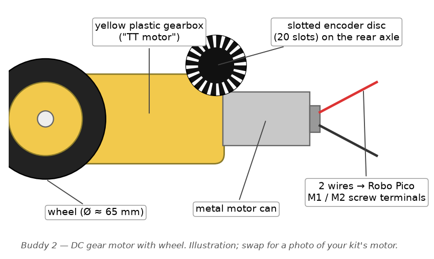
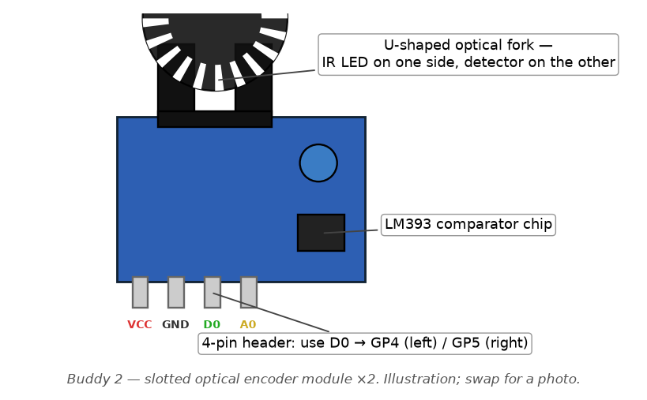

# Buddy 2 — Motion Control (PID, Odometry, Movement)

> Your part of the team guide. The shared picture — the event bus (§1.2),
> the non-blocking rule (§1.3), start-up and the mission state machine
> (§2.1–2.2), the `core/` toolbox (§2.3) and the shared hardware (§3) — is
> in [`TEAM_GUIDE.md`](../../TEAM_GUIDE.md); every `§` below points there.
> Installing, building, flashing and testing is [`BUILD.md`](../../BUILD.md).
>
> The TT motor and the encoder have no formal datasheet; the Robo Pico
> motor-driver details are in [`docs/Robo_Pico.pdf`](../Robo_Pico.pdf).

**Files:** `subsystems/sub_motion.c` / `.h`, `drivers/drv_motor.c` / `.h`,
`drivers/drv_encoder.c` / `.h`

## Your hardware — wiring, pin by pin

**DC gear motor + wheel (×2).** The classic yellow "TT motor": a yellow
plastic gearbox with a silver motor can on the back and two wires. Each one
screws into a Robo Pico motor terminal (**left wheel → MOTOR 2, right wheel
→ MOTOR 1**). The Robo Pico drives each motor with two PWM pins, so
"forward", "reverse" and "brake" are all done in `drv_motor.c` by choosing
which pin gets the duty.

**Wheel encoder, two-channel (×2).** Sits on the motor's rear axle and gives
two pulse outputs, `A` and `B`, that are the same train of pulses shifted by
a quarter of a step. Every step of the wheel gives one pulse on `A` → speed
and distance in `drv_encoder.c`. Because `B` is shifted, whether `B` is low
or high at the instant `A` rises tells you which way the wheel is turning —
so direction is *measured*, not guessed. Four wires: `VCC`, `GND`, `A`, `B`
— exactly one Grove cable.

 

**How to read a Grove socket.** Every Grove socket on the Robo Pico has
four pins, printed on the board in this order: `GND`, `3V3`, then the two
GPIO numbers. A standard Grove cable's wires are colour-coded — **black =
GND, red = 3V3, white = the first GPIO printed, yellow = the second** — but
don't trust colours blindly: hold the cable against the socket and read
which printed label each wire lands on. With a Grove-to-jumper (Dupont)
cable, the four loose ends are what you push onto the sensor's header pins.

**Motors** — loosen the two screws on the terminal, push one motor wire
into each hole, tighten. There is no "right way round": if a wheel spins
backwards in the `motion` bench, swap that motor's two wires.

| Motor | Robo Pico terminal | Pins behind it | In the code |
|---|---|---|---|
| Left wheel | **MOTOR 2** (the left of the two black terminals) | M2A = GP10, M2B = GP11 | `RC_PIN_MOTOR_L_A/B` |
| Right wheel | **MOTOR 1** (the right one, nearer the servo header) | M1A = GP8, M1B = GP9 | `RC_PIN_MOTOR_R_A/B` |

**Encoders** — one Grove cable each. The encoder's pins may be labelled
`A`/`B`, `C1`/`C2` or `OUT A`/`OUT B`; the first is A.

| Encoder pin | Left encoder → **Grove 1** (left edge of the board) | Right encoder → **Grove 7** (right edge) |
|---|---|---|
| `VCC` (red) | `3V3` | `3V3` |
| `GND` (black) | `GND` | `GND` |
| `A` (white) | `GP0` | `GP7` |
| `B` (yellow) | `GP1` | `GP28` |

Then check with the `motion` bench (`BUILD.md` §5.2): both speeds must read
**positive** when the car is driven forward. A negative one means that
encoder's A and B are swapped — swap the wires, don't change the code.

**Why Grove 1 is special.** GP0/GP1 are also the pins the kernel would use
for a wired console. `build/setup.sh` turns that off; if the left encoder
ever counts nothing while the right one works, that patch hasn't been
applied — run the setup task again.

**How your files connect to the rest of the car** (see §2.3 for what
each `core/` file is)

Three layers, bottom to top. `drv_motor` only knows how to push power to
a wheel; `drv_encoder` only knows how to count clicks; `sub_motion` is the
brain that reads the clicks, decides the power, and tells everyone else
what happened.

| Your file | Talks to | Through | In plain terms |
|---|---|---|---|
| `drv_motor.c` | `core/rc_pwm` | `rc_pwm_init_pin(pin, 20000)`, `rc_pwm_set_duty(pin, permille)` | "Set this wheel's dimmer to 40 %." Two pins per motor (GP8/9, GP10/11): drive A for forward, B for reverse, both high to brake. |
| `drv_encoder.c` | `core/rc_gpioirq` | `rc_gpioirq_attach(GP0/GP7, RC_EDGE_RISE, …)` | "Ring `encoder_isr` on every rising edge of channel A." Channel B (GP1/GP28) is a plain input the ISR reads for direction. |
| `drv_encoder.c` | `core/rc_time` | `rc_time_us()` inside the ISR | Stamps each click so the gap between clicks gives speed. |
| `drv_encoder.c` | `core/rc_defer` | `rc_defer_register(encoder_drain)`, `rc_defer_signal_i()` | The ISR only counts and rings the bell; `encoder_drain` does the arithmetic in task context. |
| `drv_encoder.c` | `core/rc_event` | `rc_event_publish(RC_EVT_ENCODER_EDGE)` | Lets anyone (telemetry, debugging) watch raw clicks. |
| `sub_motion.c` | `drv_encoder.c` | `drv_encoder_speed_mm_s()`, `drv_encoder_distance_mm()` | Actual speed and distance for the PID and for "have I gone 300 mm yet?". |
| `sub_motion.c` | `drv_motor.c` | `drv_motor_set_pair(left, right)`, `drv_motor_stop()` | The PID's output goes here every 20 ms. |
| `sub_motion.c` | `core/rc_event` | `rc_event_publish(RC_EVT_ODOMETRY)`, `…(RC_EVT_MOTION_DONE)` | Every 20 ms: "here's my speed/distance". On finishing a move: "done" (also delivered as a direct callback to whoever asked). |
| `sub_motion.c` | `core/rc_config.h` | `RC_PERIOD_MOTION_MS`, `RC_PRI_MOTION`, `RC_ENC_UM_PER_TICK`, `RC_WHEEL_BASE_MM` | Loop rate, task priority, and the measured mechanics your maths depends on. |

Who calls *you*: `sub_line` (Buddy 3) calls `sub_motion_drive(base, steer)`
on every 5 ms line sample; `sub_nav` calls `sub_motion_forward_mm()` /
`sub_motion_turn_deg()` for barcode commands and bypass legs, and
`sub_motion_stop()` on faults. None of them touch `drv_motor` directly —
you own the wheels.

**What this module does**

This module is the car's legs and inner ear. It decides how much power to
send to the left and right wheel motors, and it listens to two little
wheel encoders that click every time the wheel turns a fixed amount — the
same idea as counting clicks on a bike's spoke card to know how fast and
how far you've gone — and, because each encoder has a second, offset
channel, can also tell which *way* the wheel is turning. That click-counting is called
**odometry**: turning "number of clicks" into "distance travelled" and
"current speed." Because motors never spin at exactly the speed you ask
for (battery sag, friction, floor grip all get in the way), this module
also runs **PID control** — think of a car's cruise control, which watches
your actual speed, compares it to the speed you want, and constantly
nudges the throttle up or down to close the gap. Every other module — line
following, obstacle avoidance — just says "go forward 300mm" or "steer
this much" and trusts this module to make the wheels do it.

**Run your module** — bench `motion`. The full procedure, what good output looks like and what each bad symptom means is in [`BUILD.md`](../../BUILD.md) §5.2. Short version, in VS Code: **Terminal → Run Task → RoboCar: build bench image…**, pick it from the list, put the Pico in BOOTSEL, **…flash bench image…**, then open the Serial Monitor. **Wheels off the ground** for phase 1.

**How to get started**

1. **Measure the hardware.** Measure your wheel diameter and count the
   slots on each encoder disc. Set `RC_WHEEL_DIAM_MM`,
   `RC_ENC_SLOTS_PER_REV`, and `RC_WHEEL_BASE_MM` (distance between the two
   wheels, needed for turning math) in `rc_config.h`.
2. **Sanity-check speed sensing.** Prop the car up with wheels off the
   ground, command a fixed motor duty (via `drv_motor_set`), and log
   `drv_encoder_speed_mm_s()`. Confirm the reading is stable and roughly
   proportional to duty before going further.
3. **Tune PID gains.** Open `sub_motion_init()` in `sub_motion.c` — the
   `pid_set_gains(&pid_l, 512, 64, 16)` calls are placeholder numbers, not
   tuned values. Adjust `kp`/`ki`/`kd`, run `sub_motion_forward_mm()`, and
   log the speed step response until it settles without overshooting or
   oscillating.
4. **Calibrate distance.** With wheels on the ground, run
   `sub_motion_forward_mm(1000)` ten times, measure the actual distance
   with a tape each time, and fold the average error into
   `RC_ENC_UM_PER_TICK` (micrometres of travel per encoder click).
5. **Calibrate turns.** Same repeated-trial process for
   `sub_motion_turn_deg()`. Expect the real turn to fall short of the math
   because wheels slip when spinning in place — apply a correction factor
   rather than trusting pure geometry.

**Code walkthrough**

This is a big module, so it's broken down file by file, and inside each
file, constant by constant and function by function — the same bar of
detail as "`#define STEER_KP (2)` — what it does, why, any links to other
code" that the rest of this walkthrough follows. Jargon is explained the
first time it comes up; skip ahead once you recognise a term.

## `drv_motor.h` / `drv_motor.c` — the "pure output" layer

This layer knows nothing about speed; it just turns electrical power on
and off in a direction. It never reads a sensor. Think of it as the gas
pedal and gearstick, with no speedometer attached — `sub_motion.c` below
is the part that actually watches the speedometer and decides how hard to
press.

**Jargon you need first:**
- **PWM (pulse-width modulation)** — the only way to get a variable
  "amount of power" out of a pin that can only be fully on or fully off.
  The pin is flipped on and off very fast (20,000 times a second here —
  `MOTOR_PWM_HZ`), and the *fraction* of each cycle spent "on" — the
  **duty cycle** — controls the average power delivered. It's the same
  trick as flicking a light switch faster than your eye can follow: flick
  it on 30% of the time and the bulb just looks dimmer, it doesn't
  visibly blink.
- **H-bridge** — the chip on the Robo Pico board that actually pushes
  current through the motor. It has four internal switches arranged so
  that, depending on which pair is turned on, current flows through the
  motor one way (forward) or the other (reverse). Robo Pico exposes that
  as *two* PWM pins per motor (`pin_a` and `pin_b`) instead of one PWM pin
  plus a separate direction wire — driving `pin_a` spins the motor one
  way, driving `pin_b` spins it the other way, and driving both at once
  would short the H-bridge, which the code goes out of its way to avoid.

**Constants:**
- `#define MOTOR_PWM_HZ (20000UL)` — the PWM switching frequency, 20 kHz.
  Chosen because it's above the top of human hearing (so the motor
  doesn't audibly whine at partial power, the way a slower PWM frequency
  would) and comfortably inside what the Robo Pico's output stage can
  switch cleanly. If your motors whine anyway, the comment right above it
  suggests dropping to 10 kHz.
- `#define DUTY_MAX (1000)` — the largest legal duty value in "permille"
  units (parts-per-thousand — this project's integer stand-in for a
  percentage with one extra digit of precision, used everywhere instead
  of a fractional 0.0–1.0 float, because the RP2040 has no FPU — no
  hardware floating-point unit, so real division of fractional numbers is
  slow/unsupported and the whole codebase avoids it — see `TEAM_GUIDE.md` §5 of the
  guide, "No floating point anywhere"). `drv_motor_set()` clamps every
  incoming duty to ±`DUTY_MAX` so nothing downstream can ever ask for more
  than 100% power.

**The `motor_t` struct** — one instance per motor, kept in the private
`motors[2]` array indexed by `rc_side_t` (`RC_SIDE_LEFT`/`RC_SIDE_RIGHT`):
`pin_a`/`pin_b` are which two GPIO pins drive this motor (numbers come
from `rc_config.h`, the one file all pin numbers live in — see `TEAM_GUIDE.md` §5);
`last` is the most recently commanded signed duty, kept purely so
`drv_motor_get()` can report it later to telemetry.

**Functions:**
- `drv_motor_init(void)` — boot-time setup. Loops over both motors,
  configures PWM on both of their pins at `MOTOR_PWM_HZ`, and sets duty to
  zero on all four pins so the car can't lurch the instant power comes on.
  Call once, before anything else in this module.
- `drv_motor_set(rc_side_t side, int16_t duty_permille)` — the lowest-level
  "make a wheel spin" call in the whole project. Clamps the requested
  duty into ±1000, then — this is the important bit — always drops the
  *opposite* pin to zero before raising the driving pin, so the H-bridge
  is never told to energize both directions at once (see the H-bridge
  explanation above). Positive `duty_permille` drives forward through
  `pin_a`; negative drives reverse through `pin_b`.
- `drv_motor_set_pair(int16_t left_permille, int16_t right_permille)` —
  convenience wrapper that calls `drv_motor_set()` twice. `sub_motion.c`
  uses this almost exclusively, since nearly every control decision
  updates both wheels together.
- `drv_motor_stop(rc_motor_stop_t mode)` — stops both wheels one of two
  ways, chosen by the `rc_motor_stop_t` enum (a **enum**, short for
  "enumeration," is just a named list of integer constants — using
  `RC_MOTOR_COAST`/`RC_MOTOR_BRAKE` instead of raw `0`/`1` makes the call
  site read like English instead of a magic number). `RC_MOTOR_COAST` cuts
  power entirely so the wheel free-spins down under its own friction;
  `RC_MOTOR_BRAKE` drives *both* pins of the H-bridge high at once, which
  intentionally shorts the motor windings together — that's an
  electrical brake, not a physical one, and it stops the wheel much
  faster than coasting.
- `drv_motor_get(rc_side_t side)` — returns whatever duty was last
  commanded (not a live measurement — just "what we last told it to do").
  Only telemetry reads it. Wheel direction is *measured* by the encoder's
  B channel (next section), so nothing needs to guess it from this.

## `drv_encoder.h` / `drv_encoder.c` — turning wheel clicks into speed and distance

Each wheel has an encoder on its axle with two outputs, `A` and `B`.
Every step of the wheel pulses `A`. This is exactly the trick behind
counting clicks on a bicycle's spoke card as the wheel spins — count
clicks per second and you know speed; count total clicks and (knowing how
far one click represents) you know distance travelled. That whole idea —
clicks in, distance/speed out — is what this codebase calls **odometry**,
and it's the numeric backbone this entire module (and Buddy 4's terrain
code, and telemetry) relies on.

`B` is the same pulse train shifted by a quarter of a step ("quadrature").
That shift is what gives you direction: at the exact instant `A` rises,
`B` is still low if the wheel turns one way and already high if it turns
the other. One extra pin read inside the interrupt, and direction is a
measurement instead of a guess.

**Jargon you need first:**
- **ISR (Interrupt Service Routine)** — a tiny function the processor
  jumps to *immediately* the instant a watched pin changes voltage,
  pausing whatever normal code was running, running the ISR, then
  resuming exactly where it left off. It exists so time-critical events
  (like "the wheel just clicked") get handled with microsecond precision
  instead of waiting for the next time some loop happens to check the pin.
  See TEAM_GUIDE.md §1.2 for the project-wide "golden rule" about what an
  ISR is and isn't allowed to do.
- **`volatile`** — a C keyword you'll see on every field of the `enc_t`
  struct below. It tells the compiler "this variable can change at any
  moment from outside the normal flow of this function (here: from an
  interrupt), so never assume a cached copy in a CPU register is still
  correct — always re-read it from memory." Without `volatile`, an
  optimizing compiler could quietly break this code by reusing a stale
  value.
- **Critical section (`DI`/`EI`)** — `DI(sts)` disables interrupts and
  saves the previous interrupt-enabled state into `sts`; `EI(sts)`
  restores it. Code between them can't be interrupted, which matters
  whenever it reads more than one `volatile` field that the ISR could
  update — without this, you could read a fresh timestamp paired with a
  stale period, a "torn read."
- **Debounce** — real slotted-opto sensors don't always switch cleanly;
  a slot edge moving slowly through the sensor can make the output
  flicker (bounce) a few times instead of switching once. "Debouncing"
  means ignoring any second edge that arrives suspiciously soon after the
  first, since it's almost certainly noise from the same physical slot,
  not a second slot.

**Constants:**
- `#define STALL_TIMEOUT_US (1000000UL)` — if a full second passes with
  no new edge on a wheel, `drv_encoder_period_us()` reports `0`
  ("stopped") instead of letting the "time since last edge" number keep
  growing forever, which would otherwise make a stationary wheel look
  like it's moving at an ever-decreasing crawl rather than not moving at
  all. One second is deliberately generous; tighten it once your car's
  slowest useful speed is known.
- `#define DEBOUNCE_US (500UL)` — the debounce window described above.
  The comment beside it shows the reasoning: at 20 slots per revolution
  and 600 RPM, slots are 5 ms apart, so rejecting anything closer than
  500 µs together has a wide safety margin without risking throwing away
  a real click.

**The `enc_t` struct** — one instance per wheel, in the private `encs[2]`
array: `count` is the running total of accepted clicks since boot
(monotonic — only ever increases); `last_us` is the timestamp of the most
recent accepted edge; `period_us` is the microsecond gap between the two
most recent accepted edges — this is what speed gets computed from;
`base_count` is a snapshot of `count` taken at the last
`drv_encoder_reset()`, so "distance since reset" is just
`count - base_count`; `published` is the `count` value already turned
into an event, so the bottom-half worker (below) doesn't re-publish
unchanged data every cycle; `dir` is +1 or −1, the direction read from
channel B on the most recent edge; `pin_a` is the channel-A GPIO that
raises the interrupt and `pin_b` the channel-B GPIO the ISR samples.
Every field except the two pins is `volatile`, because the ISR writes
them and normal code reads them (see jargon above).

**`encoder_isr(pin, level, t_us, ctx)`** — the actual interrupt handler,
attached to rising edges only (`drv_encoder_init`, below, explains why
"rising only" rather than both edges). `ctx` arrives as a generic
`void *` — an untyped pointer — and is cast back to `enc_t *`; this is
the standard C pattern for giving one shared handler function its own
per-instance data (here, "which wheel is this edge for") without writing
two nearly-identical handler functions. Inside, it does the absolute
minimum: compute the gap since the last accepted edge (`delta`), bail out
if that gap is smaller than `DEBOUNCE_US` (noise, ignore it), otherwise
read channel B once with `gpio_get_val(e->pin_b)` to set `dir`, record
the new timestamp, store the new period, increment `count`, and call
`rc_defer_signal_i(defer_h)` to wake the bottom-half task. That single
GPIO read is a register read, which the interrupt rule allows. It does
**not** build or publish an event itself — see TEAM_GUIDE.md §1.2's rule
that an ISR may only record state and hand off, never do real work,
because the two encoder pins, the ultrasonic echo pin, and the barcode
pin all share the same interrupt hardware bank; time spent in one ISR is
time another pin's edge is waiting to be noticed, and for the barcode
reader specifically, edge *timing* is the actual data being measured, so
delay there directly corrupts a reading.

**`encoder_drain(ctx)`** — the "bottom half" (deferred work), which runs
later in normal task context rather than inside the interrupt, so it's
safe to do more here, including publishing on the event bus. For each
wheel, it copies `count`/`period_us` out inside a `DI`/`EI` critical
section (see jargon above), skips publishing if nothing changed since the
last drain (`count == published`), and otherwise publishes an
`RC_EVT_ENCODER_EDGE` event carrying the current count and period. Note
this deliberately *coalesces* rapid edges — if three clicks arrive before
the drain task next runs, one event reports the latest state rather than
three separate events replaying each click — because downstream code
cares about "current count and period," not "receiving one event per
physical click," and coalescing keeps a fast-spinning wheel from flooding
the event bus.

**`drv_encoder_init(void)`** — boot-time setup: registers `encoder_drain`
as the deferred worker, zeroes every field of both `enc_t` structs, sets
each channel-B pin up as a plain pulled-up input (no interrupt — the ISR
reads it), and attaches `encoder_isr` to each channel-A pin for **rising
edges only**. The comment in the code explains why not both edges:
counting both edges would double the resolution, but the encoder's
"mark" and "space" aren't the same width, so the timing between a rising
and the next falling edge isn't the same as between two risings — mixing
them would make the period measurement (and therefore speed) noisy and
wrong.

**`drv_encoder_dir(side)`** — returns the `dir` the ISR last stored: +1
forward, −1 reverse.

**`drv_encoder_count(side)`** — raw lifetime click count for one wheel,
no unit conversion, never resets.

**`drv_encoder_period_us(side)`** — returns the microsecond gap between
the two most recent accepted edges on one wheel, reading both fields
inside a critical section (see jargon above) so they can't be torn apart
by an interrupt mid-read, and returns `0` if the wheel has been silent
longer than `STALL_TIMEOUT_US`.

**`drv_encoder_speed_mm_s(side)`** — the function the PID loop in
`sub_motion.c` reads every control cycle; this is the "actual speed" half
of the cruise-control comparison described under `sub_motion.c` below.
It converts the raw period into millimetres/second:
`speed = (RC_ENC_UM_PER_TICK * 1000UL) / period`. `RC_ENC_UM_PER_TICK`
(defined in `rc_config.h`, not owned by this module but central to it) is
how many micrometres of wheel travel one click represents, computed from
wheel circumference divided by slots-per-revolution
(`(31416 * RC_WHEEL_DIAM_MM) / (10 * RC_ENC_SLOTS_PER_REV)` — 31416 is
1000×π to three decimal places, again to stay in integers). Multiplying
by 1000 before dividing shifts the units from metres/second to
millimetres/second while the whole calculation stays in whole-number
(integer) arithmetic the entire way through — there's no FPU on this
chip, so a division can never be left half-finished as a fraction; it has
to land on a usable integer immediately. The sign comes from `dir`, the
direction channel B reported on the most recent edge — so a wheel that
is still coasting backwards after you command forward correctly reads
negative until it actually turns around. Which sense of B counts as
"forward" depends on how the encoder is mounted: if a wheel reads negative
while the car drives forward, swap that encoder's A and B wires rather
than negating in software.

**`drv_encoder_distance_mm(side)`** — `(count - base_count)` converted to
millimetres using the same `RC_ENC_UM_PER_TICK` constant. This is the
number `sub_motion.c`'s `MODE_DISTANCE` state watches every cycle to know
when a "drive forward 300 mm" move has actually covered 300 mm.

**`drv_encoder_reset(void)`** — snapshots the current lifetime count of
both wheels into `base_count`, inside a critical section. This does *not*
reset the lifetime `count` — it just moves the zero-point for
`drv_encoder_distance_mm()`, so each new move in `sub_motion.c` can
measure "how far did *this* move go" starting fresh from zero, called at
the top of `start_move()` below.

## `sub_motion.h` / `sub_motion.c` — the brain that ties it together

Where the previous two files only know "spin this hard" and "here's how
fast that wheel is currently going," this file is the layer that actually
decides *what* duty to send, moment to moment, to make the car do what
the rest of the team asked for — "drive forward 300 mm," "turn 90°,"
"drive with this much steering bias." The public API is non-blocking (see
§1.3 up top): calling `sub_motion_forward_mm(300, callback, ctx)` returns
immediately with a move ID while the car drives in the background on its
own RTOS task; when the move finishes, your callback fires and an
`RC_EVT_MOTION_DONE` event is published on the event bus for anyone else
listening.

**The `mode_t` enum** — the car's current "what am I doing right now"
state: `MODE_IDLE` (motors off, nothing queued), `MODE_DISTANCE` (driving
straight toward a distance goal under PID speed control),
`MODE_TURN` (turning toward a target angle — currently a stub, see the
TODO below), `MODE_CONTINUOUS` (open-ended drive+steer with no goal,
the mode the line follower uses almost the entire time the car is
running).

**The `pid_t` struct and PID gain constants** — before the struct itself,
two `#define`s that shape every number inside it:
- `#define PID_SCALE (256)` — since there's no FPU, a PID gain that
  "should" be something like `2.5` is instead stored as a whole integer
  that's been multiplied by 256 (so `2.5` becomes `640`), and `pid_step()`
  divides the final combined result by `PID_SCALE` once at the end to
  undo the scaling. This is called **fixed-point arithmetic**: using
  ordinary integers to represent fractional values by agreeing, everywhere
  in the code, on an implicit scale factor.
- `#define INTEGRAL_CLAMP (200000)` — caps how large the PID integral
  term's running total (explained below) is allowed to grow in either
  direction. Without this, a wheel that's stalled or physically blocked
  would let the integral term climb without limit while the error stays
  nonzero — a problem called **integral windup** — and the instant the
  wheel is freed, all that pent-up correction would slam it with a sudden
  burst of power. Two independent instances of `pid_t` exist,
  `pid_l`/`pid_r`, because each wheel can need a slightly different
  amount of push to hit the same target speed (motor variance, friction,
  floor grip all differ side to side).

Fields inside `pid_t`: `kp`/`ki`/`kd` are the three tuning gains
(fixed-point, scaled by `PID_SCALE` as above); `integral` is the running
memory of past error, accumulated over time; `prev_err` is last cycle's
error, kept so the controller can tell how fast the error is changing.

**`pid_reset(p)`** — zeroes `integral` and `prev_err`. Called whenever a
fresh move starts (inside `start_move()` below), so leftover memory from
a *previous* move can't bleed into a brand-new one.

**`pid_set_gains(p, kp, ki, kd)`** — sets the three gains and calls
`pid_reset()`. Called from `sub_motion_init()` with the current
placeholder values — see the TODO section below for the tuning procedure.

**`pid_step(p, err, dt_ms)` — the PID control math itself.** This is the
heart of the whole module, so it's worth walking through line by line.
The analogy: a car's cruise control doesn't know in advance exactly how
much throttle produces exactly 60 km/h — that number changes with hills,
wind, and load. Instead it constantly measures your *actual* speed,
compares it to the speed you *asked for*, and nudges the throttle based
on the gap. `err` (computed by the caller as `target speed - actual
speed`) is that gap for this one wheel this one cycle: positive means
"going too slow, push harder," negative means "going too fast, ease off."
Each cycle combines three separate reactions to that same error:

1. **Proportional (P, uses `kp`)** — react to how wrong we are *right
   now*. This term alone is just `kp * err`: bigger error, bigger
   correction, applied immediately, with no memory of the past. On its
   own, a pure-P controller typically settles a little short of the
   target (because as the error shrinks, so does the push correcting
   it) — which is exactly the gap the next term exists to close.
2. **Integral (I, uses `ki`)** — react to how long/consistently we've
   been wrong. In code: `p->integral += (err * dt_ms)`, then clamped to
   `±INTEGRAL_CLAMP` as described above. If a wheel is *always* running a
   little slow even with a steady proportional push (say, because of
   constant extra friction the P term alone can't fully cancel), this
   running total keeps growing and keeps adding extra push until that
   steady, lingering gap disappears. It's the term that catches "small
   but persistent" errors that the proportional term, by design, can
   never fully close on its own.
3. **Derivative (D, uses `kd`)** — react to how fast the error is
   *changing*, to avoid overshoot. In code:
   `d = (err - p->prev_err) * 1000 / dt_ms` — "how much did the error
   change" divided by "how much time passed," scaled from
   per-millisecond to per-second while staying in integer math (guarded
   against `dt_ms == 0` to avoid a divide-by-zero). If the error is
   closing very quickly — the wheel is racing toward the target speed —
   this term leans *against* the proportional/integral push, the same way
   a driver eases off the accelerator just before reaching their target
   speed instead of slamming straight past it and having to correct back
   the other way.

The three terms are then combined and un-scaled in one line:
`out = ((kp * err) + ((ki * integral) / 1000) + (kd * d)) / PID_SCALE`.
The integral term gets an extra `/1000` because it accumulates
`err * dt_ms` (a larger-scale running total) rather than a single
instantaneous `err`, so it needs its own extra scale-down before joining
the other two terms. `out` is the new motor duty for that wheel, handed
straight to `drv_motor_set_pair()` back in `motion_task()`.

**`finish_move(completed)`** — the shared cleanup path used both when a
move finishes normally and when it's cut short (stopped, or pre-empted by
a newer move request). It copies the current callback/context/move-id out
to local variables *before* clearing the globals (because calling the
callback might indirectly trigger a brand-new move that would otherwise
overwrite those globals while this function is still using them);
averages both wheels' `drv_encoder_distance_mm()` into one "how far did
the car actually go" figure (averaging smooths out one wheel having
slipped slightly more than the other); resets `mode` to `MODE_IDLE`;
brakes the motors; publishes `RC_EVT_MOTION_DONE` on the event bus (so
*any* subsystem can react to a move finishing, not just whoever started
it — e.g. telemetry logging it); and finally calls the caller's own
callback function, if one was given.

**`start_move(m, target, cb, ctx)`** — shared setup used by every
"queue a move" entry point. If a move is already running it's pre-empted
first (`finish_move(false)` — "no, that one didn't complete normally, a
newer request took over"). It then resets the encoders
(`drv_encoder_reset()`, so this move's distance starts at zero — see
`drv_encoder.c` above) and both wheels' PID state (`pid_reset()`, so
stale integral/derivative memory from a previous move can't leak in),
records the caller's target/callback/context, hands out a fresh move ID
(wrapping past `0`, since `0` is reserved to mean "no active move"), and
finally switches `mode` into the requested state — at which point
`motion_task()`, described next, takes over.

**`motion_task(stacd, exinf)` — the move state machine.** This is the
background RTOS task created in `sub_motion_init()` that does *all* of
the actual driving; every public function above just sets state that
this loop reads. It's an infinite `for (;;)` loop that calls
`tk_dly_tsk(RC_PERIOD_MOTION_MS)` at the top of every iteration —
`RC_PERIOD_MOTION_MS` is 20 ms (50 Hz) from `rc_config.h`, and
`tk_dly_tsk` is a genuine RTOS sleep: the task is fully parked and other
tasks get the CPU during that 20 ms, not a busy-wait loop (see §1.3's
non-blocking rule, applied here at the task level rather than the
API-call level).

Every single cycle, regardless of mode, the task reads both wheels'
current speed via `drv_encoder_speed_mm_s()` (this is the same function
Buddy 4's terrain-detection code also reads, to help classify whether the
car is turning — see that module's section for how) and publishes a
fresh `RC_EVT_ODOMETRY` event with both wheels' speed and distance, so
anything listening (telemetry, terrain detection) always has current
numbers even while the car is simply idling.

Then it branches on `mode`:

- **`MODE_DISTANCE`** — averages both wheels' distance-so-far; if that's
  reached `goal_mm`, calls `finish_move(true)` (a real, successful
  completion) and stops. Otherwise it runs one `pid_step()` call *per
  wheel* — not once for an averaged speed — with `err = target_mm_s -
  measured speed` for that wheel, and sends the two results straight to
  `drv_motor_set_pair()`. Running PID independently per wheel (rather
  than once for the pair) is what keeps the two wheels matched in speed
  even when one side has more friction or a weaker motor than the other —
  each wheel gets exactly the push it individually needs.
- **`MODE_TURN`** — currently a stub: it just calls `finish_move(true)`
  immediately without actually turning the wheels or measuring an angle.
  The block comment directly above it in the source spells out the real
  plan: arc length for one wheel spinning about the car's centre over
  `deg` degrees is `RC_WHEEL_BASE_MM * pi * deg / 360`
  (`RC_WHEEL_BASE_MM`, from `rc_config.h`, is the centre-to-centre
  distance between the two wheels — needed here because during an
  in-place turn, each wheel effectively travels along a circle of that
  radius); convert that arc length to encoder ticks using
  `RC_ENC_UM_PER_TICK` (the same constant `drv_encoder.c` uses for
  straight-line distance); drive the two wheels in opposite directions;
  stop once both sides have accumulated that many ticks; and because
  wheels slip when spinning in place (unlike rolling forward), expect the
  real turn to fall consistently short of the pure-geometry number and
  fold a measured correction factor in rather than trusting the math
  alone. This is flagged as a required TODO — see below.
- **`MODE_CONTINUOUS`** — the mode the line follower uses almost
  constantly. Steering is applied as a simple **open-loop** differential
  on top of the closed-loop base speed: `out_l = base_cmd - steer_cmd`,
  `out_r = base_cmd + steer_cmd`. "Open-loop" here means no feedback
  corrects the *steering* itself (unlike the PID speed control in
  `MODE_DISTANCE`, which *is* closed-loop) — the code just computes the
  two duty values directly and sends them. A positive `steer_cmd` (steer
  right) speeds up the left wheel and slows the right one, pivoting the
  car rightward, and vice versa. The code comment explains why steering
  isn't *also* closed-loop here: independently closing the speed loop on
  each wheel while simultaneously trying to steer them apart fights
  itself (each wheel's PID would fight the steering bias, treating it as
  an error to correct away) — this simpler arrangement avoids that fight
  and works well enough in practice.
- **`MODE_IDLE`** (and the `default` case) — does nothing; the motors are
  already stopped.

**Public API, briefly (each wraps the machinery above):**
- `sub_motion_init(void)` — seeds both wheels' PID gains with the current
  placeholder values (`512, 64, 16` — see the TODO below), sets `mode` to
  idle, and creates + starts `motion_task` as an RTOS task at priority
  `RC_PRI_MOTION`. Must run once at boot before anything else here.
- `sub_motion_set_speed(mm_s)` — updates the cruise-control "set speed"
  dial used by `MODE_DISTANCE` (`target_mm_s`); has no effect on
  `MODE_CONTINUOUS`, which is driven directly by whatever
  `sub_motion_drive()` was last called with.
- `sub_motion_forward_mm` / `sub_motion_backward_mm(mm, cb, ctx)` — both
  currently call `start_move(MODE_DISTANCE, mm, cb, ctx)` — see the TODO
  below about backward moves not yet having real sign handling.
- `sub_motion_turn_deg(deg, cb, ctx)` — takes the absolute value of `deg`
  (via a ternary: `mag = (deg < 0) ? -deg : deg`) and calls
  `start_move(MODE_TURN, mag, cb, ctx)`; backed by the `MODE_TURN` stub
  above, so the request is accepted but the car doesn't actually turn yet.
- `sub_motion_drive(base_permille, steer_permille)` — refuses to interrupt
  an in-progress `MODE_DISTANCE` move (returns `RC_ERR_BUSY`), otherwise
  stores the two values and switches to `MODE_CONTINUOUS`.
- `sub_motion_stop(brake)` — pre-empts any running move via
  `finish_move(false)`, then calls `drv_motor_stop()` with either
  `RC_MOTOR_BRAKE` or `RC_MOTOR_COAST` depending on the flag.
- `sub_motion_busy(void)` — true only during `MODE_DISTANCE` or
  `MODE_TURN`; false during continuous drive or idle, since neither of
  those has a defined "finished" point to be busy toward.

**Missing / TODO for Buddy 2**

- **PID gains are placeholders.** `sub_motion_init()` uses numbers never
  tuned on real hardware. Per `docs/HARDWARE.md` §4.2, tune on the bench
  (wheels off the ground first, then on the track), and record step-
  response logs as the tuning report.
- **Encoder-based turning is a stub.** In `motion_task`, `MODE_TURN`
  currently just finishes immediately — it does not actually drive the
  wheels or measure the turn. Needs: compute arc length per wheel
  (`RC_WHEEL_BASE_MM * pi * deg / 360`), convert to encoder ticks via
  `RC_ENC_UM_PER_TICK`, drive the wheels in opposite directions, stop when
  both sides hit that tick count, and apply a measured slip-correction
  factor (average error over ~10 test turns) rather than raw geometry.
- **Reverse/backward moves don't handle sign correctly.** There's no
  negative/reverse sign handling built into distance moves yet, so
  backward moves won't behave correctly until implemented.
- **Distance/turn calibration constants need real measurements.**
  `RC_WHEEL_DIAM_MM`, `RC_ENC_SLOTS_PER_REV`, `RC_WHEEL_BASE_MM`, and
  `RC_ENC_UM_PER_TICK` in `rc_config.h` all need to be set from actual
  measurements and refined against tape-measure trials.
