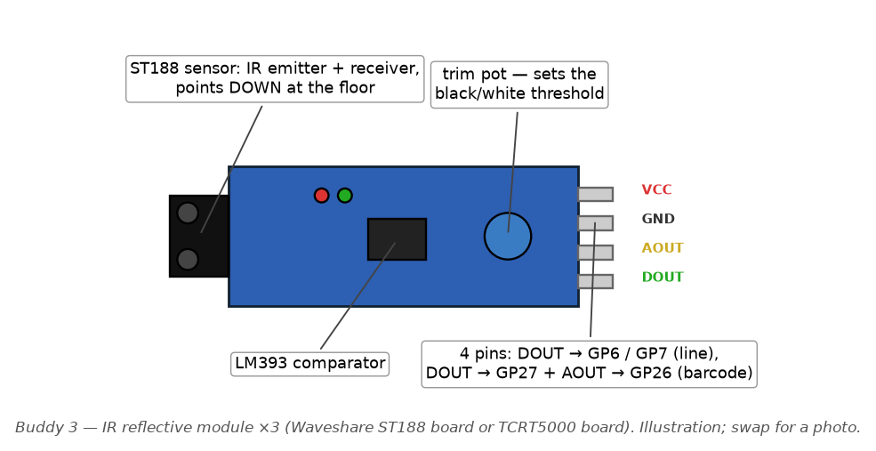
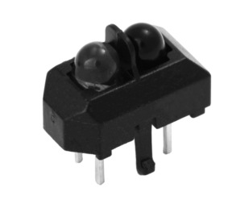

# Buddy 3 — Line Following & Barcode Decoding

> Your part of the team guide. The shared picture — the event bus (§1.2),
> the non-blocking rule (§1.3), start-up and the mission state machine
> (§2.1–2.2), the `core/` toolbox (§2.3) and the shared hardware (§3) — is
> in [`TEAM_GUIDE.md`](../../TEAM_GUIDE.md); every `§` below points there.
> Installing, building, flashing and testing is [`BUILD.md`](../../BUILD.md).
>
> **Datasheets for your parts** sit in this folder:
> - [`Infrared-Reflective-Sensor-UserManual.pdf`](Infrared-Reflective-Sensor-UserManual.pdf) — the IR module: pinout, trim pot, DO/AO behaviour
> - [`tcrt5000.pdf`](tcrt5000.pdf) — the TCRT5000 sensor element itself
> - [`LM393-D.PDF`](LM393-D.PDF) — the LM393 comparator that produces DO
> - [`Barcode & Line Specification.pdf`](Barcode%20&%20Line%20Specification.pdf) — the track: line width and the Code 39 barcode layout
> - [`Barcode Sample.pdf`](Barcode%20Sample.pdf) — a printable sample barcode for testing

**Files:** `subsystems/sub_line.c/.h`, `subsystems/sub_barcode.c/.h`,
`drivers/drv_ir.c/.h`

## Your hardware — wiring, pin by pin

**IR reflective module (×3), MH-Sensor-Series.** A small board with a
sensor element at one end that points *down* at the floor: it shines
infrared light and measures how much bounces back — a lot from white, very
little from black. An on-board LM393 comparator with a trim pot turns that
into a clean `DO` high/low ("black / not black"); `AO` gives the raw
analogue level. Each module has four pins: `VCC`, `GND`, `DO`, `AO`. Two of
them are the line sensors (wired on `DO` only); the third is the barcode
reader (wired on both outputs). The TCRT5000 element itself is the small
black block with two domes, shown on the right.

 

**How to read a Grove socket.** Every Grove socket on the Robo Pico has
four pins, printed on the board in this order: `GND`, `3V3`, then the two
GPIO numbers. A standard Grove cable's wires are colour-coded — **black =
GND, red = 3V3, white = the first GPIO printed, yellow = the second** — but
don't trust colours blindly: hold the cable against the socket and read
which printed label each wire lands on. With a Grove-to-jumper (Dupont)
cable, the four loose ends are what you push onto the sensor's header pins.

| Module pin | Line sensor 1 (left) → **Grove 4** | Line sensor 2 (right) → **Grove 5** | Barcode sensor → **Grove 6** |
|---|---|---|---|
| `VCC` (red) | `3V3` | `3V3` | `3V3` |
| `GND` (black) | `GND` | `GND` | `GND` |
| `DO` | `GP16` (white) | `GP6` (white) | `GP27` (yellow) |
| `AO` | **leave unconnected** | **MUST be left unconnected** | `GP26` (white) |

> **Why line sensor 2's `AO` must stay off.** Grove 5's second signal pin is
> **GP26 — the very same pin as the barcode sensor's `AO` on Grove 6** (the
> Robo Pico routes GP26 to both sockets). Connect all four wires on Grove 5
> and the two analogue outputs are shorted together; both sensors then read
> nonsense. Three wires only on Grove 5: red, black, and DO.

**Mounting.** Line sensors point straight down at the track, about 5–10 mm
above it, one either side of the line's centre. The barcode sensor the same
height, placed so the barcode passes under it as the car drives. Set each
module's trim pot on the actual track under the actual lights
(`docs/HARDWARE.md` §4.3), then check with the `line` bench.

**How your files connect to the rest of the car** (see §2.3 for what
each `core/` file is)

One driver serves two subsystems. `drv_ir` owns all three IR sensors:
the two *line* sensors (GP16/GP6) are read on a timer, the *barcode*
sensor (GP27) is interrupt-driven because bar widths are measured in
microseconds. `sub_line` turns the two line bits into steering;
`sub_barcode` turns the timed edges into a letter.

| Your file | Talks to | Through | In plain terms |
|---|---|---|---|
| `drv_ir.c` (line) | the **Sense task** in `app_main.c` | `drv_ir_sample_line()` called every 5 ms | The Sense task reads GP16/GP6 and you publish the two bits. |
| `drv_ir.c` (line) | `core/rc_event` | `rc_event_publish(RC_EVT_LINE_SAMPLE)` | "Left sees black / right sees black" — 200 times a second. |
| `drv_ir.c` (barcode) | `core/rc_gpioirq` | `rc_gpioirq_attach(GP27, RC_EDGE_BOTH, …)`, `rc_gpioirq_enable()` | "Ring `barcode_isr` whenever the sensor flips black↔white"; muted when not reading a barcode. |
| `drv_ir.c` (barcode) | `core/rc_time` | `rc_time_us()` in the ISR | Time between flips = width of the bar or gap. That width *is* the data. |
| `drv_ir.c` (barcode) | `core/rc_defer` | `rc_defer_register(barcode_drain)`, `rc_defer_signal_i()` | ISR stores the width in a small ring and rings the bell; the drain publishes. |
| `drv_ir.c` (barcode) | `core/rc_event` | `rc_event_publish(RC_EVT_BARCODE_EDGE)` | One parcel per bar/gap with its width. |
| `sub_line.c` | `core/rc_event` | `rc_event_subscribe(RC_EVT_LINE_SAMPLE, RC_LANE_FAST, …)` | Runs on every sample, inside the FAST dispatcher — you have no task of your own. |
| `sub_line.c` | `sub_motion.c` (Buddy 2) | `sub_motion_drive(base, steer)` | Your steering decision becomes wheel power. |
| `sub_line.c` | `core/rc_event` | `rc_event_publish(RC_EVT_LINE_LOST / RC_EVT_LINE_REACQUIRED)` | Tells `sub_nav` the line vanished / came back. |
| `sub_barcode.c` | `core/rc_event` | `rc_event_subscribe(RC_EVT_BARCODE_EDGE, RC_LANE_FAST, …)` | Collects widths into a 9-element window and matches it against the Code 39 table. |
| `sub_barcode.c` | `core/rc_event` | `rc_event_publish(RC_EVT_BARCODE_DECODED)` | Carries the letter *and* its `rc_nav_cmd_t` meaning (A→left, B→right, C→straight, D→U-turn). |
| both | `core/rc_config.h` | `RC_PIN_IR_*`, `RC_PERIOD_LINE_MS` | Pins and the 5 ms sample period. |

Who calls *you*: `sub_nav` calls `sub_line_enable()` to start/stop
steering, `sub_line_begin_search()` before and after an obstacle bypass,
and `sub_barcode_arm()` when both sensors go black (the barcode lead-in).
Your decoded command goes back to `sub_nav` as an event, never as a
direct call.

**What this module does**

The car has two small infrared sensors pointed at the ground, one slightly
left of centre and one slightly right. Black line absorbs infrared light,
white track reflects it, so each sensor can tell the software whether it's
currently sitting over the black line or not. By comparing "is the left
one on the line?" against "is the right one on the line?", the code can
tell whether the car has drifted off-centre and steer it back — this is
line following. Separately, a third sensor reads a printed barcode on the
track: as the wheels roll over alternating black bars and white gaps, the
sensor sees the light flicker on and off, and the code measures how long
each flicker lasts. In the Code 39 barcode standard used here, it's not
the absolute timing that matters (that changes with speed) but the
*ratio* between "short" and "long" flickers, and that ratio pattern spells
out a letter, which the car then treats as a driving instruction (turn
left, turn right, U-turn, or go straight).

**Run your module** — bench `line`, `follow`, `barcode`. The full procedure, what good output looks like and what each bad symptom means is in [`BUILD.md`](../../BUILD.md) §5.3–5.5. Short version, in VS Code: **Terminal → Run Task → RoboCar: build bench image…**, pick it from the list, put the Pico in BOOTSEL, **…flash bench image…**, then open the Serial Monitor. `follow` makes the car drive.

**How to get started**

1. **Wire it up per `docs/HARDWARE.md` §4.3**: line sensor 1 (left) DO →
   GP16 on Grove 4, line sensor 2 (right) DO → GP6 on Grove 5 (both
   digital, polled), barcode DO → GP27 (digital, interrupt-driven) and
   barcode AO → GP26/ADC0, both on Grove 6. **Leave line sensor 2's AO
   pin unconnected** — Grove 5's other signal pin is GP26, the same pin
   as the barcode AO, and two analogue outputs shorted together read as
   garbage on both.
2. **Check sensor polarity before anything else.** `IR_ACTIVE_HIGH` at the
   top of `drv_ir.c` says HIGH-on-the-pin means "over the line." On the
   Waveshare ST188 board this is correct, but if you're using TCRT5000
   modules or wired something differently, it may be backwards — and the
   car will confidently drive itself off the table. Test with
   `drv_ir_on_line()` over white then black to confirm; flip the macro if
   it's wrong.
3. **Calibrate the trim pots** (HARDWARE.md §4.3): read raw AOUT values
   over white and over black with `drv_ir_read_raw(RC_IR_BARCODE)`, set
   the trim pot so DOUT flips roughly midway between them, and redo this
   under your actual demo lighting (fluorescent vs sunlight differ a lot
   in IR).
4. **Bring-up order** (HARDWARE.md §7, steps 6–7 and 13): confirm DOUT
   flips cleanly crossing the line and AOUT reads clearly different; test
   line following on a straight then a curve; barcode decoding comes
   later, since a barcode read is armed off the line follower's junction
   detection.
5. Call `drv_ir_init()`, `sub_line_init()`, `sub_barcode_init()` at
   startup. Line following starts disabled — call `sub_line_enable(true)`
   when you want it steering.
6. **Fix the barcode table before testing decode** — see TODOs below;
   decoding cannot be correct for 'B', 'C', 'D' until this is done.

**Code walkthrough**

This is the longest walkthrough in the guide because this module leans on
several C ideas (pointers, bitwise operators, function pointers, ISRs,
ring buffers) that nobody on the team is expected to already know. Every
time one of those shows up below, it's explained in plain terms the first
time, then referred back to afterwards. If you haven't yet, skim
TEAM_GUIDE.md §1.2–1.3 (event bus, publish/subscribe, the two lanes, the
non-blocking pattern, and why everything uses "permille" whole numbers
instead of fractions) — this section assumes you know those already and
won't re-explain them.

## `drv_ir.h` / `drv_ir.c` — the hardware layer

This is the bottom layer: it only talks to the physical sensors and knows
nothing about "line following" or "barcodes" as concepts — that
intelligence lives one layer up, in `sub_line.c` and `sub_barcode.c`.

**`IR_ACTIVE_HIGH`** (`drv_ir.c`, near the top)
```c
#define IR_ACTIVE_HIGH      (1)
```
What it does: a compile-time switch. `#define` creates a *macro* — a
find-and-replace rule the compiler applies before it even starts
compiling. Anywhere the code writes `IR_ACTIVE_HIGH`, the compiler
substitutes `(1)` first. Further down, `drv_ir_on_line()` uses
`#if IR_ACTIVE_HIGH ... #else ... #endif` — that's a *preprocessor*
conditional, resolved before compilation, not a runtime `if`. Whichever
branch doesn't match gets deleted before the compiler even sees it, so
there's no runtime cost to supporting both sensor wirings.
Why: different IR sensor boards report "on the line" in opposite ways —
some pull the output pin HIGH over black, some pull it LOW. Rather than
hard-code one behaviour, this macro lets you flip a single `1`→`0` to
match your hardware.
Links to other code: read by `drv_ir_on_line()` immediately below it.
Getting this wrong is called out explicitly in "How to get started" step
2 above as the single most common way to make the car drive off the
table with total confidence, because every other function in this module
trusts whatever `drv_ir_on_line()` reports.

**`ADC_DEVNAME`**
```c
#define ADC_DEVNAME         ((UB *)"adca")
```
What it does: names the ADC (analogue-to-digital converter — the chip
hardware that turns a sensor's continuously-variable voltage into a
plain number the CPU can read and compare) device this RTOS should open.
`(UB *)` in front of the string is a *cast* — a explicit instruction to
the compiler "treat this piece of data as if it were this other type."
Here it tells the compiler to treat the text `"adca"` (normally a
`char *`) as a `UB *` (unsigned byte pointer), because that's the type
this particular RTOS's device-open function expects. A cast doesn't
change the underlying bytes, only how the compiler is willing to use
them.
Why: needed once, to open the device in `drv_ir_init()`.
Links to other code: used only by `tk_opn_dev(ADC_DEVNAME, ...)` inside
`drv_ir_init()`.

**Module-level `static` variables** (`adc_dd`, `bar_cb`, `bar_ctx`,
`bar_last_us`, `bar_enabled`, `defer_h`)
What they do: hold this module's private, persistent state — the ADC
device handle, an optional extra callback for raw barcode edges, the
timestamp of the last barcode edge, whether the barcode interrupt is
currently armed, and a handle for the deferred "bottom half" worker
(explained below).
Why `static`: at file scope (outside any function), `static` means "this
name is only visible inside this .c file." It's how C fakes "private"
member variables without having classes — no other file can accidentally
read or clobber `bar_enabled`, for example. This matters a lot in a
codebase with five people editing five different files: `static` is what
stops your file's `enabled` from colliding with `sub_line.c`'s `enabled`.
Why `volatile` on some of them (`bar_last_us`, `bar_enabled`, and the
ring buffer indices further down): these are written by an ISR
(interrupt handler, explained below) and read by ordinary code, or vice
versa, at moments the compiler can't predict from the plain flow of the
program. `volatile` tells the compiler "never assume this value hasn't
changed since you last checked it — always re-read it from memory,
don't cache it in a CPU register or optimize the read away." Without
`volatile` here, an aggressive compiler optimization could make code
that waits on `bar_enabled` loop forever, because it "proved" the
variable's value inside the loop never changes — except it does, from
inside the interrupt.

**The barcode edge ring buffer** (`BAR_RING_SZ`, `BAR_RING_MASK`,
`bar_edge_rec_t`, `bar_ring`, `bar_head`, `bar_tail`, `bar_overrun`)
```c
#define BAR_RING_SZ     (32U)
#define BAR_RING_MASK   (BAR_RING_SZ - 1U)
```
What it does: sets up a *ring buffer* (also called a circular buffer) — a
fixed-size array used as a queue. A "head" index marks where the next
item gets written; a "tail" index marks where the next item gets read
from. Both wrap back to 0 once they reach the end of the array, so the
same 32 slots get reused forever instead of the array growing.
Why: the barcode ISR (interrupt) discovers new bar/space edges instantly,
but decoding them is comparatively slow work that must not happen inside
an interrupt (see the ISR explanation below). The ring buffer is the
hand-off point — the ISR writes into it in microseconds, and the
"bottom half" task drains it at its own pace, moments later, without the
two ever needing to be perfectly synchronized.
Why `BAR_RING_SZ` is a power of two (32, not e.g. 30): so that wrapping
an index can be done with a single bitwise-AND (`index & BAR_RING_MASK`)
instead of a division (`index % BAR_RING_SZ`). `BAR_RING_MASK` is
`32 - 1 = 31`, which in binary is `0b00011111` — ANDing any number with
that keeps only its lowest 5 bits, which is mathematically identical to
`% 32` but much cheaper for a small microcontroller like the RP2040 to
compute (no division instruction needed). This bit trick — "AND with
size-minus-one instead of modulo" — only works when the size is a power
of two, which is why 32 was chosen rather than a rounder-sounding 30.
The bitwise operators here: `&` (AND) keeps bits that are 1 in *both*
operands; you'll see `|` (OR, sets a bit), `<<` (left shift, "multiply by
2 and make room for a new low bit"), and `>>` (right shift) elsewhere in
this module and elsewhere in the codebase — think of shifting as sliding
all the bits sideways, with zeros filling in behind.
`bar_edge_rec_t` is a `struct` — a bundle of related fields (here,
`width_us` and `level`) given one name so they can be stored and passed
around together, like a labelled envelope instead of two loose sheets of
paper.
Links to other code: written by `barcode_isr()`, read by
`barcode_drain()`, both below.

**`barcode_isr()`** — the barcode interrupt handler
What it literally does, line by line: computes `width` as the time
elapsed (in microseconds) since the previous edge; stores the new
timestamp as the baseline for next time; computes where the *next* ring
write would land (wrapping with the `& BAR_RING_MASK` trick above)
without committing to it yet; if that landing spot is the tail (meaning
the ring is completely full and the consumer hasn't caught up), counts
an overrun and bails out rather than overwriting unread data; otherwise
writes the width and level into the current head slot, advances head,
and calls `rc_defer_signal_i(defer_h)` to wake up the bottom-half task.
Why it's written this way: this is an ISR (Interrupt Service Routine) —
a tiny function the RP2040 jumps to automatically, pausing whatever else
the chip was doing, the instant the barcode sensor's output pin changes
voltage. TEAM_GUIDE.md §1.2's "golden rule" applies in full force here:
an ISR may only record a timestamp, flip a couple of registers, and hand
off — never loop, never publish an event directly, never do anything
that could take an unpredictable amount of time. Bar width *is* the
actual barcode data (see the Code 39 explanation below), so if this
handler were delayed by other work, the very timestamps it exists to
capture would be corrupted. Keeping the ISR to "a subtraction, a ring
write, and a signal" is what keeps that timing trustworthy.
Links to other code: signals `barcode_drain()` (the bottom half) via
`rc_defer_signal_i()`, whose `_i` suffix is this RTOS's naming
convention for "safe to call from inside an interrupt" (an ordinary
kernel call here could corrupt the scheduler's internal state, since the
scheduler wasn't expecting to be interrupted mid-operation).

**`barcode_drain()`** — the "bottom half"
What it does: loops `while (bar_tail != bar_head)`, meaning "while there
are unread entries in the ring," reading one entry at a time, advancing
the tail, building an `RC_EVT_BARCODE_EDGE` event from it, and
publishing that event — plus calling the optional extra `bar_cb`
callback if one was registered.
Why: this runs in ordinary task context, not inside an interrupt, so it
is allowed to do the comparatively slow work of building and publishing
an event — the exact work `barcode_isr()` was forbidden from doing
directly. This producer/consumer split (ISR produces fast, task consumes
whenever it gets scheduled) is the standard pattern for "I need
microsecond timing but also need to do real work with the data" on a
microcontroller.
Links to other code: every published `RC_EVT_BARCODE_EDGE` event is
what `sub_barcode.c`'s `on_edge()` subscribes to and reacts to — this is
the seam between the hardware layer and the decoding layer.

**`drv_ir_init()`**
What it does: registers `barcode_drain` as the deferred worker, sets both
line-sensor pins as plain digital inputs, attaches `barcode_isr` to the
barcode pin's interrupt but leaves it masked (disabled) until armed, and
opens the ADC device (allowed to fail without aborting init, since the
digital line-following path doesn't need it).
Why the barcode interrupt starts masked: see the reasoning under
`drv_ir_barcode_enable()` below — it's the same "don't decode track
noise as a fake barcode" concern.
Links to other code: called once at boot, before any other function in
this module is used.

**`drv_ir_on_line()`**
What it does: reads one sensor's raw digital pin value with
`gpio_get_val(pin)`, then applies the `IR_ACTIVE_HIGH` polarity
correction explained above to turn "raw HIGH/LOW" into "is this
genuinely over the black line, yes or no."
Links to other code: called by `drv_ir_sample_line()` below (for the two
line sensors) and directly by anyone testing sensor wiring (see "How to
get started" step 2).

**`drv_ir_read_raw()`**
What it does: reads the raw ADC brightness value (0–4095, a 12-bit
range) from the barcode sensor's analogue output, but only for
`RC_IR_BARCODE` — the two line sensors aren't wired to any ADC pin in
this design, so calling it for them just returns 0. `buf & 0x0FFFU` at
the end masks off everything except the lowest 12 bits, in case the ADC
hardware returns extra bits the code doesn't want.
Why: used purely for trim-pot calibration — reading actual brightness
numbers over white vs. black track to set the sensor's threshold.
Links to other code: also called internally by `drv_ir_sample_line()`
to attach the barcode channel's raw brightness onto every line-sample
event, for logging/telemetry even though it isn't used for steering
decisions.

**`drv_ir_sample_line()`**
What it does: reads both line sensors via `drv_ir_on_line()`, then
converts the two true/false readings into a single signed "position"
number using this table (also documented directly above the function in
the source):

| Left | Right | Meaning | position |
|---|---|---|---|
| off | off | line lost | keeps the previous sign (handled by sub_line.c, not here) |
| on | off | drifting right | -500 |
| off | on | drifting left | +500 |
| on | on | centred, or a junction | 0 |

...then publishes an `RC_EVT_LINE_SAMPLE` event carrying both raw
booleans, the position number, and the barcode sensor's raw brightness.
Why only four possible values: with two purely digital (on/off) sensors,
there are exactly four combinations of two booleans, so the "position"
this driver can report is necessarily coarse — this is the "4-state
position logic" the task description calls out, and it's exactly what
the TODO in `sub_line.c` (and in TEAM_GUIDE.md's "Missing/TODO" list) is
about upgrading to something continuous.
Links to other code: called every 5ms (`RC_PERIOD_LINE_MS`) from the
sensing task; its published event is what `sub_line.c`'s `on_sample()`
reacts to — this is the seam between the hardware layer and the
steering layer, exactly parallel to the barcode edge seam above.

**`drv_ir_on_barcode_edge()`**
What it does: stores an optional extra callback function, called
directly (from interrupt context — so it must be just as fast as the ISR
itself) for every raw edge, in addition to the event that's always
published. Most code should subscribe to the event instead; this exists
for anything needing lower latency than an event-bus hop.

**`drv_ir_barcode_enable()`**
What it does: when turning the barcode interrupt ON, first resets the
timing baseline (`bar_last_us`) and both ring indices to zero, so no
stale timestamp or leftover ring data from a previous arm/disarm cycle
can leak into the first reading; then enables (or disables) the actual
hardware interrupt via `rc_gpioirq_enable()`.
Why: the barcode path is deliberately left masked except when a barcode
read is actually expected (armed by `sub_line.c` reporting a junction —
see below). Leaving it always-on would mean ordinary shiny patches of
track, or the car simply idling, could generate spurious edges that the
decoder would try to interpret as a real barcode character.
Links to other code: called both directly, and indirectly via
`sub_barcode_arm()` in `sub_barcode.c`, which is itself triggered by
`sub_line.c` reaching `RC_LINE_JUNCTION` state.

## `sub_line.h` / `sub_line.c` — steering decisions

**The `rc_line_state_t` enum** (`sub_line.h`)
```c
typedef enum {
    RC_LINE_TRACKING = 0,
    RC_LINE_LOST,
    RC_LINE_SEARCHING,
    RC_LINE_JUNCTION
} rc_line_state_t;
```
What it is: an `enum` (enumeration) — a small set of named whole-number
constants. `RC_LINE_TRACKING` is 0 (because it's written `= 0`
explicitly), and the rest count upward automatically (1, 2, 3).
Why use an enum instead of plain numbers: `state == RC_LINE_LOST` reads
as English; `state == 1` would force anyone reading the code to go look
up what "1" means. It also lets the compiler catch typos that plain
integers wouldn't (assigning an unrelated enum type to this variable is
a compile error; assigning a random int usually isn't caught).
The four states, in plain terms:
- `RC_LINE_TRACKING` — normal driving, at least one sensor currently
  sees the line, actively steering.
- `RC_LINE_LOST` — neither sensor has seen the line for
  `LOST_THRESHOLD` samples in a row; the car is now arcing, searching.
- `RC_LINE_SEARCHING` — the car deliberately left the line on purpose
  (e.g. driving around an obstacle under `sub_scan`'s control) and is
  watching for it to reappear, without treating the absence as an
  error.
- `RC_LINE_JUNCTION` — both sensors have seen black for
  `JUNCTION_THRESHOLD` samples in a row, which almost always means the
  car has reached a junction or the start of a barcode, not that it's
  perfectly centred on a normal line.
Links to other code: `sub_barcode_arm()` gets called (from the shared
`sub_nav.c` mission logic — see TEAM_GUIDE.md §2.2) when this state
becomes `RC_LINE_JUNCTION`, arming the barcode decoder at exactly the
moment it's likely to be needed.

**`LOST_THRESHOLD` and `JUNCTION_THRESHOLD`** (`sub_line.c`)
```c
#define LOST_THRESHOLD      (20U)
#define JUNCTION_THRESHOLD  (6U)
```
What they do: `LOST_THRESHOLD` is how many consecutive "neither sensor
sees the line" samples must happen before the code gives up and declares
the line genuinely lost, rather than reacting to a single blip.
`JUNCTION_THRESHOLD` is the same idea for "both sensors see the line" —
how many consecutive samples before that's treated as a real junction
rather than a momentary coincidence.
Why these specific values: the comment above `LOST_THRESHOLD` in the
source works the math out explicitly — at 5ms per sample (the line
sensor poll rate), 20 samples is 100ms, and at a typical 250mm/s driving
speed that's about 25mm of travel: short enough that the car reacts
quickly to a genuinely lost line, but long enough to smoothly ride over
small gaps or momentary sensor noise without false-triggering a
"searching" arc. `JUNCTION_THRESHOLD` at 6 samples (30ms) is shorter,
because a junction should be recognized promptly so the barcode decoder
gets armed with plenty of lead time before the barcode itself arrives.
This "count N consecutive matching samples before reacting" pattern is
called *debouncing* — the same idea used for encoder pulses in Buddy 2's
module and button presses in general embedded programming, to filter out
noise that only ever lasts one or two samples.
The `U` suffix on `20U` / `6U`: tells the compiler this is an *unsigned*
integer literal, matching the `uint32_t lost_count` / `both_count`
counters it gets compared against. Comparing a signed and unsigned
number in C can silently produce wrong results in edge cases (the signed
one gets converted to unsigned, and a negative number becomes a huge
positive one) — matching the suffix to the variable type sidesteps that
whole class of bug.

**`STEER_KP`** — this is the exact constant flagged for special
attention, so here is the full explanation at the requested level of
detail:
```c
#define STEER_KP        (2)
```
- **What it does / what KP means:** "KP" stands for "K, proportional" —
  the conventional name in control theory for the multiplier on a
  proportional-control term. This is the same idea as Buddy 2's PID
  speed controller (`sub_motion.c`, `pid_step()`) simplified down to just
  the "P" — there's no integral or derivative term here (see the TODO
  below). The general idea of proportional control: the further off you
  are from where you want to be, the harder you correct, in direct
  proportion to how far off you are. A real-world analogy: steering a
  shopping cart back toward the centre of an aisle — drift a little, nudge
  the cart gently; drift a lot, turn the wheel harder. `STEER_KP` is the
  "how hard do I nudge, per unit of drift" number.
- **What it's multiplied by:** the `position` value reported by
  `drv_ir_sample_line()` in `drv_ir.c` — the raw sideways error described
  in the 4-state table above (-500, 0, or +500, since there are only two
  digital sensors). This happens inside `steer_from_position()`:
  ```c
  int16_t steer = (int16_t)((int32_t)position * STEER_KP / 2);
  ```
  Reading this line: `position` gets cast up to `int32_t` (a wider,
  32-bit signed integer) before multiplying, specifically so that
  `position * STEER_KP` — which could reach 500 × 2 = 1000, still small,
  but the pattern matters for future larger gains — cannot silently
  overflow a 16-bit value before being scaled back down. This is a real,
  common C bug: multiplying two `int16_t` values together happens in
  16-bit arithmetic and can wrap around to a wrong (even negative-looking)
  result long before you'd expect it to, so widening to `int32_t` first
  is a defensive habit worth learning early. The `/ 2` at the end scales
  the result back down into the same -1000..1000 "permille" range that
  `sub_motion_drive()`'s steering parameter expects (see below). Only
  after all that arithmetic is safely back in range does the final
  `(int16_t)` cast narrow it back down to the type `steer_from_position()`
  hands off.
- **Why the value is 2:** it was picked as a small whole number that
  produces a firm, noticeable steering correction without saturating the
  output. At the sensors' maximum reported drift (`position = 500`) with
  `STEER_KP = 2`, the formula above gives `steer = 500 * 2 / 2 = 500` —
  half of the full ±1000 permille steering range: assertive, but not
  maxed out, leaving headroom. Like every constant in this codebase, it
  must be a whole number because the RP2040 has no hardware
  floating-point unit (see TEAM_GUIDE.md §5) — a "gain of 2.0" happens to
  be convenient here because it's already a whole number, but note the
  formula divides by 2 afterward specifically so that non-whole-feeling
  gains could still be approximated with integer tricks if this ever
  needed tuning to something like "1.5×" (e.g. `STEER_KP = 3`, still
  divided by 2, gives an effective ×1.5).
- **What happens if you raise it:** the car reacts more aggressively —
  it snaps back toward centre faster when it drifts, which sounds
  purely good, but a P-only controller with too high a gain overshoots:
  it corrects so hard that it swings past centre onto the *other* side,
  then has to correct back, then overshoots again — visible on the track
  as the car weaving side to side even on straight, well-marked line. This
  is exactly the "classic gain-too-high" behaviour that a derivative term
  (see the TODO comment directly above `STEER_KP` in the source) exists
  to damp out in a full PID controller; this module doesn't have one yet.
- **What happens if you lower it:** the correction becomes gentler and
  smoother in a straight line, but the car takes longer to recover from
  drift and may run wide (cut the corner too shallow, or drift off the
  outside) on sharp curves, because it isn't steering hard enough soon
  enough.
- **How it connects to `steer_from_position()` / `on_sample()`:**
  `steer_from_position(position)` is the only place `STEER_KP` is used.
  It's called from `on_sample()` in two situations: every time exactly
  one sensor reports the line (the normal tracking branch), and during a
  brief dropout (fewer than `LOST_THRESHOLD` all-dark samples so far) —
  in that second case it's called with `last_position`, i.e. "keep
  steering as if the last known reading still holds," which lets the car
  ride over small physical gaps in the line without over-reacting.
  `steer_from_position()`'s output, `steer`, is passed straight into
  `sub_motion_drive(base_permille, steer)` — Buddy 2's module (see
  TEAM_GUIDE.md's Buddy 2 section) — which biases the left and right
  wheel motor speeds against each other to actually turn the car.
  `sub_line.c` never touches a motor directly; it only ever decides *how
  hard* to ask Buddy 2's module to steer.

**`steer_from_position()`**
What it literally does: computes `position * STEER_KP / 2` in widened
32-bit arithmetic (explained fully under `STEER_KP` above), narrows the
result back to `int16_t`, and calls `sub_motion_drive(base_permille,
steer)`, ignoring its return value with a `(void)` cast (a standard C
idiom meaning "I know this returns something, I'm deliberately not
checking it here" — it silences a compiler warning about an unused
result, not an error).
Why it's a separate function rather than inlined: it's called from two
different places in `on_sample()` (normal tracking, and brief dropouts),
so factoring it out avoids repeating the formula.

**`on_sample()`** — the core decision function, called automatically
every ~5ms via the event bus (see TEAM_GUIDE.md §1.2) whenever
`drv_ir_sample_line()` publishes a new `RC_EVT_LINE_SAMPLE`.
Walking through it branch by branch:
1. **`if (!enabled) return;`** — if `sub_line_enable(false)` was called
   (e.g. because obstacle avoidance currently owns the wheels), do
   nothing at all — not even update the internal counters. This is what
   lets `sub_scan.c` take over driving cleanly without `sub_line.c`
   fighting it for control of the motors.
2. **Both sensors on the line** (`s->on_line_l && s->on_line_r`) — bumps
   `both_count`, resets `lost_count` to 0 (we clearly haven't lost the
   line), and once `both_count` reaches `JUNCTION_THRESHOLD`, transitions
   into `RC_LINE_JUNCTION` state. Regardless of whether the threshold has
   been reached yet, it drives straight (`steer = 0`) through — a
   sensible default while it's still ambiguous whether this is a real
   junction or just a wide bit of line.
3. **Exactly one sensor on the line** (`s->on_line_l || s->on_line_r`,
   having already ruled out "both") — the normal tracking case. Resets
   both counters (neither "junction" nor "lost" applies right now), and
   if the state was previously `RC_LINE_SEARCHING`, publishes
   `RC_EVT_LINE_REACQUIRED` first (telling e.g. `sub_scan.c` that the
   search for the line succeeded) before switching to
   `RC_LINE_TRACKING`. It remembers this position as `last_position` (in
   case the line vanishes on the very next sample) and calls
   `steer_from_position()` with the live reading.
4. **Neither sensor on the line** (the final `else`) — resets
   `both_count`, increments `lost_count`. If the car is deliberately
   `RC_LINE_SEARCHING`, it returns immediately without steering or
   declaring anything lost — whatever `sub_scan.c` commanded the motors
   to do stays in effect. Otherwise, once `lost_count` reaches
   `LOST_THRESHOLD`, it transitions to `RC_LINE_LOST` (publishing
   `RC_EVT_LINE_LOST`, but only on the *transition* into that state —
   the `if (state != RC_LINE_LOST)` guard stops the event from firing
   again every single sample while still lost) and starts arcing: half
   speed, steering hard (±400 permille) toward whichever side
   `last_position` was leaning, using the ternary operator
   `condition ? a : b` (a compact inline if/else that evaluates to one
   value or the other) to pick the direction. The reasoning, straight
   from the source comment: a car that drives dead straight after losing
   the line rarely finds it again by luck, but one that arcs back toward
   where it last saw the line usually does — because the line is a
   continuous path, and the car was on it a moment ago. If `lost_count`
   hasn't reached the threshold yet, it's treated as a brief dropout and
   handled the same as a normal sample, just using `last_position`
   instead of a fresh reading — this is what lets the car ride smoothly
   over small physical gaps in the printed line without over-reacting.

**`sub_line_init()` / `sub_line_enable()` / `sub_line_begin_search()` /
`sub_line_state()` / `sub_line_set_base()`**
- `sub_line_init()` subscribes `on_sample()` to `RC_EVT_LINE_SAMPLE` on
  the fast lane (steering must react quickly — see TEAM_GUIDE.md §1.2 on
  why fast vs. slow lanes exist) and resets state. Call once at boot.
- `sub_line_enable(on)` is the on/off switch for actually steering —
  state tracking continues either way, only the motor commands stop.
- `sub_line_begin_search()` tells the module "we left the line on
  purpose," switching straight into `RC_LINE_SEARCHING` so a deliberate
  detour isn't misread as an error.
- `sub_line_state()` is a simple getter other modules (`sub_nav.c`,
  telemetry) poll or react to.
- `sub_line_set_base(permille)` changes the cruising speed used while
  tracking — in permille (parts per thousand of full speed) rather than
  a percentage-with-decimals, again because there's no floating point on
  this chip.

## `sub_barcode.h` / `sub_barcode.c` — Code 39 decoding

**Why widths, not a clock** (from the header's own top comment, worth
restating): the car's speed varies as it crosses a barcode, so the
absolute duration of a bar in milliseconds is meaningless on its own.
What stays constant regardless of speed is the *ratio* between a "wide"
bar and a "narrow" bar — Code 39 always keeps that ratio at roughly 2:1
or 3:1. Because the decoder works entirely off ratios rather than
absolute time, it works correctly whether the car crosses the barcode
fast or slow. This is what "ratio-based decoding" means, and it's the
single idea the rest of this section builds on.

**`sub_barcode_cb_t`** (`sub_barcode.h`)
```c
typedef void (*sub_barcode_cb_t)(char symbol, rc_nav_cmd_t cmd, void *ctx);
```
What it is: a *function pointer type*. Reading C function-pointer syntax
is genuinely one of the odder corners of the language — the trick is to
read from the inside out: `(*sub_barcode_cb_t)` says "`sub_barcode_cb_t`
is a pointer to a function," and the surrounding pieces say that function
takes `(char, rc_nav_cmd_t, void *)` and returns nothing (`void`). Once
declared, any ordinary function matching that exact shape — like
`symbol_to_cmd`'s caller pattern, or any handler another subsystem
writes — can be stored in a variable of this type and *called through
it* later, without the code that stores it needing to know in advance
which specific function it will be.
Why: this is how `sub_barcode.c` lets other subsystems (`sub_nav.c`,
telemetry, or your own test code) register their own "a character was
decoded" handler without `sub_barcode.c` needing a compile-time
`#include` of, or any knowledge about, those other files. It's the same
role a callback plays in JavaScript (`button.addEventListener(...)`) or
Python (passing a function as an argument) — C just needs an explicit
type declaration to describe the function's "shape" first.
Links to other code: the type of the `cb` parameter to
`sub_barcode_on_decode()`, and of the `user_cb` variable that gets called
inside `on_edge()`.

**`ELEMENTS` and `WINDOW`**
```c
#define ELEMENTS        (9U)
#define WINDOW          (10U)
```
What they mean: Code 39 encodes one character as 9 elements — alternating
bars and spaces — of which exactly 3 are "wide" and 6 are "narrow."
`ELEMENTS` is that count. `WINDOW` (10) is one bigger: the code keeps a
sliding buffer of up to 10 recent widths so that after a failed decode
attempt it can discard just the oldest one and retry with the next 9,
rather than throwing away everything and waiting for a completely fresh
batch — this "slide by one and retry" strategy handles the case where the
code's buffer just happened to start one element early or late.

**`ELEM_MIN_US` / `ELEM_MAX_US`**
```c
#define ELEM_MIN_US     (800UL)
#define ELEM_MAX_US     (200000UL)
```
What they do: any measured width outside this microsecond range (800µs
to 200,000µs = 0.8ms to 200ms) is treated as implausible — not a real
bar or space at all — and the whole collection window is reset. Why:
these bounds filter out two different kinds of bad data: electrical
noise causing extremely short spurious edges (below `ELEM_MIN_US`), and
long idle stretches of plain track where nothing is happening (above
`ELEM_MAX_US`, which would otherwise sit in the buffer looking like one
enormous "element"). The `UL` suffix marks these as `unsigned long`
(32-bit unsigned) literals, matching the `uint32_t width_us` values they
get compared against — the same signed/unsigned-matching discipline
explained under `LOST_THRESHOLD` above.

**`code39_t` struct and `table[]`**
```c
typedef struct {
    char     symbol;
    uint16_t pattern;
} code39_t;
```
What it is: bundles one printable character together with the 9-bit
number that represents its wide/narrow pattern. `table[]` is an array of
these — the lookup table the decoder searches. `TABLE_N` computes the
array's length at compile time as `sizeof(table) / sizeof(table[0])`
(total size in bytes, divided by one entry's size), so adding rows to
the table later automatically keeps the count correct without anyone
needing to update a separate number by hand.
The table holds the standard Code 39 patterns for `'*'` (the mandatory
start/stop guard), the four command letters `'A'`–`'D'`, and `'Z'`
(printed on the sample sheet in this folder, handy for a first test).
Every entry has exactly three `1` bits — Code 39 is "3 of 9": two wide
bars and one wide space per character. To add a letter, look up its bars
and spaces in any Code 39 table and interleave them bar, space, bar, …
(the comment above `table[]` walks through `'A'` = `0x109`).

**`symbol_to_cmd()`**
What it does: a `switch` statement (a clean way to write "check one
value against several possibilities," clearer here than a chain of
`if`/`else if`) mapping each decoded character to a driving instruction:
`'A'` → turn left, `'B'` → turn right, `'C'` → go straight, `'D'` →
U-turn, anything else → no command. This mapping comes directly from the
project brief, not from anything about Code 39 itself — Code 39 just
carries characters; what those characters *mean* to this particular car
is this function's decision.

**`classify()`** — the heart of ratio-based decoding, explained step by
step, matching what the earlier inline comments in `sub_barcode.c` now
say:
1. **Find the shortest and longest width** in the current window of 9
   buffered widths (`min_w`, `max_w`). The code doesn't know the car's
   speed in advance, so it can't compare against some fixed "anything
   over 20ms is wide" rule — instead it works out short vs. long
   *relative to this specific window*, which is what makes the decoder
   speed-independent.
2. **Sanity check the spread:** if the longest element isn't at least
   double the shortest (`max_w < min_w * 2`), this window doesn't look
   like a real character yet (maybe it's straddling two characters, or
   it's noise) — bail out and let the caller slide the window and retry.
3. **Pick a threshold:** the midpoint between shortest and longest,
   `mid = (min_w + max_w) / 2`. Anything above the midpoint counts as
   "wide," anything at or below counts as "narrow."
4. **Classify and pack into one number:**
   ```c
   for (i = 0U; i < ELEMENTS; i++) {
       pattern <<= 1;
       if (widths[i] > mid) {
           pattern |= 1U;
           wide_count++;
       }
   }
   ```
   Reading this: `pattern <<= 1` shifts every bit already in `pattern`
   one place to the left (making room at the bottom for a new bit — the
   same left-shift idea explained under the ring buffer above, just used
   here to build up a value bit by bit instead of to wrap an index).
   Then, if this element was wide, `pattern |= 1U` (bitwise OR) turns on
   just the new bottom bit, leaving every bit already shifted in above it
   untouched. Doing this once per element, in order, packs all 9
   wide/narrow yes-or-no answers into the low 9 bits of a single 16-bit
   number — this is *bit-packing*: representing several small pieces of
   information as individual bits inside one larger number instead of as
   9 separate variables, so the whole character can be compared and
   looked up as one value. The very first element ends up in the
   highest of the 9 used bits (because it gets shifted left the most
   times by the elements that follow it), matching the "bit 8 is the
   first element" comment on the `pattern` field in `code39_t`.
5. **Final sanity check:** a legal Code 39 character always has exactly
   3 wide elements out of 9. If `wide_count` isn't exactly 3, the
   classification is rejected — this single check catches most
   misreads that made it past step 2.
Returns `false` (and leaves the output untouched) if either sanity check
fails; the caller (`on_edge()`) then slides the window forward by one
width and tries again, rather than giving up entirely.

**`lookup()`**
What it does: searches `table[]` for an exact match to the given
pattern. If found, writes the matching character through the `out`
pointer and sets `*reversed = false`. If not found, it builds the
*bit-reversed* version of the pattern (flips the order of all 9 bits —
so the element that was first becomes last and vice versa) and searches
again.
Why reversed matching matters: the car can physically cross a printed
barcode moving in either direction depending on approach angle, so the
sequence of bar widths it measures could come out either forwards or
backwards relative to how the barcode was printed. Without also checking
the reversed pattern, the decoder would silently fail roughly half the
time in a way that looks exactly like a sensor or wiring problem, which
would be a frustrating thing to debug.
`out` and `reversed` as pointer parameters: C functions can only
directly return one value (via the `return` keyword), so when a
function needs to hand back two or more results, it takes pointers to
the caller's own variables and writes into them via `*out = ...`
instead. This is a very common C pattern worth recognizing on sight.
The bit-reversal loop uses the same `1U << b` "build a mask with only
bit b set" technique explained under the ring buffer's bitmask above,
combined with `pattern & (1U << b)` to test whether that specific bit is
currently set.

**`shift_window()`**
What it does: drops the oldest buffered width and shifts every remaining
one down by one slot, so the window "slides" forward by exactly one
element rather than being wiped completely. Called after any failed
`classify()` or `lookup()`, on the assumption that the buffer might
simply be misaligned with the true start of the character (one element
too early or late) rather than genuinely full of garbage.

**`on_edge()`** — ties it all together, called automatically via the
event bus every time `drv_ir.c`'s barcode ISR records and publishes one
more bar/space width:
1. If decoding isn't currently `armed`, do nothing.
2. If the width is outside `ELEM_MIN_US..ELEM_MAX_US`, treat it as
   implausible and reset the whole window (`n_widths = 0`) rather than
   trying to build on top of noisy data.
3. Otherwise append the width to the buffer (sliding out the oldest one
   first via `shift_window()` if the buffer's already full at `WINDOW`),
   and if fewer than `ELEMENTS` (9) widths have been collected yet,
   simply wait for more.
4. Once 9 or more are buffered, call `classify()`; on failure, slide the
   window and return, ready to try again on the next edge.
5. On a successful classification, call `lookup()`; on failure, likewise
   slide and return.
6. On a full success: reset the window to start collecting the *next*
   character cleanly, remember the symbol for `sub_barcode_last()`,
   publish an `RC_EVT_BARCODE_DECODED` event (for anyone subscribed, such
   as `sub_nav.c`'s mission state machine), and — if one was registered
   via `sub_barcode_on_decode()` — call the user's callback function
   directly too. The `if (user_cb != NULL)` check before calling through
   the function pointer matters: `user_cb` starts out as `NULL` (meaning
   "points at nothing") until someone registers a real callback, and
   calling through a `NULL` function pointer would crash the program by
   trying to jump to invalid memory address zero.

**`sub_barcode_init()` / `sub_barcode_arm()` / `sub_barcode_on_decode()` /
`sub_barcode_last()`**
- `sub_barcode_init()` zeroes the width buffer, starts disarmed, and
  subscribes `on_edge()` to `RC_EVT_BARCODE_EDGE` on the fast lane. Call
  once at boot.
- `sub_barcode_arm(on)` turns decoding on/off *and* forwards that to
  `drv_ir_barcode_enable()` so the underlying hardware interrupt is
  masked too while disarmed — belt-and-braces protection against track
  noise being decoded as a phantom navigation command. In the full
  system, this gets called automatically when `sub_line.c` reports
  `RC_LINE_JUNCTION` (see `sub_line.h`'s enum explanation above) — the
  barcode decoder only listens right when a barcode is actually likely.
- `sub_barcode_on_decode(cb, ctx)` is how another subsystem registers its
  own handler, storing both the function pointer and an arbitrary `ctx`
  pointer that gets handed back to that function unchanged every time
  it's called — a way of giving a plain C function "memory" of which
  caller registered it, without needing objects or classes.
- `sub_barcode_last()` just returns the most recently decoded character,
  mainly useful for Buddy 1's telemetry module to report on progress.

## How the three files fit together end to end

1. `drv_ir_sample_line()` polls the two line sensors every 5ms and
   publishes `RC_EVT_LINE_SAMPLE`.
2. `sub_line.c`'s `on_sample()` reacts to that event, steers the car via
   `sub_motion_drive()` (Buddy 2's module), and tracks whether the car is
   tracking / lost / searching / at a junction.
3. Reaching `RC_LINE_JUNCTION` (via the shared `sub_nav.c` mission logic,
   TEAM_GUIDE.md §2.2) arms `sub_barcode_arm(true)`, which in turn enables
   `drv_ir`'s barcode hardware interrupt.
4. As the car rolls over the barcode, `barcode_isr()` in `drv_ir.c` times
   every bar/space edge and queues the widths through the ring buffer;
   `barcode_drain()` publishes each one as `RC_EVT_BARCODE_EDGE`.
5. `sub_barcode.c`'s `on_edge()` collects those widths, classifies and
   looks up a character via `classify()`/`lookup()`, and publishes
   `RC_EVT_BARCODE_DECODED` with both the character and the navigation
   command it maps to (turn left/right, go straight, or U-turn).
6. `sub_nav.c` (shared mission logic) picks that command up and moves the
   car into `RC_NAV_EXECUTING_CMD`, handing off to Buddy 2's motion module
   to actually perform the turn.

**Missing / TODO for Buddy 3**

- **Line following is proportional-only (no derivative term).**
  `steer_from_position()` only reacts to how far off-centre the car is,
  not how fast that's changing — the code will "weave." Add a derivative
  term to damp the overshoot. High value, small change.
- **Position estimate is coarse (4-state, not continuous).** Both line
  sensors are read as digital on/off, giving only four possible positions.
  To get smooth, continuous steering, switch to reading the *analogue*
  AOUT signal and interpolate a real numeric position. Note the two line
  sensors currently aren't wired to ADC pins — that would need to be
  added to the pin map alongside the code change.
- **Code 39 table covers `*`, A–D and Z only.** If the final track uses
  other characters, add them to `table[]` in `sub_barcode.c` (9-bit
  patterns, most-significant-bit first, three bits set — the comment
  above the table shows how to build one). Check that no new pattern is
  the mirror image of an existing one, or the `reversed` detection will
  confuse the two.
