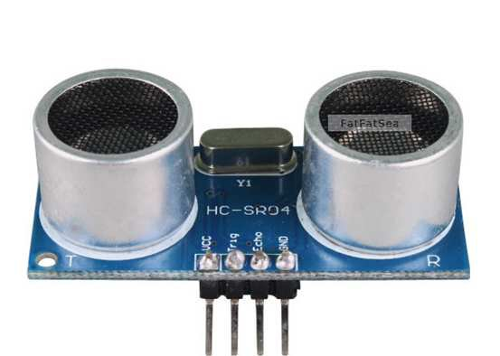
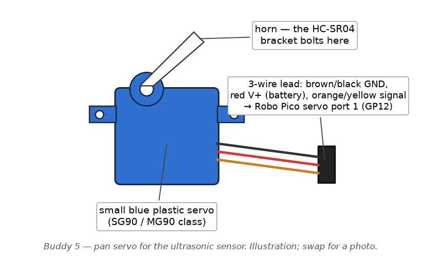
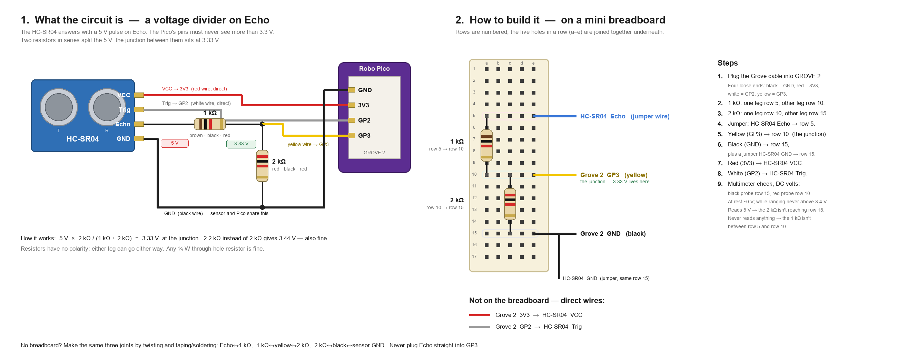

# Buddy 5 — Obstacle Scanning & Avoidance

> Your part of the team guide. The shared picture — the event bus (§1.2),
> the non-blocking rule (§1.3), start-up and the mission state machine
> (§2.1–2.2), the `core/` toolbox (§2.3) and the shared hardware (§3) — is
> in [`TEAM_GUIDE.md`](../../TEAM_GUIDE.md); every `§` below points there.
> Installing, building, flashing and testing is [`BUILD.md`](../../BUILD.md).
>
> **Datasheets for your parts** sit in this folder:
> - [`HCSR04.pdf`](HCSR04.pdf) — the HC-SR04 ranger — timing, 5 V Echo, range limits

**Files:** `subsystems/sub_scan.c/.h`, `drivers/drv_ultrasonic.c/.h`,
`drivers/drv_servo.c/.h`

## Your hardware — wiring, pin by pin

**HC-SR04 ultrasonic ranger (×1).** The blue board with two silver "eyes":
one speaker (T) that shouts an inaudible click, one microphone (R) that
listens for the echo. Four pins: `VCC`, `Trig`, `Echo`, `GND`. Range 2 cm –
4 m; the flight time of the echo is what `drv_ultrasonic.c` measures with
the microsecond stopwatch.

**SG90-class servo + pan bracket (×1).** The small blue plastic servo with a
white horn and a three-wire lead (brown or black = ground, red = power,
orange or yellow = signal). The HC-SR04 bolts to a bracket on the horn so
the scan task can point it from 30° to 150°. **Centre the servo at 90°
before attaching the bracket** (the `ultra` bench parks it at 90°).

 

**How to read a Grove socket.** Every Grove socket on the Robo Pico has
four pins, printed on the board in this order: `GND`, `3V3`, then the two
GPIO numbers. A standard Grove cable's wires are colour-coded — **black =
GND, red = 3V3, white = the first GPIO printed, yellow = the second** — but
don't trust colours blindly: hold the cable against the socket and read
which printed label each wire lands on. With a Grove-to-jumper (Dupont)
cable, the four loose ends are what you push onto the sensor's header pins.

**HC-SR04 → Grove 2**, one Grove cable, **with a resistor divider on the
Echo wire**:

| HC-SR04 pin | → Grove 2 label | Note |
|---|---|---|
| `VCC` | `3V3` (red) | the module prefers 5 V; at 3.3 V it works with shorter range — see `docs/HARDWARE.md` §3 |
| `GND` | `GND` (black) | |
| `Trig` | `GP2` (white) | the Pico's 12 µs "shout" pulse |
| `Echo` | **→ 1 kΩ → `GP3`** (yellow), **and 2 kΩ from `GP3` to `GND`** | see below |

> **Echo outputs 5 V. The Pico's pins are 3.3 V only and are not 5 V
> tolerant — connect Echo directly and you destroy the Pico.** Build the
> divider: Echo wire → one end of a 1 kΩ resistor; the other end of that
> resistor → the `GP3` wire *and* one end of a 2 kΩ resistor; the other end
> of the 2 kΩ → `GND`. The junction between the two resistors is what goes
> to GP3, at 3.33 V. A small breadboard or three solder joints; check it
> with a multimeter before plugging the Grove cable in.



**Building the divider, step by step** (the right half of the picture):

1. Plug the Grove cable into **Grove 2**. Its four loose ends are black =
   `GND`, red = `3V3`, white = `GP2`, yellow = `GP3`.
2. **1 kΩ** (bands brown · black · red): one leg in breadboard row 5, the
   other in row 10.
3. **2 kΩ** (red · black · red; 2.2 kΩ red · red · red is fine too): one
   leg in row 10 — a *different hole* of the same row — the other in row 15.
4. Jumper wire from the HC-SR04's `Echo` pin to row 5.
5. **Yellow (GP3)** into row 10. That row is the junction: 3.33 V lives here.
6. **Black (GND)** into row 15, plus a jumper from the HC-SR04's `GND` to
   row 15 — the sensor and the Pico must share a ground.
7. **Red (3V3)** straight to the HC-SR04's `VCC`; **white (GP2)** straight
   to `Trig`. No resistors on those two.
8. Multimeter on DC volts, black probe in row 15, red probe in row 10: about
   0 V at rest, and never above 3.4 V while the sensor is ranging. If you
   read 5 V the 2 kΩ isn't reaching row 15; if you never read anything the
   1 kΩ isn't between rows 5 and 10.

Resistors have no polarity — either leg can go either way. No breadboard?
Make the same three joints by twisting and taping or soldering: Echo↔1 kΩ,
1 kΩ↔yellow↔2 kΩ, 2 kΩ↔black↔sensor GND.

**Servo → servo header, port 4** (the rightmost of the four columns; the
header's three rows are `S`, `+`, `−` top to bottom):

| Servo wire | → header pin | GPIO |
|---|---|---|
| orange / yellow (signal) | `S`, column 4 | `GP15` |
| red (power) | `+`, column 4 | battery voltage |
| brown / black (ground) | `−`, column 4 | — |

Then `docs/HARDWARE.md` §4.5 steps 2–3: measure your servo's settle time
into `drv_servo.c`, and set `CAR_WIDTH_MM` in `sub_scan.c`.

**How your files connect to the rest of the car** (see §2.3 for what
each `core/` file is)

Two drivers, one subsystem, and you are the heaviest user of `core/` on
the team: the ultrasonic driver alone touches the switchboard, the
stopwatch, the defer list *and* the RP2040's hardware timer alarms.

| Your file | Talks to | Through | In plain terms |
|---|---|---|---|
| `drv_servo.c` | `core/rc_pwm` | `rc_pwm_init_pin(GP15, 50)`, `rc_pwm_set_pulse_us()`, `rc_pwm_enable()` | "Hold this angle" becomes a 1000–2000 µs pulse fifty times a second. `drv_servo_settle_ms()` estimates how long the horn takes to get there. |
| `drv_ultrasonic.c` | the RTOS's timer interrupts | `tk_def_int(INTNO_TIMER_1 / _2)` directly (not via `core/`) | Alarm 1 ends the 12 µs TRIG pulse; alarm 2 gives up if no echo arrives within 30 ms. No delay loops anywhere. |
| `drv_ultrasonic.c` | `core/rc_gpioirq` | `rc_gpioirq_attach(GP3, RC_EDGE_BOTH, …)`, `rc_gpioirq_enable(GP3, on/off)` | "Ring `echo_isr` on both edges" — but only while a ping is live, so a stray edge can't fake a reading. |
| `drv_ultrasonic.c` | `core/rc_time` | timestamps in `echo_isr` | Echo went high at *t1*, low at *t2*; `t2 − t1` in µs × 343 m/s ÷ 2 = distance. |
| `drv_ultrasonic.c` | `core/rc_defer` | `rc_defer_register(ultra_drain)`, `rc_defer_signal_i()` | ISR stores the two timestamps and rings the bell; `ultra_drain` does the division and publishes. |
| `drv_ultrasonic.c` | `core/rc_event` | `rc_event_publish(RC_EVT_ULTRA_RESULT)` | Range in mm, valid flag, and the servo angle it was tagged with. `sub_nav` watches these for the "something ahead" trigger. |
| `drv_ultrasonic.c` | `sub_scan.c` | `drv_ultrasonic_on_result(cb)` direct callback | Same result, delivered straight to your subsystem so the scan task can wake immediately (`tk_set_flg` on your own flag). |
| `sub_scan.c` | `drv_servo.c` / `drv_ultrasonic.c` | `drv_servo_set_angle()`, `drv_ultrasonic_ping(angle)` | The scan task steps the servo, pings, waits on its flag, repeats — coarse 30° sweep, then fine 6° sweep around the nearest hit. |
| `sub_scan.c` | `core/rc_event` | `rc_event_publish(RC_EVT_OBSTACLE_PROFILE)`, `…(RC_EVT_AVOIDANCE_PLAN)` | Your conclusions: where the obstacle is and which way to go round it. |
| `sub_scan.c` | `core/rc_config.h` | `RC_SCAN_COARSE_*`, `RC_SCAN_FINE_STEP`, `RC_PERIOD_SCAN_MS`, `RC_ULTRA_*` | Sweep geometry, step timing, range limits. |

Who calls *you*: `sub_nav` calls `sub_scan_set_watch(true, mm)` while
line-following (one forward ping every 60 ms), `sub_scan_start()` when a
watch ping comes back closer than the trigger distance, and
`sub_scan_abort()` on a stop. Your plan comes back to `sub_nav` as an
event and as the `on_complete` callback, and `sub_nav` then drives the
bypass using Buddy 2's `sub_motion_*()` calls — you never touch the
motors yourself.

**What this module does**

Imagine a bat, or a submarine's sonar operator: shout a short sound, then
listen for the echo bouncing off something in front of you — the longer
the echo takes to come back, the farther away the object is. That's
exactly what the HC-SR04 ultrasonic sensor does, except with an
ultrasonic "click" (40 kHz, above human hearing) instead of a shout.
Because one sensor only measures distance in a single straight line, it's
mounted on a small hobby servo motor — the same kind that swivels a
security camera — so it can be aimed left and right to build up a picture
of what's around the car, not just what's directly ahead. Buddy 5's job is
to sweep that sensor across an arc (a "coarse scan"), zoom in around
anything it finds (a "fine scan"), turn the raw distance readings into a
description of the obstacle (how close, how wide, how much room on each
side), and then decide whether the car should go straight, swerve left,
swerve right, or stop.

**Run your module** — bench `ultra`, `scan`. The full procedure, what good output looks like and what each bad symptom means is in [`BUILD.md`](../../BUILD.md) §5.7–5.8. Short version, in VS Code: **Terminal → Run Task → RoboCar: build bench image…**, pick it from the list, put the Pico in BOOTSEL, **…flash bench image…**, then open the Serial Monitor.

**How to get started**

1. **Wire it correctly first** (`docs/HARDWARE.md` §4.5): servo signal →
   GP15 (servo port 4), HC-SR04 on Grove 2: TRIG → GP2, ECHO → GP3
   **through a voltage divider** (1 kΩ ECHO→GP3, 2 kΩ GP3→GND). The
   RP2040 is not 5V
   tolerant and ECHO is a 5V signal — skipping the divider is the fastest
   way to destroy the board.
2. **Centre the servo mechanically at 90° before bolting on the bracket.**
   Power it, command 90° (`drv_servo_init()`'s default), and physically
   mount the bracket so "90°" really points straight ahead.
3. **Measure your actual servo's settle time and update the constants in
   `drv_servo.c`** (`US_PER_DEG`, `SETTLE_FIXED_MS`, used by
   `drv_servo_settle_ms()`). Defaults are rough guesses for a typical 9g
   servo. A full coarse scan takes roughly 5 × (servo travel time + 30ms
   of ultrasonic flight time) — getting this wrong makes scans too slow
   or makes them ping before the sensor has stopped swinging.
4. **Set `CAR_WIDTH_MM` in `sub_scan.c`** (currently a placeholder `150`)
   to your car's widest point plus about 40mm margin — this is what the
   avoidance planner compares gaps against.
5. Follow the HARDWARE.md §7 bring-up order: servo sweep test (step 8),
   ultrasonic vs. tape measure at 100/300/1000mm (step 9), full scan while
   confirming the motor PID loop keeps running smoothly throughout (step
   10).

**Code walkthrough**

Jargon up front — these terms show up constantly in this module, so get
comfortable with them before reading the code:

- **ISR (Interrupt Service Routine)** — a tiny piece of code the chip
  jumps to *automatically*, the instant some hardware event happens (a
  pin's voltage changes, a timer reaches zero), pausing whatever else was
  running to do it. Think of it like a phone ringing: you drop what
  you're doing, answer briefly, and get back to what you were doing — an
  ISR is expected to be that quick.
- **PWM (Pulse Width Modulation)** — a way to control something (a servo's
  position, a motor's speed) using only an on/off digital pin, by
  controlling *how long* the pulse stays "on" within each repeating time
  slice.
- **Duty cycle** — the fraction of each PWM cycle spent "on." Higher duty
  = more average power/signal.
- **TIMER alarm interrupt** — the RP2040 chip has hardware timers you can
  tell "interrupt me in X microseconds," and then simply forget about —
  no code sits in a loop counting down. When the time's up, the chip
  jumps straight to an ISR you registered ahead of time. This module uses
  two of these (see below) instead of software delay loops.
- **Pointer** — a variable that holds a memory *address* rather than a
  value directly — "where to find the data," not the data itself.
  Function pointers (pointers that hold the address of a *function*) are
  how this codebase implements callbacks: "call me back later," instead
  of "wait right here until you're done."
- **`struct`** — a way to bundle several related values into one named
  unit, like stapling several related fields onto one form instead of
  keeping them as loose separate notes.
- **`static`** (at file scope) — means "only visible inside this one .c
  file." It's how C fakes "private" module state without needing classes.
- **`const`** — a promise to the compiler (and to anyone reading the code)
  that a function won't modify whatever a pointer points to.
- **State machine (`enum` + `switch`/`if` chains)** — a way of writing
  code that can only ever be in one of a small, named set of "modes" at a
  time (e.g. "idle," "moving," "waiting for echo"), and reacts differently
  depending which mode it's currently in. This whole module is built as
  nested state machines — see below.

## `drv_servo.h` / `drv_servo.c` — aiming the sensor

This is the smaller of the two driver files, and does one job: point the
ultrasonic sensor at a given angle, and estimate how long it'll take to
get there. There is no way to *ask* the servo where it currently is — a
cheap hobby servo just accepts a "go here" pulse and trusts you to know
when it's arrived, the way a fax machine has no receipt showing the other
side actually printed the page.

- **`#define SERVO_HZ (50UL)`** — the PWM frame rate for the servo signal:
  one pulse every 1/50th of a second (20 ms). This isn't a tunable
  performance knob, it's just what hobby servos expect by convention —
  fixed by the hardware, not chosen for this project.
- **`#define PULSE_MIN_US (500UL)` / `#define PULSE_MAX_US (2400UL)`** —
  the pulse widths (in microseconds, within each 20 ms frame) that a
  typical hobby servo reads as "go to 0°" and "go to 180°." Everything
  between those two angles is a straight-line interpolation between these
  two pulse widths. These numbers come from the servo's own
  datasheet/convention, and are what `drv_servo_set_angle()` converts
  every angle into.
- **`#define SWEEP_DEG (RC_SERVO_ANGLE_MAX - RC_SERVO_ANGLE_MIN)`** — total
  degrees of travel (180), used as the divisor in that same interpolation.
- **`#define US_PER_DEG (2200UL)` and `#define SETTLE_FIXED_MS (25UL)`** —
  this is the pair called out explicitly in the "how to get started"
  section above, and it deserves the "what it does, why, what links to
  it" treatment the brief asks for:
  - **What it does:** `US_PER_DEG` estimates how many microseconds of
    travel time the servo needs *per degree* of movement; divided by 1000
    inside `drv_servo_settle_ms()`, it becomes milliseconds-per-degree.
    `SETTLE_FIXED_MS` is a flat number of extra milliseconds tacked on
    top, to let the mechanical arm stop physically wobbling ("ringing" —
    like a diving board bouncing after someone jumps off) once it
    technically arrives.
  - **Why:** because there's no feedback sensor telling the code "the
    servo has arrived," these two constants are the *entire* basis for
    knowing when a distance reading taken at a new angle can be trusted.
    Too short, and `sub_scan.c` pings before the sensor has physically
    settled, producing readings tagged with the wrong angle or blurred
    by motion. Too long, and every scan takes needlessly longer — a full
    5-point coarse scan takes roughly `5 × (servo travel + 30ms echo
    flight)`, so this pair of constants directly controls how long the
    car sits still scanning instead of driving.
  - **Links to other code:** `drv_servo_settle_ms()` (which uses both
    constants) is called from `step_to()` in `sub_scan.c`, which is the
    single function both the coarse and fine sweep loops use for every
    angle they visit. Get this wrong, and it shows up as a symptom in
    `sub_scan.c`'s scan timing, not in this file.
- **`drv_servo_init(void)`** — sets up the 50 Hz PWM signal and centers
  the sensor at 90° (straight ahead). Call once at boot, after the
  bracket has been mechanically aligned (see "How to get started" step 2
  above — the code's idea of "90° = straight ahead" only means anything
  if the bracket was bolted on correctly).
- **`drv_servo_set_angle(int16_t deg)`** — the actual "point it here"
  function. First it clamps `deg` to `RC_SERVO_ANGLE_MIN`/`MAX` (0–180)
  so a bug elsewhere can never ask for an angle outside what the bracket
  can physically reach. Then it does the pulse-width math:
  ```c
  pulse_us = PULSE_MIN_US
           + (((PULSE_MAX_US - PULSE_MIN_US) * (uint32_t)deg) / SWEEP_DEG);
  ```
  Read this as: "0° maps to `PULSE_MIN_US`, 180° maps to `PULSE_MAX_US`,
  and everything in between is proportionally in between" — the same
  logic as reading a value off a ruler between two marked ends. It's
  written as multiply-then-divide (not divide-then-multiply) specifically
  to lose as little precision as possible while only using whole-number
  (integer) arithmetic — there's no `float`/`double` anywhere in this
  codebase because the RP2040 chip has no hardware floating-point unit
  (FPU), and doing real decimal math in software would be slow. Finally
  it remembers `last_angle` and hands the pulse width to the PWM driver.
  It returns immediately — it does **not** wait for the servo to actually
  get there.
- **`drv_servo_get_angle(void)`** — returns whatever was last commanded.
  Again: a *command history*, not a live measurement.
- **`drv_servo_settle_ms(int16_t from, int16_t to)`** — see the detailed
  walkthrough of `US_PER_DEG`/`SETTLE_FIXED_MS` above; this function is
  where those two constants actually get combined: distance travelled
  (in degrees) × time-per-degree, plus the fixed settle allowance.
- **`drv_servo_release(void)`** — stops sending PWM pulses entirely, which
  lets the servo go mechanically limp and stop drawing current. This
  matters because the servo and the drive motors share one battery — a
  servo move happening at the exact moment the drive motors draw a big
  current spike (e.g. starting from a stop) can brown out (momentarily
  starve of power) the whole Pico.

## `drv_ultrasonic.h` / `drv_ultrasonic.c` — the "shout and listen"

This is the most technically interesting file in the module, because of
*how* it avoids blocking the rest of the car while a measurement is in
flight. It's worth understanding the naive alternative first, because the
whole design here is a direct reaction to it.

**The problem it avoids.** A textbook Arduino-style ultrasonic driver
looks like this:

```c
digitalWrite(TRIG, HIGH); delayMicroseconds(10);
digitalWrite(TRIG, LOW);  pulseIn(ECHO, HIGH);
```

Both `delayMicroseconds` and `pulseIn` are **busy-waits** — the processor
sits in a tight loop doing nothing else until the operation finishes.
`pulseIn` in particular can hold the CPU hostage for up to 30
milliseconds if nothing echoes back (sound has to travel out and back, at
about 343 m/s, and the sensor's own max range takes a while to time out).
On this car, the wheel motor control loop needs to run roughly every 20
milliseconds to keep the car driving straight and smooth (see Buddy 2's
PID loop in `sub_motion.c`). A 30ms stall means a missed control update —
visible as a stutter or swerve exactly when the sensor is trying to look
for obstacles, which is precisely the worst possible moment for the car
to lose control.

**The fix: a 5-step interrupt relay.** Instead of one function that waits
the whole way through, the measurement is broken into five tiny pieces,
each one doing only a few microseconds of work and then handing off to
the *next* piece via a hardware interrupt — nothing in software ever sits
and waits. Here's each step, in order, with what hardware event triggers
it and exactly what it does:

1. **`drv_ultrasonic_ping(int16_t tag_angle_deg)`** — called from ordinary
   code (specifically `step_to()` in `sub_scan.c`), not from an
   interrupt. This is where a measurement *begins*. It:
   - Briefly disables all interrupts (`DI(sts)` / `EI(sts)` — Disable
     Interrupts / Enable Interrupts) just long enough to check "is a
     measurement already running?" and, if not, mark one as starting.
     This tiny "critical section" exists so an ISR can never sneak in
     between the check and the set and see the state half-updated — a
     classic bug called a race condition.
   - Records `tag_angle_deg` — the servo angle this measurement is being
     taken at — so that once a result eventually comes back, it can be
     matched to *which direction* it was looking, without extra
     bookkeeping elsewhere.
   - Raises the TRIG pin high (this is the "shout") and arms **TIMER
     alarm 1** to fire again in `RC_ULTRA_TRIG_US` (12 microseconds) —
     the standard trigger pulse length the HC-SR04 datasheet asks for.
   - Returns immediately. Total time spent: a handful of microseconds.

2. **`trig_done_handler` — triggered by TIMER alarm 1 firing**, exactly
   12µs after step 1 armed it. This is the chip's own hardware clock
   jumping straight to this function; nothing was sitting and counting
   down in software. It:
   - Drops TRIG back to low — the trigger pulse is over, and the HC-SR04
     has (by now) started emitting its 40kHz "click" and preparing to
     listen for the echo.
   - **Un-masks (enables) the ECHO pin's interrupt.** This is the key
     idea that makes the *listening* half interrupt-driven too: from this
     instant on, any voltage change on the ECHO pin will itself
     automatically trigger step 3/4 below — no polling loop needed.
   - Arms **TIMER alarm 2** as a timeout safety net (step 5), in case the
     echo never comes back at all.

3. **`echo_isr` (rising edge) — triggered the instant the ECHO pin goes
   high.** The HC-SR04 raises ECHO the moment it starts listening for the
   sound to bounce back, so the pin itself is effectively a stopwatch
   button. This handler just records the current microsecond timestamp
   into `t_rise` and moves the internal state machine on to "waiting for
   the echo to end."

4. **`echo_isr` (falling edge) — triggered the instant the ECHO pin drops
   back to low**, meaning the sensor detected the reflected sound. It
   computes `t_us - t_rise` — exactly how long ECHO stayed high, in
   microseconds — and hands that duration off to `finish_i()`. Crucially,
   the actual *division* needed to turn microseconds into millimetres
   (via the `US_TO_MM` macro) does **not** happen here — it's deferred to
   a "bottom half" function, `ultra_drain()`, that runs later in normal
   task context. The golden interrupt rule from TEAM_GUIDE.md §1.2
   applies directly here: an ISR may only record a timestamp and hand
   off, never do the heavier work (division, publishing an event, calling
   a user callback) itself. `finish_i()` also does the two things that
   genuinely *can't* wait — masking the ECHO pin's interrupt back off
   (so a noisy, ringing 5V-to-3.3V voltage divider can't keep firing
   spurious interrupts while the car is busy doing something else) and
   cancelling the now-unnecessary timeout alarm.
5. **`timeout_handler` — triggered by TIMER alarm 2 firing**, if steps 3
   and 4 never happened within `RC_ULTRA_TIMEOUT_US` of step 2 arming it.
   This is the safety net: if nothing echoes back at all (nothing is in
   front of the sensor, or it's too far away, too soft to reflect sound,
   or angled away), this fires instead and reports an *invalid* reading —
   so a scan can never get stuck waiting forever for a result that will
   never arrive.

**Why two TIMER alarms and not one?** Because two independent countdowns
are needed simultaneously at different points: one to time the outgoing
12µs trigger pulse (alarm 1), and a separate one to time the maximum
allowed wait for a returning echo (alarm 2). They're both RP2040 hardware
peripherals reserved specifically because this project's underlying RTOS
port doesn't otherwise use them (see the comment at the top of
`drv_ultrasonic.h`).

**The math constant worth knowing:**
```c
#define US_TO_MM(us)  (((us) * 343UL) / 2000UL)
```
Speed of sound is roughly 343 metres/second at room temperature. The echo
travels *out and back* (to the obstacle and then all the way back to the
sensor), so the raw one-way distance is half of what the round-trip time
would suggest — that's where the extra factor of 2 comes from (`/2000`
instead of `/1000`, folding the unit conversion and the "divide by two
for round trip" into one division). It's written as a macro (compiler
text-substitution, not a real function call) so it's essentially free to
use, and it works directly on whatever integer width is handed in.

**Result delivery — `ultra_drain()` and `RC_EVT_ULTRA_RESULT`.** Once
`finish_i()` has stashed a raw measurement, it calls
`rc_defer_signal_i()` to request that `ultra_drain()` run soon, in normal
task context. `ultra_drain()` converts the width to millimetres, checks
it against `RC_ULTRA_MIN_MM`/`RC_ULTRA_MAX_MM` (flagging it invalid if
out of the sensor's honest working range), then publishes
`RC_EVT_ULTRA_RESULT` on the shared event bus (see TEAM_GUIDE.md §1.2)
and — if one was registered via `drv_ultrasonic_on_result()` — calls a
direct callback too. `sub_scan.c`'s `on_range()` is exactly that
callback: it's what stitches a raw distance reading back into the
angle-tagged `points[]` array a scan is building up.

## `sub_scan.h` / `sub_scan.c` — scanning, profiling, and planning

This file is where the two drivers above get orchestrated into an actual
behaviour: sweep, look at what was found, decide what to do about it. It
is built as **two nested state machines** — the top-level scan state
(idle / watching / coarse-moving / coarse-pinging / fine-moving /
fine-pinging) plus the ping/echo state machine inside
`drv_ultrasonic.c` underneath it.

**The event-flag "doorbell" pattern.** Before the state machine itself, a
quick note on the plumbing: `scan_flgid` is a kernel "event flag" object,
which is like a doorbell a task can go to sleep listening for (via
`tk_wai_flg`), instead of constantly checking a mailbox in a loop. Other
code rings that doorbell (`tk_set_flg`) with one of three named bits:

- **`FLG_RESULT`** — "an ultrasonic ping just produced a result," rung by
  `on_range()` (the ultrasonic driver's registered callback) every time a
  measurement completes.
- **`FLG_START`** — "please begin a scan," rung by `sub_scan_start()`.
- **`FLG_ABORT`** — "stop whatever's running," rung by `sub_scan_abort()`.

This is how `scan_task` (the background task driving the whole module)
can sleep almost the entire time a scan is happening, without polling
anything.

**The scan state machine.** `scan_state_t` defines the named states:
`S_IDLE` (nothing happening), `S_WATCH` (slow continuous forward ping —
see below), `S_COARSE_MOVE`/`S_COARSE_PING` (the broad first sweep),
`S_FINE_MOVE`/`S_FINE_PING` (the zoomed-in re-scan), and an unused
`S_DONE` marker. Walking through what actually happens, function by
function:

- **`sub_scan_init(void)`** — creates the event flag and the background
  `scan_task`, and registers `on_range()` with the ultrasonic driver.
  Call once at boot, after `drv_servo_init()` and `drv_ultrasonic_init()`.
- **`sub_scan_start(void)`** — the entry point everything else calls
  (typically `sub_nav.c`, the shared mission state machine, when it
  decides an obstacle needs a proper look). Returns `RC_ERR_BUSY` if a
  scan is already running, otherwise rings `FLG_START` and returns
  **immediately** — this is the "start it and register a callback"
  non-blocking pattern from TEAM_GUIDE.md §1.3 in action. The actual
  scanning work happens later, on `scan_task`'s own schedule.
- **`scan_task(INT stacd, void *exinf)`** — the background task, created
  once and running forever (`for (;;)`, a loop with no exit — the normal
  C idiom for "a task that just keeps doing its job"). Each time through
  the loop:
  - If in `S_WATCH`, it pings straight ahead once, waits for the result,
    then sleeps for `RC_PERIOD_SCAN_MS` before looping again — this is
    the slow, continuous "is something getting close while I'm just line
    following" background check (see `sub_scan_set_watch` below).
  - Otherwise it sleeps (via `tk_wai_flg`) until `FLG_START` is rung (or
    100ms passes, just so the loop can re-check things periodically).
  - Once started, it calls `run_coarse()`, then — if something was found
    — `find_fine_window()` followed by `run_fine()`, then
    `publish_and_finish()` to report the result. If a watch was requested
    meanwhile, it drops back into `S_WATCH` instead of `S_IDLE` once done.
- **`step_to(int16_t angle)`** — the one function both sweep loops call
  for every angle they visit: ask `drv_servo_settle_ms()` how long this
  particular move will take, command the servo there, **sleep for that
  long via `tk_dly_tsk()`** (a genuine kernel sleep — the task is
  completely off the CPU, not spinning), then start one ultrasonic ping.
  This single function is where the "non-blocking but still correctly
  timed" trick lives: from the outside it looks like ordinary sequential
  code (move, wait, ping), but because the wait is a kernel sleep and not
  a busy loop, every other task on the system — especially the motion PID
  loop — keeps running at full rate the entire time.
- **`wait_result(void)`** — sleeps until either `FLG_RESULT` or
  `FLG_ABORT` is rung, or 100ms passes as a safety timeout (protecting
  against a genuinely wedged measurement, not expected to fire in normal
  operation since the ultrasonic driver has its own timeout — see step 5
  above).
- **`run_coarse(void)`** — the broad first pass: steps the servo from
  `RC_SCAN_COARSE_START` to `RC_SCAN_COARSE_END` in
  `RC_SCAN_COARSE_STEP`-degree increments (all defined in
  `rc_config.h`), pinging and collecting a result at each stop. This is
  the "slowly pan the security camera across the whole visible arc once"
  pass.
- **`find_fine_window(void)`** — looks back over everything `run_coarse()`
  collected, finds the single closest hit that counted as an obstacle
  (closer than `OBSTACLE_MM`), and computes a narrow angular window
  (`fine_from`..`fine_to`) centred on it, clamped to the servo's physical
  travel limits. This is the "spotted something, now swing back and get a
  closer look at just that spot" step. Returns `false` (skipping the fine
  scan entirely) if nothing close enough was found.
- **`run_fine(void)`** — re-scans just that narrow window at the tighter
  `RC_SCAN_FINE_STEP` spacing, adding these extra, more closely-packed
  points on top of what the coarse pass already collected. This sharpens
  the eventual width/clearance estimate around the one obstacle that
  matters, without paying the cost of scanning the *entire* arc that
  finely.
- **`on_range(uint16_t range_mm, bool valid, void *ctx)`** — registered
  with the ultrasonic driver as its result callback, so this runs in
  **interrupt context**. It does the bare minimum allowed: store the
  reading (angle, range, valid) into the next free slot of the `points[]`
  array — guarded by a bounds check so a scan can never write past the
  end of the fixed-size array, a classic C bug this code deliberately
  avoids — then rings `FLG_RESULT` to wake `scan_task`.

**The obstacle-profiling trigonometry — `build_profile()`.** Once a scan
finishes, this function walks every collected `(angle, range)` point once
and boils the whole scan down into five numbers: closest obstacle
distance and its bearing, an estimated width, and clearance (open space)
on the left and right of straight-ahead. The interesting part is the
width estimate:

```c
int32_t span_ddeg = ((int32_t)last_hit - (int32_t)first_hit) * 10;
int32_t span_mrad = (span_ddeg * 1745) / 1000;
p->width_mm = (uint16_t)(((int32_t)closest * span_mrad) / 1000);
```

The underlying geometry: `width ≈ 2 × range × tan(span / 2)`, where
`span` is the angular width (in degrees) the obstacle occupied across the
sweep (`first_hit` to `last_hit` — the first and last angle at which a
reading counted as "close"), and `range` is the distance to it. Picture
the sensor at the point of a narrow triangle, with the obstacle's two
edges as the triangle's other two corners — this is exactly the same
trigonometry an old-fashioned land surveyor uses to estimate the width of
something across a field just from one distance and two angles.

The code doesn't call a real `tan()` function, though — and this is the
key trick, called the **small-angle approximation**: for angles under
about 60 degrees, `tan(x)` (measured in radians) is close enough to `x`
itself that the error is smaller than the HC-SR04's own ~15° beam width
(the sensor's own fuzziness already swamps this shortcut's error). That
approximation lets the whole computation be done with plain integer
multiply/divide instead of needing a real trigonometric function — which
matters because the RP2040 chip has **no hardware floating-point unit
(FPU)**, so calling a software `tan()` would be slow, and would also
require `float`/`double` math, which this entire codebase avoids on
principle (see TEAM_GUIDE.md §5, "No floating point anywhere" — Buddy 4's
pitch-to-height calculation in `sub_terrain.c` uses this exact same
small-angle trick for the same reason). Concretely: `span_ddeg` converts
the angular span into tenths of a degree (keeping it a whole number even
though the real span may not be a multiple of 10), `span_mrad` converts
that into milliradians (thousandths of a radian, using the constant 1745
≈ 1000 × π/180 × 10, i.e. "tenths of a degree to milliradians"), and the
final line multiplies that angle (in "radians × 1000") by the distance
and divides back down by 1000 — which works out to exactly `range ×
angle_in_radians`, standing in for the full `2 × range × tan(span/2)`
formula (the factor of 2 and the "half the span" cancel out
algebraically, which is why neither shows up explicitly in the code).

**Clearance counting.** `clearance_left_mm`/`clearance_right_mm` are
*not* a measured gap width — they're a count of how many sampled bearings
on each side of straight-ahead came back "clear" (farther than
`OBSTACLE_MM`), multiplied by the angular spacing between samples
(`RC_SCAN_COARSE_STEP`) to turn "N clear bearings" into a rough linear
distance. This is a deliberately crude stand-in: a single narrow ranging
beam, sampled in discrete angular steps, can honestly only report "this
direction looked open," not a smooth, precise gap width.

**The decision — `build_plan()`.** Takes the profile above and turns it
into one of: go straight (nothing close, or the nearest thing is further
than `OBSTACLE_MM`), stop (both `clearance_left_mm` and
`clearance_right_mm` are below `CAR_WIDTH_MM` — nowhere safe to fit), or
turn toward whichever side reported more clearance (`>=` breaks a tie
toward turning left, an arbitrary but consistent choice). When it decides
to turn, it also computes how far sideways (`lateral_mm`) and forward
(`forward_mm`) to steer — half the car's width plus half the obstacle's
width sideways, and the obstacle's width plus a 100mm margin forward —
simple geometric estimates for clearing the obstacle's far edge before
straightening back out. `build_plan()` only *decides*; it's
`sub_motion.c` (Buddy 2's module) that actually drives the resulting
turn/distance commands.

**Reporting the result — `publish_and_finish()`.** Builds the profile and
plan, then publishes both on the shared event bus:
`RC_EVT_OBSTACLE_PROFILE` and `RC_EVT_AVOIDANCE_PLAN`. `sub_nav.c` (the
shared mission state machine everyone's module plugs into — see
TEAM_GUIDE.md §2.2) subscribes to `RC_EVT_AVOIDANCE_PLAN` to know when
it's time to leave `RC_NAV_AVOIDING` mode and hand off to `sub_motion.c`'s
actual turn/drive commands; `sub_telemetry.c` (Buddy 1's module)
subscribes to `RC_EVT_OBSTACLE_PROFILE` to report what was found. Any
direct callback registered via `sub_scan_on_complete()` is also called
here, and finally the state machine resets to idle (or back to `S_WATCH`
if a continuous watch was requested).

**Continuous forward watch — `sub_scan_set_watch(bool on, uint16_t
trigger_mm)`.** A lighter-weight mode than a full scan: while the car is
just line-following, one ping straight ahead fires every
`RC_PERIOD_SCAN_MS` so the car can notice something getting close without
running a full sweep constantly — like a security camera's motion sensor
staying on low-power standby between active sweeps. `sub_nav.c` subscribes
to `RC_EVT_ULTRA_RESULT` directly (not through this module) and decides
when a watch reading is close enough to escalate into a real
`sub_scan_start()`.

**Missing / TODO for Buddy 5**

- **No memory of which side was chosen last time.** On a track with
  several obstacles in a row, the planner picks left-or-right
  independently each time from current clearance counts only. If it
  alternates sides between obstacles, the car wastes distance zig-
  zagging. Needs a small piece of state remembering the last avoidance
  direction (with a bias toward repeating it when clearance is roughly
  tied).
- **No "reverse and reattempt" case.** The project brief calls for this,
  but `build_plan()` currently just returns `RC_CMD_STOP` when both
  `clearance_left_mm` and `clearance_right_mm` are below `CAR_WIDTH_MM` —
  it stops rather than backing up and trying a different approach angle.
  Needs: when both sides are too narrow, issue a reverse command, then
  re-trigger `sub_scan_start()` from the new position.
- **Report the real angular resolution honestly.** The HC-SR04's ~15°
  beam width means `RC_SCAN_FINE_STEP` (6°) is oversampling for smoothing
  only — the sensor physically cannot distinguish bearings closer than
  ~15° apart. Say so in writeups rather than claiming 6° accuracy.
