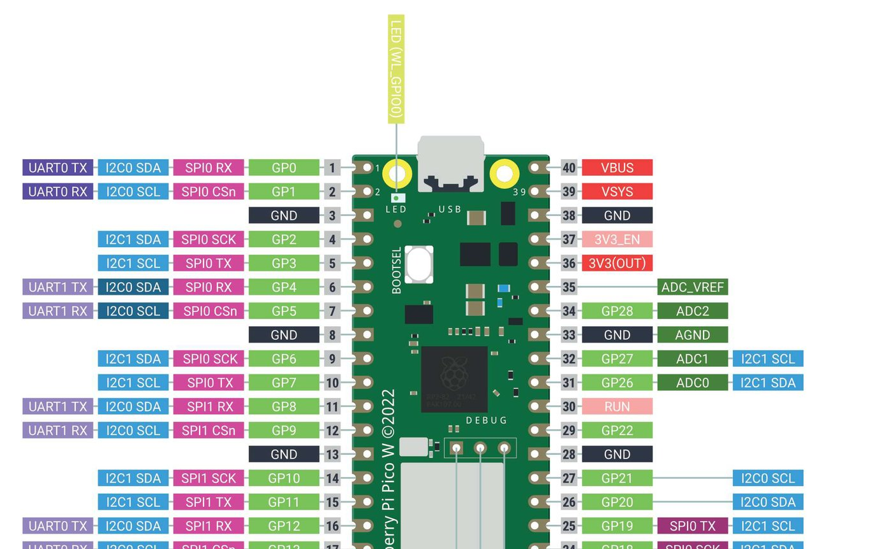

# Buddy 1 — WiFi, Command & Telemetry

> Your part of the team guide. The shared picture — the event bus (§1.2),
> the non-blocking rule (§1.3), start-up and the mission state machine
> (§2.1–2.2), the `core/` toolbox (§2.3) and the shared hardware (§3) — is
> in [`TEAM_GUIDE.md`](../../TEAM_GUIDE.md); every `§` below points there.
> Installing, building, flashing and testing is [`BUILD.md`](../../BUILD.md).

## Your hardware — nothing to wire

The WiFi radio is the CYW43439 module already soldered onto the Pico W (the
metal can at the USB end). It talks to the RP2040 over pins that never leave
the board (GP23/24/25/29), so there is no cable for you. Your hardware work
is:

- making sure every image is built by `build/build.sh` / the VS Code tasks,
  so the console rides the USB cable (`CONSOLE=usb_cdc`) — GP0/GP1, the
  pins a wired console would use, belong to the left encoder;
- later, confirming the radio comes up through the kernel port's
  `libwifi`, and bringing a laptop hotspot or router to the demo.

The status LED on GP19 is *shared* hardware (everyone's boot check) — its
wiring is in `TEAM_GUIDE.md` §3.



**How your files connect to the rest of the car** (see §2.3 for what
each `core/` file is)

You are the only buddy without a `drivers/` file of your own — the WiFi
chip is driven by the RTOS port's own library, and until that path is
proven your "hardware" is the serial console. Your subsystem sits at the
*receiving* end of the notice board: it never reads a sensor directly, it
listens to what the other four subsystems publish and turns that into
messages.

| Your file | Talks to | Through | In plain terms |
|---|---|---|---|
| `sub_telemetry.c` | `core/rc_event` | `rc_event_subscribe(…, RC_LANE_SLOW, …)` for `ODOMETRY`, `LINE_SAMPLE`, `BARCODE_DECODED`, `HUMP_END`, `OBSTACLE_PROFILE`, `IMPACT` | "Tell me whenever one of these happens." Always the SLOW lane, so a slow network send can never delay steering. |
| `sub_telemetry.c` | `core/rc_fmt` | `rc_snprintf()`, `rc_strlen()` | Builds the JSON text without the heavy standard library. |
| `sub_telemetry.c` | `core/rc_time` | `rc_time_ms()` | Timestamps each message. |
| `sub_telemetry.c` | `core/rc_event` | `rc_event_dropped(lane)` | Reports in the heartbeat whether the notice board is overflowing — a health statistic for the whole car. |
| `sub_telemetry.c` | `core/rc_config.h` | `RC_PERIOD_TELEM_MS`, `RC_PRI_TELEMETRY` | How often to publish (250 ms) and how unimportant your task is (priority 10, the lowest). |
| `sub_telemetry.c` | *a sink* (console now; UDP / MQTT later) | the `sub_telemetry_sink_t` function-pointer struct | The only thing you swap to move from serial to WiFi. The rest of the file doesn't change. |

Data flows *into* you from Buddies 2–5 via events, and *out* of you to the
sink. The one path in the other direction — commands arriving from the
network — comes in through the callback registered with
`sub_telemetry_on_command()`, which hands the `rc_nav_cmd_t` to `sub_nav`
(nothing delivers a command yet; that arrives with the MQTT sink).

**What this module does**

This module is the robot's "reporting and remote-control desk." While other
parts of the code drive motors and read sensors, this one packages up
status updates (speed, distance, line-sensor readings, detected barcodes,
bumps in the road) into small text messages and sends them out so a human
or a laptop can watch what the robot is doing in real time. It also has a
slot ready for the reverse direction — receiving driving commands from
outside — though that path isn't wired up yet. Today the messages go to the
on-screen debug console; the design lets that be swapped for WiFi later
without rewriting anything else.

**Run your module** — bench `telemetry`. The full procedure, what good output looks like and what each bad symptom means is in [`BUILD.md`](../../BUILD.md) §5.9. Short version, in VS Code: **Terminal → Run Task → RoboCar: build bench image…**, pick it from the list, put the Pico in BOOTSEL, **…flash bench image…**, then open the Serial Monitor.

**How to get started**

1. Open `subsystems/sub_telemetry.c` and `subsystems/sub_telemetry.h` side
   by side — the header is the "public menu" of what this module offers,
   the `.c` file is the implementation.
2. Build and flash the project as-is first. `sub_telemetry_init()` is
   already wired into `usermain` — watch the debug console and you should
   see lines like `[telem] car/01/state {...}` appearing repeatedly. That's
   the console sink working; it's your baseline before touching anything.
3. Read `send()`, `publish_state()`, and `publish_heartbeat()` in the `.c`
   file to see how a message goes from "some numbers" to "a line of JSON on
   a topic."
4. Look at the `TODO Buddy 1` comments — one in `sub_telemetry.h` and one
   inside `telemetry_task()` in the `.c` file. Those are your two real
   jobs: build a transport that actually leaves the board (UDP, then MQTT)
   and add reconnect logic when the link drops.
5. When you build a transport, write a new `.c` file that fills in a
   `sub_telemetry_sink_t` struct (four function pointers, described below)
   and pass it to `sub_telemetry_set_sink()`. You do not need to touch the
   framing or scheduling code — that's the whole point of the sink
   interface.
6. Recommended build order (see `README.md` "Telemetry" section):
   **console (already works) → UDP → MQTT**. Don't start with MQTT — the
   RTOS port doesn't ship an MQTT client at all, so you'd have nothing to
   demo until you also built or imported one.

**Code walkthrough**

This is a line-by-line-style tour of `sub_telemetry.h` and
`sub_telemetry.c`. It assumes you've read `TEAM_GUIDE.md` §1.2–1.3 (event bus, lanes,
non-blocking pattern) and explains everything else — pointers, structs,
casts, the works — the first time it shows up. The source files
themselves now also carry inline comments next to almost every
non-obvious line; this section is the "why," the source is the "what,
right here."

## Jargon you'll hit immediately

- **Pointer**: a variable that stores a memory *address* rather than a
  value directly — think of it as a sticky note with someone else's
  house address written on it, instead of a photocopy of what's inside
  that house. You "follow" a pointer to get at the real data. C spells
  "pointer to a `foo`" as `foo *`.
- **Struct**: a bundle of named fields glued into one value, like a
  form with labelled boxes (name, age, address). C has no
  classes/objects — a struct is as close as it gets, and this module
  uses structs a lot.
- **Function pointer**: a pointer whose address points at *code*
  instead of data — a variable that "remembers a function" so it can be
  called later, possibly by code that has no idea which specific
  function it ends up calling. This is C's version of a "callback" and
  is the trick the whole pluggable-transport design rests on.
- **Cast**: writing `(int)x` or `(unsigned long)x` tells the compiler
  "treat this value as this other type for this one expression." It
  doesn't change the underlying number, it just satisfies a function
  that expects a specific type (very common when formatting numbers
  into text, as this file does constantly).
- **`static`** on something at file scope means "private to this .c
  file" — no other file can see or link to it. It's the nearest C gets
  to encapsulation without classes.
- **`const`** on a pointer parameter is a promise: "this function will
  only read through this pointer, never write through it."
- **JSON** (JavaScScript Object Notation): plain text laid out as
  `{"key":value, "key2":value2}`. It's human-readable in a debug
  console and every network/monitoring tool already understands it,
  which is exactly why this module uses it for message bodies.

## `sub_telemetry.h` — the public menu

```c
typedef struct {
    const char *name;
    rc_result_t (*open)(void);
    rc_result_t (*publish)(const char *topic, const char *payload, uint16_t len);
    rc_result_t (*close)(void);
    bool        (*is_up)(void);
} sub_telemetry_sink_t;
```
This is a **struct of function pointers** — the single most important
idea in this module, so it's worth slowing down on. Every field after
`name` is not a value but the *shape* of a function: "a function taking
no arguments and returning an `rc_result_t`," for instance. Nothing here
says *which* function — that gets filled in later, once per transport
(see `console_sink` below). Once a `sub_telemetry_sink_t` is fully
filled in, it behaves like a plug: the rest of this file can call
`sink->open()`, `sink->publish(...)`, `sink->close()`, `sink->is_up()`
without caring at all whether it's actually talking to the debug
console, a UDP socket, or (eventually) an MQTT client. This is why
Buddy 1's real job — building UDP and MQTT transports — never requires
touching `send()`, `publish_state()`, or any of the scheduling logic:
build a new file that fills in one of these structs, hand it to
`sub_telemetry_set_sink()`, done. `open`/`publish`/`close` all return
`rc_result_t` (this project's shared success/failure enum — see
`rc_types.h`) so failures propagate the same way everywhere else in the
codebase; `is_up` returns a plain `bool` because it's a pure status
check, not an action that can itself fail.

```c
typedef void (*sub_telemetry_cmd_cb_t)(rc_nav_cmd_t cmd, int32_t arg, void *ctx);
```
This line defines a *type*, not a function — read it as "the name
`sub_telemetry_cmd_cb_t` now means: a pointer to a function that takes
an `rc_nav_cmd_t`, an `int32_t`, and a `void *`, and returns nothing."
`rc_nav_cmd_t` is the shared enum of driving commands (turn left, turn
right, U-turn, straight, stop — see `rc_types.h`, also used by Buddy 3's
barcode decoder and Buddy 5's obstacle planner). `void *ctx` is a
generic "carry whatever you like" pointer: whoever registers a callback
supplies it once via `sub_telemetry_on_command(cb, ctx)`, and it comes
back unchanged every time the callback fires later, letting the callback
find its own state without needing a global variable. This whole type
exists for the *receiving* side of telemetry — commands coming in from
outside the robot — which is declared but not yet wired to anything real
(see TODOs).

```c
rc_result_t sub_telemetry_init(void);
rc_result_t sub_telemetry_set_sink(const sub_telemetry_sink_t *sink);
rc_result_t sub_telemetry_on_command(sub_telemetry_cmd_cb_t cb, void *ctx);
rc_result_t sub_telemetry_publish_event(const rc_event_t *evt);
const sub_telemetry_sink_t *sub_telemetry_console_sink(void);
```
These five are the module's entire public API — everything another file
is allowed to call. They're covered in detail below alongside their
implementations in the `.c` file, since the header only declares their
*shape*, not what they do.

## `sub_telemetry.c` — constants

```c
#define TOPIC_MAX       (48)
#define PAYLOAD_MAX     (192)
#define TOPIC_BASE      "car/01"
```
`#define` is a **preprocessor macro** — before the compiler even sees
the code, a separate pass called the preprocessor does a literal
find-and-replace of the macro name with its text. So every later use of
`TOPIC_MAX` becomes the literal number `48`. Using named constants
instead of scattering bare numbers ("magic numbers") through the code
means the *meaning* of the number is documented at its one definition,
and changing it later only requires editing one line.

- **`TOPIC_MAX` (48 bytes)** — the size of the local buffer `send()`
  uses to build a topic string like `car/01/state`. C strings need one
  extra byte for the terminating `'\0'` (a zero byte marking "end of
  string" — C strings don't carry their length separately, unlike, say,
  Python strings), so this has to be big enough for `TOPIC_BASE` plus
  the longest leaf name (`"heartbeat"`, `"obstacle"`, etc.) plus a `/`
  plus that terminator.
- **`PAYLOAD_MAX` (192 bytes)** — the size of the local buffer used to
  build one JSON message body before sending it. If a future message
  needs more fields than fit in 192 bytes, `rc_snprintf` will simply
  truncate it rather than overflow the buffer — bump this constant first
  if you add fields and messages start looking cut off.
- **`TOPIC_BASE` ("car/01")** — the shared prefix for every topic this
  car publishes, e.g. `car/01/state`, `car/01/barcode`. If this project
  ever ran multiple cars on one shared MQTT broker, each car would get a
  different number here so a broker subscription like `car/+/state`
  (the `+` is an MQTT wildcard for "any one topic segment") could
  address all of them, or `car/01/#` (the `#` wildcard, "everything
  under this prefix") could address just this one. This constant is
  exactly the kind of thing "#define STEER_KP (2)" is a stand-in for in
  the task brief — a single named knob other code (here, `send()`) reads
  by name instead of retyping the string.

## File-scope state

```c
static const sub_telemetry_sink_t *sink;
static ID       telem_tskid;
static uint32_t seq;
static uint32_t tx_count;
static uint32_t tx_fail;
static sub_telemetry_cmd_cb_t cmd_cb;
static void    *cmd_ctx;
```
All `static` at file scope, meaning private to this file but alive for
the whole program run (unlike a variable declared inside a function,
which is thrown away when that function returns). `sink` is the pointer
to whichever transport struct is currently active — everything in this
file routes messages *through* this one pointer, which is the entire
mechanism behind swapping transports without touching the rest of the
code. `telem_tskid` is the RTOS's handle for the background task created
in `sub_telemetry_init()`. `seq`, `tx_count`, `tx_fail` are simple
running counters reported in the outgoing messages themselves — useful
for a human watching the console to notice, say, that `tx_fail` is
climbing. `cmd_cb`/`cmd_ctx` hold whatever was registered through
`sub_telemetry_on_command()`, waiting for a receiving transport to
actually call them one day.

```c
static volatile int32_t  st_speed_l;
static volatile int32_t  st_speed_r;
static volatile uint32_t st_dist_mm;
static volatile bool     st_line_l;
static volatile bool     st_line_r;
```
This little block is the module's cache of "the latest known sensor
readings," kept fresh by the `on_odometry()`/`on_line()` event
subscriptions further down and read out whenever `publish_state()` needs
to build the next status message. `volatile` here tells the compiler
"this value can change at any moment for reasons outside this function's
own code (a different task's callback wrote to it), so never assume a
previously read value is still valid — always re-read it." Without
`volatile`, an optimizing compiler would be technically allowed to
"cache" one of these values in a CPU register and never notice a
callback updated it. The comment above them in the source explains why
no lock/mutex is needed despite two different tasks touching them: each
field is written by exactly one callback and read by exactly one task,
and on this 32-bit architecture reading/writing a single `int32_t` or
`bool` can't be interrupted halfway through, so there's no way to
observe a "torn" half-updated value.

## The console sink — `console_open`/`console_publish`/`console_close`/`console_is_up`, `console_sink`, `sub_telemetry_console_sink()`

These four small functions are the console transport's implementation
of the `sub_telemetry_sink_t` interface described above. `console_open`
and `console_close` do nothing (return `RC_OK` immediately) because
there's no connection to set up or tear down for printing to a screen.
`console_is_up` always returns `true` — there's no cable to unplug.
`console_publish` is the interesting one:

```c
static rc_result_t console_publish(const char *topic, const char *payload, uint16_t len)
{
    (void)len;
    tm_printf((UB *)"[telem] %s %s\n", topic, payload);
    return RC_OK;
}
```
`tm_printf` is the RTOS's own `printf`-alike for writing to the debug
console (the same place you see boot logs). `(void)len;` is a very
common C idiom meaning "yes, I know this parameter exists and I'm not
using it, don't warn me about it" — the console doesn't need an explicit
length because `tm_printf` can find the end of `payload` itself (it's a
normal null-terminated string), but the interface always hands `len`
along because a lower-level transport like raw UDP genuinely needs to
know how many bytes to send. `(UB *)` is a cast converting the string
literal's type to `UB *` ("unsigned byte pointer"), the type this
particular RTOS's `tm_printf` expects — it doesn't change any bytes,
just satisfies the compiler.

```c
static const sub_telemetry_sink_t console_sink = {
    "console", console_open, console_publish, console_close, console_is_up
};
```
This is where the "plug" actually gets built: a real
`sub_telemetry_sink_t` value with each function-pointer field pointing
at the matching function above. Writing a function's name without
parentheses (`console_open`, not `console_open()`) gives you its
*address* — exactly what a function-pointer field needs.
`sub_telemetry_console_sink()` just hands back `&console_sink` (the
address of that one shared instance) so other files can get at it — for
example, to pass explicitly to `sub_telemetry_set_sink()`, or as the
safe fallback when nothing else is configured.

## `send()` — the shared mailroom

```c
static rc_result_t send(const char *leaf, const char *payload)
{
    char topic[TOPIC_MAX];
    rc_result_t res;

    if ((sink == NULL) || !sink->is_up()) {
        tx_fail++;
        return RC_ERR_STATE;
    }

    (void)rc_snprintf(topic, sizeof(topic), "%s/%s", TOPIC_BASE, leaf);

    res = sink->publish(topic, payload, (uint16_t)rc_strlen(payload));
    if (res == RC_OK) {
        tx_count++;
    } else {
        tx_fail++;
    }
    return res;
}
```
Every outgoing message in this module funnels through `send()`, so it's
the one place that (a) builds the full topic string, (b) makes sure
there's actually a working transport before trying, and (c) keeps the
`tx_count`/`tx_fail` counters accurate. `char topic[TOPIC_MAX]` is a
fixed-size buffer that lives on the stack (local to this function call —
it disappears the moment `send()` returns). The `if` guard handles two
different failure shapes: `sink == NULL` (nothing has been installed
yet, e.g. this got called before `sub_telemetry_init()`) and
`!sink->is_up()` (a real transport exists but currently reports itself
as down, e.g. WiFi dropped) — either way, count it as a failure and
bail out *before* touching the transport, rather than letting it fail
messily.

`rc_snprintf(topic, sizeof(topic), "%s/%s", TOPIC_BASE, leaf)` is this
project's own bounded string-formatting helper — like the C standard
library's `sprintf`, but because it's also told `sizeof(topic)` (the
buffer's actual capacity), it can never write past the end of the
buffer no matter how long the inputs are. That's what makes a
fixed-size `TOPIC_MAX`-byte buffer safe to use here. `"%s/%s"` is a
format string with two placeholders, filled in order by `TOPIC_BASE`
and `leaf` — e.g. `"car/01"` and `"state"` become `"car/01/state"`. The
leading `(void)` on this call and the next one discards the return
value (the count of characters that *would* have been written) — this
codebase consistently marks "I mean to ignore this" explicitly rather
than leaving an unchecked value that looks like an oversight.

`res = sink->publish(topic, payload, (uint16_t)rc_strlen(payload));` is
the payoff of the whole function-pointer design: this line calls
*through* whatever function `sink->publish` currently points at. It
never changes no matter which transport is active — that's the entire
point of the sink interface. `rc_strlen` is this project's `strlen`
equivalent (length of a string, not counting the terminating `'\0'`);
the cast to `uint16_t` matches the `len` parameter's declared type in
the sink interface. The final `if`/`else` updates whichever counter
matches the outcome, and `send()` returns that same result so its own
caller (`publish_state()`, `publish_heartbeat()`, or a case in
`sub_telemetry_publish_event()`) can react if needed too.

## `publish_state()` — the per-tick status message

```c
static void publish_state(void)
{
    char buf[PAYLOAD_MAX];

    (void)rc_snprintf(buf, sizeof(buf),
        "{\"seq\":%lu,\"t\":%lu,\"spd_l\":%ld,\"spd_r\":%ld,"
        "\"dist\":%lu,\"m_l\":%d,\"m_r\":%d,\"line\":\"%c%c\","
        "\"cls\":%d,\"peak\":%u,\"bc\":\"%c\"}",
        (unsigned long)seq,
        (unsigned long)rc_time_ms(),
        (long)st_speed_l,
        (long)st_speed_r,
        (unsigned long)st_dist_mm,
        (int)drv_motor_get(RC_SIDE_LEFT),
        (int)drv_motor_get(RC_SIDE_RIGHT),
        st_line_l ? '1' : '0',
        st_line_r ? '1' : '0',
        (int)sub_terrain_motion_class(),
        (unsigned int)sub_terrain_max_peak_mm(),
        (sub_barcode_last() != '\0') ? sub_barcode_last() : '-');

    seq++;
    (void)send("state", buf);
}
```
This builds one JSON object by hand, using `rc_snprintf` the same way a
sentence gets built with fill-in-the-blanks: the big quoted string is
the template with a `%something` placeholder for each field, and the
arguments after it fill those blanks in order, left to right. It pulls
data from several other buddies' modules, which is a good map of how
this subsystem cross-cuts the whole project:

- `seq` — this module's own message counter, incremented after every
  send so a listener can notice gaps or reordering.
- `rc_time_ms()` — milliseconds since boot, from `core/rc_time.h`; used
  as a lightweight timestamp instead of a real wall-clock (the board has
  no RTC/network time source).
- `st_speed_l`/`st_speed_r`/`st_dist_mm` — the cached values described
  above, last updated by `on_odometry()` from Buddy 2's
  `RC_EVT_ODOMETRY` events.
- `drv_motor_get(RC_SIDE_LEFT/RIGHT)` — reads Buddy 2's motor driver
  directly (not via an event) to report the currently commanded duty
  cycle for each wheel.
- `st_line_l`/`st_line_r` — cached from `on_line()`, sourced from Buddy
  3's line-sensor events.
- `sub_terrain_motion_class()`/`sub_terrain_max_peak_mm()` — calls
  straight into Buddy 4's terrain module for the current motion category
  and tallest hump seen so far.
- `sub_barcode_last()` — calls into Buddy 3's barcode decoder for the
  most recently decoded character.

Every argument except the two `? :` ones is wrapped in a cast like
`(unsigned long)` or `(int)`. This is necessary because `rc_snprintf`'s
`%lu`/`%ld`/`%d`/`%u`/`%c` placeholders expect specific, exact C types,
and this project's own types (`uint32_t`, `int32_t`, etc.) don't
necessarily match those built-in types bit-for-bit on this platform — the
cast just relabels the value for this one call; it doesn't change the
number itself. `st_line_l ? '1' : '0'` is the **ternary/conditional
operator**: shorthand for "if `st_line_l` is true, use the character
`'1'`, otherwise use `'0'`" — a compact inline if/else that produces a
value rather than running a statement, handy inside an argument list
like this. The barcode field does the same trick to fall back to `'-'`
when nothing has been decoded yet (`sub_barcode_last()` returns `'\0'`,
the null character, to mean "nothing").

The two lines after the big `rc_snprintf` call — `seq++;` and
`send("state", buf);` — bump the counter for *next* time and hand the
finished buffer to the shared mailroom to actually go out on topic
`car/01/state`.

## `publish_heartbeat()` — the less-frequent health summary

```c
static void publish_heartbeat(void)
{
    char buf[PAYLOAD_MAX];

    (void)rc_snprintf(buf, sizeof(buf),
        "{\"up\":%lu,\"tx\":%lu,\"fail\":%lu,"
        "\"drop_fast\":%lu,\"drop_slow\":%lu,\"sink\":\"%s\"}",
        (unsigned long)rc_time_ms(),
        (unsigned long)tx_count,
        (unsigned long)tx_fail,
        (unsigned long)rc_event_dropped(RC_LANE_FAST),
        (unsigned long)rc_event_dropped(RC_LANE_SLOW),
        (sink != NULL) ? sink->name : "none");

    (void)send("status", buf);
}
```
Same technique as `publish_state()`, different, less time-critical set
of numbers: uptime, total messages sent (`tx_count`) and failed
(`tx_fail`), and — interesting cross-link — `rc_event_dropped(RC_LANE_FAST)`
/`rc_event_dropped(RC_LANE_SLOW)`, which ask `core/rc_event.c` (the
event bus itself, shared by every module) how many events on each lane
were ever dropped because a subscriber's queue filled up before it could
keep up. `RC_LANE_FAST`/`RC_LANE_SLOW` are the same two lanes described
in §1.2 — seeing `drop_fast` above zero anywhere in the fleet is a real
warning sign, since that's the lane steering and obstacle response rely
on. `sink->name` reports which transport is currently active
("console" today; "udp"/"mqtt" once built) as plain text, reading the
`name` field set back in the `console_sink` struct literal. `send()` is
called with topic leaf `"status"`, landing on `car/01/status`.

## Event subscriptions — `on_odometry`, `on_line`, `on_notable`

```c
static void on_odometry(const rc_event_t *evt, void *ctx)
{
    (void)ctx;
    st_speed_l = evt->u.odometry.speed_l_mm_s;
    st_speed_r = evt->u.odometry.speed_r_mm_s;
    st_dist_mm = (evt->u.odometry.dist_l_mm + evt->u.odometry.dist_r_mm) / 2U;
}
```
This is a **subscriber callback** — a function registered against one
event ID via `rc_event_subscribe()` (see `sub_telemetry_init()` below),
which the event bus then calls automatically every time that kind of
event is published anywhere in the program. This module never calls
Buddy 2's motion code directly; it just reacts whenever Buddy 2's code
publishes an `RC_EVT_ODOMETRY` event, exactly the publish/subscribe
pattern from §1.2. `evt` is a *pointer* to the event data (passed by
pointer rather than by copy so the whole struct doesn't have to be
duplicated for every subscriber); `evt->u.odometry.speed_l_mm_s` uses
`->` instead of `.` specifically because `evt` is a pointer — `->` means
"follow the pointer, then reach into the field." The `u` in the middle
is a **union**: one block of memory that can be interpreted as different
shapes (`odometry`, `line`, `barcode`, `hump`, ...) depending on
`evt->id`, so one generic `rc_event_t` type can carry many different
payload shapes without wasting memory holding all of them at once — a
bit like one small parcel box that gets relabelled and repacked
differently depending on what's being shipped that day. This callback
does the least possible work: copy three numbers into the module's
cached state (`st_speed_l` etc., described above) and return — keeping
event-bus callbacks fast matters because the bus calls them directly,
and a slow subscriber can back up the lane it's on.

`on_line()` does the exact same thing for line-sensor state
(`st_line_l`/`st_line_r`), triggered by Buddy 3's `RC_EVT_LINE_SAMPLE`
events.

```c
static void on_notable(const rc_event_t *evt, void *ctx)
{
    (void)ctx;
    (void)sub_telemetry_publish_event(evt);
}
```
This one callback is reused for four different event IDs (barcode
decoded, hump end, obstacle profile, impact — see the subscriptions
below). Rather than caching anything, it just forwards the whole event
straight to `sub_telemetry_publish_event()` to build and send a message
*immediately*, rather than waiting for the next scheduled tick the way
`publish_state()` does. That's the "out of band" idea mentioned in the
header: a decoded barcode or a finished hump shouldn't have to wait up
to `RC_PERIOD_TELEM_MS` milliseconds to be reported.

## `sub_telemetry_publish_event()` — build-and-send for one-off events

```c
rc_result_t sub_telemetry_publish_event(const rc_event_t *evt)
{
    char buf[PAYLOAD_MAX];

    switch (evt->id) {
    case RC_EVT_BARCODE_DECODED:
        (void)rc_snprintf(buf, sizeof(buf),
            "{\"sym\":\"%c\",\"cmd\":%d,\"rev\":%d}",
            evt->u.barcode.symbol,
            (int)evt->u.barcode.command,
            evt->u.barcode.reversed ? 1 : 0);
        return send("barcode", buf);
    ...
```
A `switch` statement picks one of several code paths based on a single
value — here, `evt->id`, the event's type tag. Each `case` reaches into
a different member of the `u` union described above (`evt->u.barcode`,
`evt->u.hump`, `evt->u.profile`) because each event type carries
different data, and builds its own small JSON shape and its own topic
leaf:

- `RC_EVT_BARCODE_DECODED` → `car/01/barcode`, carrying the decoded
  character, the navigation command it maps to (Buddy 3's decoder
  output), and whether the pattern was read reversed.
- `RC_EVT_HUMP_END` → `car/01/hump`, carrying Buddy 4's estimated peak
  height, how long the hump took, and the maximum pitch angle recorded.
- `RC_EVT_OBSTACLE_PROFILE` → `car/01/obstacle`, carrying Buddy 5's scan
  results: point count, closest distance/angle, estimated width, and
  clearance on each side.
- `RC_EVT_IMPACT` → `car/01/impact`, with a fixed `{"impact":1}` body
  since there's nothing further to report — the event firing at all
  *is* the information.
- `default:` — any event ID this function doesn't recognise returns
  `RC_ERR_PARAM`. This shouldn't happen in practice, since
  `sub_telemetry_init()` only ever hands `on_notable()` (which calls
  this function) the four IDs handled above, but it's a safe, explicit
  fallback rather than silently doing nothing.

This function is exposed in the header specifically so other code
*besides* `on_notable()` could call it directly too, if some future
module wanted to push a telemetry message immediately without going
through the event bus at all.

## `telemetry_task()` — the background loop

```c
static void telemetry_task(INT stacd, void *exinf)
{
    uint32_t ticks = 0U;
    (void)stacd;
    (void)exinf;

    if (sink != NULL) {
        (void)sink->open();
    }

    for (;;) {
        tk_dly_tsk(RC_PERIOD_TELEM_MS);
        /* TODO Buddy 1: connection recovery belongs here. ... */
        publish_state();
        ticks++;
        if ((ticks % 8U) == 0U) {
            publish_heartbeat();
        }
    }
}
```
This is the function that actually runs as a **task** — in this RTOS, a
task is like a thread: an independent stream of execution the kernel
schedules alongside every other subsystem's task (motor control, line
following, scanning, ...). Its parameter shape `(INT stacd, void
*exinf)` is fixed by the RTOS's task API — it's what `tk_cre_tsk()`
below expects to be able to call, whether or not this particular task
needs those parameters (it doesn't, hence the `(void)stacd; (void)exinf;`
"ignore these" lines). `for (;;)` is a deliberate infinite loop: this
task runs for the entire lifetime of the program, the same as every
other subsystem's background task.

`tk_dly_tsk(RC_PERIOD_TELEM_MS)` is the key line for the non-blocking
philosophy in §1.3: it's an RTOS kernel call that puts *this task*
(only this one) to sleep for `RC_PERIOD_TELEM_MS` milliseconds — 250ms
by default, defined in `core/rc_config.h`, the same shared tunables file
every subsystem's periods and priorities live in (Buddy 4's IMU sampling
period, `RC_PERIOD_IMU_MS`, lives right next to it, following the same
pattern) — while every *other* task keeps running normally. This is what
makes the telemetry loop periodic without a busy `while` loop wasting
CPU cycles the motor-control task needs.

The `TODO` comment marks Buddy 1's second real task: today, once the
sink is opened at task start, nothing ever checks whether it's still
connected. The fix belongs right here, once per loop iteration — call
`sink->is_up()`, and if it reports down, call `sink->close()`, wait a
bit using `tk_dly_tsk` with a growing delay each retry (a "backoff"), then
try `sink->open()` again. The comment specifically warns against a
"retry loop" — a tight loop that keeps trying without yielding — because
that would violate the non-blocking rule from §1.3 and stall the whole
task (and delay every message after it) while waiting on a dead network
link.

`publish_state()` runs every single tick (every 250ms by default).
`ticks % 8U == 0U` uses the **modulo operator** `%` (remainder after
division) to run `publish_heartbeat()` only on every 8th tick — 250ms ×
8 = 2 seconds — a cheap way to put something on a slower sub-schedule
without needing a second timer or task.

## `sub_telemetry_init()` — wiring it all up at boot

```c
rc_result_t sub_telemetry_init(void)
{
    T_CTSK ctsk;
    sink = &console_sink;

    (void)rc_event_subscribe(RC_EVT_ODOMETRY, RC_LANE_SLOW, on_odometry, NULL);
    (void)rc_event_subscribe(RC_EVT_LINE_SAMPLE, RC_LANE_SLOW, on_line, NULL);
    (void)rc_event_subscribe(RC_EVT_BARCODE_DECODED, RC_LANE_SLOW, on_notable, NULL);
    (void)rc_event_subscribe(RC_EVT_HUMP_END, RC_LANE_SLOW, on_notable, NULL);
    (void)rc_event_subscribe(RC_EVT_OBSTACLE_PROFILE, RC_LANE_SLOW, on_notable, NULL);
    (void)rc_event_subscribe(RC_EVT_IMPACT, RC_LANE_SLOW, on_notable, NULL);

    ctsk.exinf   = NULL;
    ctsk.itskpri = RC_PRI_TELEMETRY;
    ctsk.stksz   = RC_STACK_SZ;
    ctsk.task    = telemetry_task;
    ctsk.tskatr  = TA_HLNG | TA_RNG3;

    telem_tskid = tk_cre_tsk(&ctsk);
    if (telem_tskid <= E_OK) {
        return RC_ERR_HARDWARE;
    }
    (void)tk_sta_tsk(telem_tskid, 0);
    return RC_OK;
}
```
Called once, from the app's startup code (`usermain`, in `app/`), this
is the module's entry point. First it defaults `sink` to the console
transport so messages have somewhere safe to go from the very first
tick, even before anyone calls `sub_telemetry_set_sink()`.

Then it makes six calls to `rc_event_subscribe(event_id, lane, callback,
ctx)` — one line per kind of announcement this module cares about. Every
single one uses `RC_LANE_SLOW` deliberately: telemetry reporting must
never be allowed to sit in front of, or delay, the fast lane used for
steering and obstacle-avoidance reactions (§1.2's golden rule). `NULL`
is passed as the `ctx` argument on each because none of these callbacks
need any extra context beyond the event data itself — everything they
need is either in the event or in this module's own file-scope state.

The rest of the function creates the background task. `T_CTSK ctsk;`
declares a **configuration struct** — the RTOS's way of describing "the
task I want" before actually creating it, the same settings-struct
pattern used for the sink interface above, just for a different purpose.
Each field is filled in: no extra start data (`exinf`), the priority and
stack size read from the shared config constants in `rc_config.h`
(`RC_PRI_TELEMETRY` = 10, `RC_STACK_SZ` = 4096 bytes — the same stack
size constant every other subsystem's task uses, so nobody has to
reinvent a number), which function the task should actually run
(`telemetry_task`, described above), and attribute flags required by
this particular RTOS (`TA_HLNG` — written in a high-level language, i.e.
C, not assembly; `TA_RNG3` — runs at the least-privileged CPU protection
ring). `tk_cre_tsk(&ctsk)` is the kernel call that actually creates the
task from those settings and hands back either a small positive integer
ID or a negative error code; `telem_tskid <= E_OK` checks for that
failure case (`E_OK` is the kernel's "no error" sentinel value — a
successful task ID is always greater than it). Finally
`tk_sta_tsk(telem_tskid, 0)` actually starts it running — `tk_cre_tsk`
only creates a task in a dormant state, so without this call
`telemetry_task()` would never begin executing at all.

## `sub_telemetry_set_sink()` and `sub_telemetry_on_command()` — the two remaining public entry points

```c
rc_result_t sub_telemetry_set_sink(const sub_telemetry_sink_t *new_sink)
{
    if (sink != NULL) {
        (void)sink->close();
    }
    sink = (new_sink != NULL) ? new_sink : &console_sink;
    return sink->open();
}
```
This is the function Buddy 1 will call from application startup code
once a UDP or MQTT sink is built: close whatever transport was active
before (if any), switch the shared `sink` pointer to the new one — or
back to `&console_sink` if `NULL` was passed in, a deliberate safe
fallback — and open it. Because every other function in this file reads
messages out through the same `sink` pointer rather than hard-coding a
transport, this one function is all it takes to change where every
future message goes.

```c
rc_result_t sub_telemetry_on_command(sub_telemetry_cmd_cb_t cb, void *ctx)
{
    cmd_cb  = cb;
    cmd_ctx = ctx;
    return RC_OK;
}
```
The simplest function in the file: it just remembers the callback and
context pointer it was given, for later. Nothing in the current codebase
ever actually calls `cmd_cb` — that's the other half of the "receiving
commands from outside the robot" TODO. Once a UDP or MQTT sink's receive
path exists and decodes an incoming command, it would call `cmd_cb(cmd,
arg, cmd_ctx)` to hand it off to whatever registered here (most likely
`sub_nav.c`, the shared mission state machine from §2.2).

**Missing / TODO for Buddy 1**

- **`sub_telemetry_udp_sink()`** — not implemented. Needs its own file
  implementing the `sub_telemetry_sink_t` interface over the RP2040 port's
  lwIP UDP support (lwIP is the lightweight TCP/IP networking stack this
  platform ships). Build this first, before MQTT.
- **`sub_telemetry_mqtt_sink()`** — not implemented. Needs an MQTT client
  to be brought in separately (the RTOS doesn't ship one), then wired into
  the same sink interface. Deliberately the last step.
- **Connection recovery** — flagged with a TODO inside `telemetry_task()`.
  Currently the task never checks whether the sink is still connected once
  opened. Needs: check `sink->is_up()` each tick, and on a drop, call
  `sink->close()`, wait with a backoff delay (using `tk_dly_tsk`, never a
  busy retry loop), then reopen.
- **Command receiving path** — `sub_telemetry_on_command()` only stores a
  callback; nothing actually listens for or decodes incoming commands over
  WiFi yet. Build this alongside the UDP/MQTT sinks.
