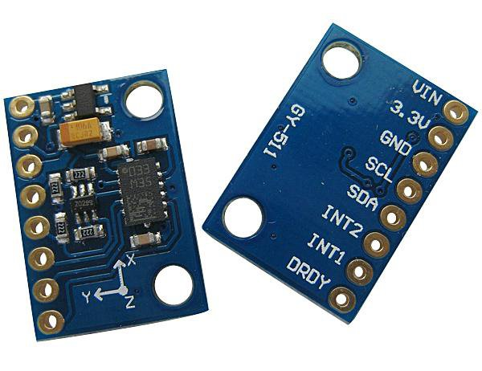

# Buddy 4 — IMU & Terrain Detection

> Your part of the team guide. The shared picture — the event bus (§1.2),
> the non-blocking rule (§1.3), start-up and the mission state machine
> (§2.1–2.2), the `core/` toolbox (§2.3) and the shared hardware (§3) — is
> in [`TEAM_GUIDE.md`](../../TEAM_GUIDE.md); every `§` below points there.
> Installing, building, flashing and testing is [`BUILD.md`](../../BUILD.md).

**Files:** `subsystems/sub_terrain.c/.h`, `drivers/drv_imu.c/.h`

## Your hardware — wiring, pin by pin

**GY-511 (LSM303DLHC) breakout (×1).** A small blue board, about the size
of a fingernail, with an 8-pin header labelled `VIN 3.3V GND SCL SDA INT2
INT1 DRDY`. It contains an accelerometer (tilt — how far the nose is up or
down, which is how humps are detected) and a magnetometer (compass). **It
has no gyroscope**, despite what many online tutorials for "GY-511" assume
— see `docs/HARDWARE.md` §1.1. Mount it flat and firmly; a wobbling IMU
reports a wobbling road.



**How to read a Grove socket.** Every Grove socket on the Robo Pico has
four pins, printed on the board in this order: `GND`, `3V3`, then the two
GPIO numbers. A standard Grove cable's wires are colour-coded — **black =
GND, red = 3V3, white = the first GPIO printed, yellow = the second** — but
don't trust colours blindly: hold the cable against the socket and read
which printed label each wire lands on. With a Grove-to-jumper (Dupont)
cable, the four loose ends are what you push onto the sensor's header pins.

Only four of the eight pins are used — one Grove cable into **Grove 3**:

| GY-511 pin | → Grove 3 label | Why |
|---|---|---|
| `VIN` | `3V3` (red) | power in, through the module's own regulator |
| `GND` | `GND` (black) | ground |
| `SDA` | `GP4` (white) | I²C data — **SDA is GP4**, fixed by the RP2040 chip |
| `SCL` | `GP5` (yellow) | I²C clock — **SCL is GP5** |
| `3.3V`, `INT1`, `INT2`, `DRDY` | — | leave empty (the code polls; no interrupt pins needed) |

Swapping SDA and SCL is the single most common reason the boot log says
`[init] imu FAILED`. Check with the `imu` bench: level should read pitch
≈ 0 and `z` ≈ 1000 mg.

**How your files connect to the rest of the car** (see §2.3 for what
each `core/` file is)

The IMU is the one sensor that does **not** go through `core/rc_gpioirq`
or `core/rc_defer`: it's polled over I2C on a timer rather than firing an
interrupt, and the I2C bus itself is driven by the RTOS port's own
`dev_i2c` device driver (that's the `#include <dev_i2c.h>` at the top of
`drv_imu.c` — the only place in our tree that uses a port driver
directly).

| Your file | Talks to | Through | In plain terms |
|---|---|---|---|
| `drv_imu.c` | the RTOS port's I2C driver | `<dev_i2c.h>` — `tk_opn_dev("iica")` plus the port's device read/write calls on I2C0 | Reads six bytes of accelerometer and six of magnetometer from the chip at addresses `0x19` / `0x1E` (GP4/GP5 after the `BUILD.md` §3 pin patch). |
| `drv_imu.c` | the **Sense task** in `app_main.c` | `drv_imu_sample()` called every 10 ms | The Sense task is the clock; you don't own a task. |
| `drv_imu.c` | `core/rc_event` | `rc_event_publish(RC_EVT_IMU_SAMPLE)` | One parcel per sample with raw x/y/z and the derived pitch in tenths of a degree. |
| `drv_imu.c` | `core/rc_config.h` | `RC_I2C_UNIT_IMU`, `RC_I2C_ADDR_ACCEL`, `RC_I2C_ADDR_MAG` | Which bus and which chip addresses. |
| `sub_terrain.c` | `core/rc_event` | `rc_event_subscribe(RC_EVT_IMU_SAMPLE, RC_LANE_FAST, …)` | Your hump state machine runs inside the FAST dispatcher on every sample. |
| `sub_terrain.c` | `core/rc_time` | `rc_time_ms()` | How long the hump lasted. |
| `sub_terrain.c` | `core/rc_event` | `rc_event_publish(RC_EVT_HUMP_BEGIN / HUMP_END / MOTION_CLASS / IMPACT)` | Your conclusions. `HUMP_END` carries the peak height; `IMPACT` sends `sub_nav` to STOPPED. |
| `sub_terrain.c` | `sub_motion.c` (Buddy 2) | *(planned)* odometry distance during the hump | The TODO cross-check: pitch × distance travelled as a second estimate of height. |

Who calls *you*: `app_main.c` calls `drv_imu_calibrate()` once at boot
while the car is still; `sub_telemetry` (Buddy 1) reads
`sub_terrain_max_peak_mm()` for the "highest hump" report. Note that
`app_main.c` deliberately lets `drv_imu_init()` fail without stopping the
car — hump reporting is lost, but the mission continues.

**What this module does**

This module lets the car feel the ground it's driving on. It uses two
sensors on one small breakout board: an **accelerometer**, which works
like a tilt sensor — it feels which way is "down" and how hard the car is
being pushed or shoved — and a **magnetometer**, which works like a
compass, sensing the Earth's magnetic field to (weakly) tell direction.
Together they let the car notice when it's tipping nose-up over a speed
hump, estimate how tall that hump is, and tell "driving straight,"
"turning," "climbing a hump," "hitting something," and "stopped" apart.
**Important: this board has no gyroscope** (the part that would normally
measure spin rate directly), so the "obvious" textbook approach of
integrating rotation over time to get an angle is not available here —
every trick in this module works around that missing piece.

**Run your module** — bench `imu`. The full procedure, what good output looks like and what each bad symptom means is in [`BUILD.md`](../../BUILD.md) §5.6. Short version, in VS Code: **Terminal → Run Task → RoboCar: build bench image…**, pick it from the list, put the Pico in BOOTSEL, **…flash bench image…**, then open the Serial Monitor. Keep the car level and still while it boots.

**How to get started**

1. **Read the warning comment at the top of `drv_imu.h` first.** It lists
   the three places the missing gyroscope changes the plan: tilt comes
   from gravity, not integration; turning comes from wheel encoders
   (Buddy 2's territory), not the IMU; hump height comes from pitch angle,
   not double-integrated acceleration.
2. **Wire and mount the board.** GY-511 (LSM303DLHC chip) on I²C. Per
   `docs/HARDWARE.md` §4.4: SDA→GP4, SCL→GP5, VIN→3V3, GND→GND (one Grove
   cable into Grove 3; SDA is the lower-numbered pin, fixed by the chip).
   Mount it
   **rigidly** — if it's on a wobbly standoff, it registers its own wobble
   as fake terrain.
3. **Bring the driver up.** Call `drv_imu_init()` once at startup. It
   configures the accelerometer for 100 Hz sampling across all three axes
   at ±2g range (at that range each measurable step is about a thousandth
   of a g, the precision hump detection needs), and sets the magnetometer
   to continuous-read mode.
4. **Calibrate.** With the car level and completely still, call
   `drv_imu_calibrate(100)`. Skip this and every pitch reading afterward
   will be offset by the board's mounting tilt and manufacturing
   tolerance.
5. **Wire up sampling.** `drv_imu_sample()` should be called periodically
   (`RC_PERIOD_IMU_MS`) from the sensing task — it reads both sensors,
   subtracts the calibration bias, and broadcasts an `RC_EVT_IMU_SAMPLE`
   event that `sub_terrain.c` listens for.
6. **Call `sub_terrain_init()`** so the terrain module subscribes to those
   events and starts tracking hump state and motion class.
7. **Tune hump thresholds empirically** — don't guess. Drive hard on flat
   ground, log `drv_imu_pitch_ddeg()`, and set `PITCH_ENTER_DDEG` in
   `sub_terrain.c` comfortably above the peak noise you see from normal
   acceleration/braking/cornering. Current values (4.0° enter / 2.0° exit)
   are a starting point, not a validated setting.
8. Register a callback via `sub_terrain_on_hump()` if you want hump
   notifications directly, alongside the `RC_EVT_HUMP_END` event.

**Code walkthrough**

This is the detailed, line-by-line-style companion to the "How to get
started" walkthrough above. It assumes zero prior coding or physics
background, so the first time a term like "gravity vector," "pitch,"
"accelerometer," "endianness," or "bit-shifting" shows up, it's explained
in plain language. It does **not** repeat the event-bus/publish-subscribe
or non-blocking explanations from `TEAM_GUIDE.md` §1.2–1.3 — read those first if
you haven't.

## The two sensors, in plain terms

The board (a GY-511, built around a chip called the LSM303DLHC) is
actually two separate sensors glued onto one little circuit board:

- **Accelerometer** — feels acceleration, i.e. any push or pull on it,
  along three directions at once (X = forward/back, Y = side to side, Z =
  up/down). Here's the trick this whole module is built on: even when the
  car is sitting perfectly still, the accelerometer *still* feels
  something — gravity, pulling everything toward the centre of the
  Earth, at a constant 1 g ("g" is just the name for "how hard gravity
  pulls," used as a unit). Since gravity always points straight down,
  when the car is level, all of that "1 g of downward pull" shows up on
  the Z axis and nothing shows up on X or Y. But tilt the car — say, the
  front end rides up over a speed hump — and gravity doesn't change, but
  the car's *orientation relative to gravity* does: part of that same
  constant downward pull now leaks onto the X axis instead. The more the
  car tilts, the more of that pull shifts from Z onto X. This constant
  "which way is down, and by how much on each axis" reading is called the
  **gravity vector**, and reading how it's split between X and Z is
  exactly how this module measures tilt without ever needing a
  gyroscope.
- **Magnetometer** — a digital compass. It senses the Earth's (very weak)
  magnetic field to estimate which way is magnetic north. It's wired up
  and read in this codebase, but not currently used for navigation — see
  the warning in `drv_imu.h`, quoted below.

**The gyroscope this board doesn't have** would normally measure *rate of
rotation* directly (e.g. "you are currently rotating at 30 degrees per
second") — the textbook way to get an angle is to add up ("integrate")
that rate over time. Without one, this module has to derive tilt from the
gravity vector instead (accelerometer) and derive turning from how much
faster one wheel is spinning than the other (encoders, Buddy 2's
territory) instead of from the IMU at all. `drv_imu.h` opens with exactly
this warning:

> THIS PART HAS NO GYROSCOPE... Tilt must come from the gravity vector in
> the accelerometer, not from integrating a rate. Turn rate has no direct
> source, use differential encoder counts from Buddy 2. Hump height
> cannot come from double-integrating acceleration; the drift over a two
> second climb is larger than the hump.

Keep that constraint in mind — nearly every unusual-looking piece of math
below exists specifically to work around it.

## `drv_imu.c` / `drv_imu.h` — talking to the chip

This is the "hardware layer": it only knows how to read raw numbers out
of the sensor over **I²C** (pronounced "eye-squared-C") — a simple
two-wire communication protocol (one wire carries data, one carries a
clock signal) that lets several chips share the same two Raspberry Pi
Pico pins, each chip only responding when its own numeric address is sent
first. This file has no opinion about what a "hump" is — that judgment
call belongs entirely to `sub_terrain.c`.

**Registers, and the `#define` constants at the top.** A "register" is
just a numbered memory slot inside the sensor chip — think of it as one
labelled cell in a tiny built-in spreadsheet that you can either write a
setting into, or read a measurement out of. The `#define`s near the top
of `drv_imu.c` give readable names to those slot numbers and to specific
bit patterns written into them, e.g.:

- `A_CTRL_REG1 = 0x20` and `A_ODR_100HZ = 0x57` — writing the value
  `0x57` (hexadecimal, i.e. base-16 — a compact way to write binary bit
  patterns) into register `0x20` turns the accelerometer on, at 100
  samples per second, with all three axes active. The specific bits that
  make up `0x57` are defined by the chip's datasheet, not invented here.
- `A_CTRL_REG4 = 0x23` and `A_FS_2G_HR = 0x08` — configures the
  accelerometer's measurement range to ±2 g (as opposed to a wider range
  like ±8 g). The trade-off: a narrower range means each measurable step
  ("LSB," least-significant bit — the smallest change the sensor can
  detect) represents a smaller amount of tilt, about a thousandth of a g,
  which is the precision hump detection needs. A wider range would let
  the car survive a bigger jolt without the reading "clipping" (maxing
  out), but at the cost of coarser resolution for gentle tilts.
- `M_CRA_REG`, `M_CRB_REG`, `M_MR_REG` — the magnetometer's equivalent
  rate/gain/mode registers, set to 75 Hz, a specific gain, and continuous
  read mode.
- `AUTO_INC = 0x80` — explained in detail below, in the accelerometer
  register-trap section.

**`drv_imu_init(void)`.** Opens the I²C bus device by name, then writes
the configuration bytes above into both chips' registers. If the very
first open or the accelerometer writes fail, it returns an error
immediately (`RC_ERR_HARDWARE`) rather than limping on — this is
deliberate, so a board that isn't wired up yet fails loudly at boot
instead of silently reporting all-zero tilt forever. The magnetometer
writes are allowed to fail without aborting startup, since the
magnetometer isn't required for the hump/hazard features this module is
graded on.

**`drv_imu_read_accel(int16_t *x, int16_t *y, int16_t *z)` — register
trap #1: left-justified data.** `x`, `y`, `z` here are **pointers** —
instead of the function returning one number, the caller hands it the
*addresses* of three variables it owns (using `&x`, the "address-of"
operator, at the call site), and the function writes results directly
into them via `*x = ...`. This is how C hands back more than one value
from a single function call. The function reads 6 raw bytes back from the
chip (2 bytes per axis) and has to reassemble them into three signed
16-bit numbers. Two traps lurk here, both explained with inline comments
at the exact lines in `drv_imu.c`:

1. **Byte order ("endianness").** The accelerometer sends the *low* byte
   of each 16-bit value first and the *high* byte second — the opposite
   of how you'd write the number on paper. So the code does
   `((uint16_t)b[1] << 8) | b[0]` — the `<<` is a **left shift**: it
   slides `b[1]`'s bits 8 positions to the left, i.e. into the *upper*
   half of a 16-bit slot, making room below it; the `|` is a **bitwise
   OR**, which merges two sets of bits together (any bit that's 1 in
   either input becomes 1 in the result) — together they rebuild the
   correct 16-bit value from two separately-received bytes.
2. **Left-justified data.** The accelerometer's actual measurement is
   only 12 bits of precision, but it's placed in the *top* 12 bits of
   that 16-bit slot instead of the bottom 12 — like writing a 3-digit
   number but padding it with extra zero digits on the right instead of
   the left. So after reassembling the 16-bit value, the code shifts it
   right by 4 (`>> 4`, a **right shift**, sliding all the bits down 4
   places) to bring the real measurement back down into the normal
   range. Skip this shift and every single accelerometer reading comes
   out exactly 16 times too large — a bug that's easy to "fix" by luck
   (scale your thresholds by 16 too) and very hard to notice is wrong
   until you compare against a real angle.

The final `(int16_t)` in each line is a **cast** — an explicit instruction
to treat the bits as a particular type, here a signed 16-bit integer,
because tilt can be positive (nose up) or negative (nose down) and the
raw bytes alone don't carry that sign information on their own.

This function calls `reg_read_burst()`, which requests `A_OUT_X_L |
AUTO_INC` as the starting register. `AUTO_INC` (`0x80`) is another
bitwise OR trick: setting the top bit of the register address tells the
chip "after sending me one register's byte, automatically advance to the
next register" — so one request streams back all 6 bytes (X, Y, Z) in
one go, instead of needing 6 separate one-byte requests. Forget this bit
and a multi-byte read comes back with only the first two bytes correct
and garbage after that.

Because this function *blocks* — it waits for the I²C transaction to
finish before returning — it must only be called from a normal task, and
never from an **ISR** (Interrupt Service Routine, a tiny piece of code
the processor jumps to instantly when a hardware event happens, e.g. a
pin changing state — see §1.2 of this guide for the full explanation and
the "golden rule" about what an ISR is and isn't allowed to do).

**`drv_imu_read_mag(int16_t *x, int16_t *y, int16_t *z)` — register trap
#2: opposite endianness *and* scrambled axis order.** Same output-via-
pointer pattern as above, but two things are different from the
accelerometer, and both are exactly the kind of mistake that's invisible
until you're debugging a car that swerves the wrong way:

1. This chip is **big-endian** — the *opposite* byte order from the
   accelerometer's little-endian data. Here the *high* byte comes first,
   so the code does `((uint16_t)b[0] << 8) | b[1]` — b[0] shifted into
   the upper half this time, not b[1]. There's also no `>> 4` shift here,
   because unlike the accelerometer, this chip's value isn't
   left-justified — it already fills the full 16 bits.
2. The registers come out in the order **X, then Z, then Y** — not X, Y,
   Z like you'd naturally assume. Read them in the "obvious" order and
   the car's sideways and up/down magnetic readings get silently
   swapped, which would look exactly like a bug somewhere else entirely.

**`drv_imu_sample(void)`.** The function the sensing task calls on a
timer, roughly 100 times a second (`RC_PERIOD_IMU_MS`, defined in
`rc_config.h`). It calls the two read functions above, subtracts the
calibration bias measured at start-up from each accelerometer axis, and
publishes an `RC_EVT_IMU_SAMPLE` event — the one piece of data every
other function in this module ultimately reacts to. One deliberate
detail: Z's bias correction only removes the *error* found during
calibration, not the whole 1 g gravity signal itself — because the pitch
math (see below) specifically needs that constant "1 g on Z when level"
reference to still be there; removing all of Z would delete the very
signal this whole module depends on.

**`drv_imu_calibrate(uint16_t n)`.** Every real accelerometer has a small
built-in offset from manufacturing tolerances and from however it's
actually mounted on your particular car — even sitting dead level, it
won't read *exactly* zero on X and Y. This function takes `n` readings
with the car sitting still and level, adds them up (in a wider 32-bit
running total, since adding many 16-bit numbers can overflow a 16-bit
total), divides by how many readings actually succeeded, and stores the
result as `bias_x`/`bias_y`/`bias_z` — to be subtracted from every future
reading. It sleeps briefly between samples (`tk_dly_tsk`, a kernel
"pause this task, let others run" call) rather than looping tight, in
keeping with the non-blocking philosophy from §1.3 — though since this
only runs once before the mission starts, that cost is essentially free
either way. **Skip calling this and every pitch reading for the rest of
the run will be silently offset by whatever tilt the board happened to be
mounted at.**

**`drv_imu_pitch_ddeg(void)` — the small-angle approximation, explained
with the actual numbers.** This is the single most important function in
the whole module: it turns the last accelerometer X reading into a pitch
angle. "Pitch" means how much the car is tilted nose-up or nose-down,
like one end of a see-saw. The proper trigonometric formula for this
would use `asin()` (inverse sine) — but the RP2040's CPU (a Cortex-M0+)
has **no FPU** (floating-point unit — the hardware circuitry that makes
`3.14 * 2.0`-style decimal math fast). Without one, real trig functions
have to be emulated entirely in software ("soft-float"), which would cost
thousands of CPU cycles *per call*, far too slow to run 100 times a
second. So the code uses a shortcut instead: for angles under about 25
degrees (which covers every realistic speed hump), the *small-angle
approximation* says `sin(angle) ≈ angle`, as long as the angle is
measured in radians (radians are simply a different unit for measuring
angles, the one this formula needs — 2π radians = 360 degrees). Since
`ax` (the accelerometer's X reading) is already proportional to
`sin(pitch)` once you divide by gravity, this collapses the whole
calculation down to simple integer division and multiplication:

```c
return (int16_t)(((int32_t)last_ax * 573) / 1000);
```

Walking through where `573` comes from: `last_ax` is in milli-g
(thousandths of a g), so dividing by 1000 converts it to a fraction of
gravity, which (via the small-angle trick) is approximately the pitch in
radians. Multiplying by 573 then converts radians to *tenths of a
degree* in one step: 1 radian = 180/π degrees ≈ 57.3 degrees ≈ 573 tenths
of a degree. The result stays a plain whole number throughout — the
project's "no floating point anywhere" rule (see `TEAM_GUIDE.md` §5) in
action. The one caveat: this only measures tilt correctly when the car
isn't *also* accelerating or braking hard at the same moment, since a
hard brake pushes on the X axis too and would be indistinguishable from
tilt using this method alone.

## `sub_terrain.c` / `sub_terrain.h` — deciding what the numbers mean

If `drv_imu.c` is "the ears and inner ear," `sub_terrain.c` is "the part
of the brain that decides what you just felt." It never touches I²C
directly — it only reacts to `RC_EVT_IMU_SAMPLE` events.

**The threshold constants.** `PITCH_ENTER_DDEG` (40, i.e. 4.0°) is how far
nose-up the car must pitch before the code believes a hump has actually
started, and `PITCH_EXIT_DDEG` (20, i.e. 2.0°) is the narrower band the
pitch must settle back inside before the hump is considered finished.
Deliberately using two *different* thresholds instead of one shared value
is a standard trick called **hysteresis** — it stops the reading
flickering rapidly between "hump" and "not hump" if the pitch happens to
sit right at the edge of a single threshold. `HUMP_MIN_MS` (150 ms)
throws out anything too quick to be a physically real hump (more likely
sensor jitter); `HUMP_MAX_MS` (5000 ms) gives up on a climb that's taken
too long, treating it as a long gentle slope instead of a hump.
`IMPACT_MG` (2200, i.e. 2.2 g) is the jolt size on X that means "the car
just hit something," not "the car is just accelerating hard."

**The hump state machine, in `on_sample()`.** This function runs every
single time a new IMU sample arrives (about 100 times/second) and
advances a small state machine with three phases, defined as a C `enum`
(a way of giving readable names to a small fixed set of whole-number
states — `H_FLAT` is really just the number 0 under the hood, `H_CLIMBING`
is 1, and so on, but the name is what a human reads):

- **`H_FLAT`** — the default, "nothing happening" state. Every sample,
  it checks whether pitch has crossed above `PITCH_ENTER_DDEG`; if so, it
  switches to `H_CLIMBING`, records the current timestamp, seeds the
  "peak pitch so far" with this first reading, snapshots the current
  wheel-odometry distance (`dist_at_hump_start`, via
  `drv_encoder_distance_mm()` — again Buddy 2's territory), and publishes
  `RC_EVT_HUMP_BEGIN`.
- **`H_CLIMBING`** — keeps updating the running peak-pitch-so-far
  (needed later to compute height), and watches for pitch to swing over
  to clearly nose-down, which means the car has crested the top and moved
  to `H_DESCENDING`. If it's been climbing longer than `HUMP_MAX_MS`
  without cresting, it gives up and resets straight back to `H_FLAT`
  instead.
- **`H_DESCENDING`** — waits for pitch to settle back within the narrow
  exit band. Once it does, if the whole climb-to-settle episode lasted at
  least `HUMP_MIN_MS`, it computes the hump's height (see next section),
  updates the run's tallest hump if this one's bigger, publishes
  `RC_EVT_HUMP_END` with the height/duration/peak-pitch, and calls the
  optional user-registered callback (set via `sub_terrain_on_hump()`) if
  one was registered.

**`pitch_to_height_mm()` — the geometry, worked through with the real
numbers.** This is the cleverest piece of this module, and the reason a
gyroscope-free board can still estimate how tall a hump is. The naive
approach — integrate acceleration twice to get position — genuinely
doesn't work here: over the roughly two seconds a climb takes, small
sensor errors compound (this is called "drift") into a height estimate
bigger than the hump itself. Instead, the code treats the car as a rigid
ruler of known length: the **wheelbase**, the front-to-back distance
between the axles (`RC_WHEEL_BASE_MM`, measured and set in
`rc_config.h`, Buddy 2's calibration constant). While the front wheels
are already up on the ramp and the rear wheels are still on flat ground,
the whole car body tilts by exactly the pitch angle, and basic geometry
(picture a ramp forming the hypotenuse of a right triangle, with the
wheelbase as that hypotenuse) says:

```
rise = wheelbase * sin(pitch)
```

and — the same small-angle trick used in `drv_imu_pitch_ddeg()` — for the
small angles a speed hump produces, `sin(pitch) ≈ pitch` in radians. In
code, `peak_ddeg` (tenths of a degree) is first converted to
milliradians (thousandths of a radian, another fixed-point scaling trick
to avoid ever needing a fraction) via `* 1745 / 1000` — 1745/1,000,000 is
the degrees-in-tenths-to-radians conversion factor (π/1800) approximated
as a whole-number fraction — and then multiplied by `RC_WHEEL_BASE_MM`
and divided by 1000 (undoing the earlier milliradian scaling) to get the
rise in millimetres. That rise **is** the estimated hump height: how tall
the ramp must be for the car's known wheelbase to have tilted that much.
It is explicitly an *estimate*, not a direct measurement — see the TODOs
below for how to validate and cross-check it.

**`classify()` — deciding the one-word motion label every sample.** This
function is checked in strict priority order, and the first matching
condition wins:

1. A hard jolt on X beyond `IMPACT_MG` in either direction →
   `RC_MOTION_IMPACT`, published immediately as `RC_EVT_IMPACT`.
2. Otherwise, if the hump state machine above is currently `H_CLIMBING`
   or `H_DESCENDING` → `RC_MOTION_CLIMBING` / `RC_MOTION_DESCENDING`.
3. Otherwise, if both wheel-encoder speeds read zero →
   `RC_MOTION_STATIONARY`.
4. Otherwise, if the left and right encoder speeds differ by more than
   150 mm/s → `RC_MOTION_TURNING`. This is the module's honest
   workaround for having no gyroscope: it falls back entirely to
   `drv_encoder_speed_mm_s()` from **Buddy 2's** motion module — the same
   way a tank or a wheelchair turns by driving its two sides at different
   speeds, a difference between the wheels is direct evidence of turning,
   and it's a more reliable signal than trying to infer rotation from
   this IMU's limited data.
5. Otherwise, a strong forward/backward push on X classifies as
   `RC_MOTION_ACCELERATING` or `RC_MOTION_DECELERATING`.
6. Otherwise, `RC_MOTION_CRUISING` (steady speed, nothing notable
   happening).

An event (`RC_EVT_MOTION_CLASS`) is only published when the class
actually *changes* — not every single sample — so subscribers like Buddy
1's telemetry module aren't flooded with "still cruising" a hundred times
a second.

**The public API in `sub_terrain.h`.** `sub_terrain_init()` is called
once at boot; it resets internal state and subscribes `on_sample()` to
`RC_EVT_IMU_SAMPLE` on the bus's **fast lane** (see §1.2 — hump/impact
detection needs to react without delay, the same reasoning as steering).
`sub_terrain_on_hump(cb, ctx)` lets any other module register a plain
function to be called the moment a hump finishes, as an alternative to
subscribing to the event bus directly. `sub_terrain_max_peak_mm()` and
`sub_terrain_motion_class()` are simple getters returning the module's
internally-tracked state. `sub_terrain_reset()` clears everything back to
"just booted, car still" — useful for starting a fresh run without a
full reboot.

**Missing / TODO for Buddy 4**

- **Turning classification is a placeholder, not real motion sensing.**
  The code comment above `classify()` admits it directly. "Turning"
  currently uses a crude threshold on left/right encoder speed difference
  (`diff > 150` or `< -150`), wired in quickly rather than tuned. Needs
  real tuning: verify the threshold against actual turning tests on the
  car, not a guessed constant.
- **Hump height has no independent cross-check yet.** Pitch-to-height is
  an *estimate*, not a measurement — validate it against a ruler on three
  known humps and quote the error in the terrain report. Beyond that,
  there's a concrete TODO: use distance travelled between hump entry and
  pitch peak (via `drv_encoder_distance_mm()`, already captured as
  `dist_at_hump_start`) multiplied by `sin(pitch)` for a *second*,
  independent height estimate from a different sensor (wheels, not tilt).
  Large disagreement between the two estimates is a signal a threshold
  needs retuning.
